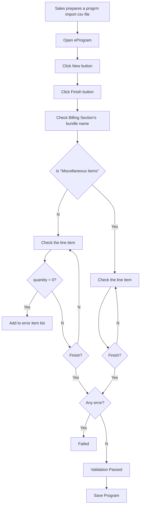

## Solution Proposal - Import 0 Quantity Item

### Summary

In currently program import process, if a pricing item quantity is 0, it is not allowed to be imported.

We will need to allow import additional items to Miscellaneous Section with 0 Quantity.

- Ability to import 0 quantity items to this section

- Maintain quantity check on other sections.

  

##### Import File Sample

##### Imported Program Sample

### Business Process for client stamp tracking

### Solution Description

- [ ] Update line item calculation logic to allow line price section quantity equal 0 under "Miscellaneous Section" Section.
- [ ] Quantity 0 may affect the who billing section calculation. Need further test to correct bug if any. the PriceLIneItemSection is in SanjelCommonLibrary.

### UI Mock

N/A
