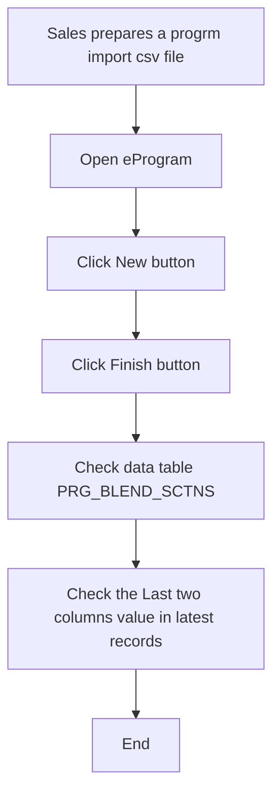

## Solution Proposal - Import Pilot Test Reference

### Summary

- We need to import pilot test reference on per blend level. 
- Only need to import the data in database, don't need to show in UI right now.

##### Import File Sample

### Business Process for client stamp tracking

### Solution Description

- [ ] Add PilotTestId(string), PilotTestIteration(int) in BlendSection class in SanjelCommonLibrary.

- [ ] Add two new columns according to above definition to PRG_BLEND_SCTNS, PUMP_BLEND_SCTNS, PSPT_BLEND_SCTNS tables.

- [ ] Update BlendSectionDao in SanjeleService for the new fields.

- [ ] Update work book template and update import mapping for above to data items in SanjelClientSoultionTool.

  

### UI Mock

N/A
