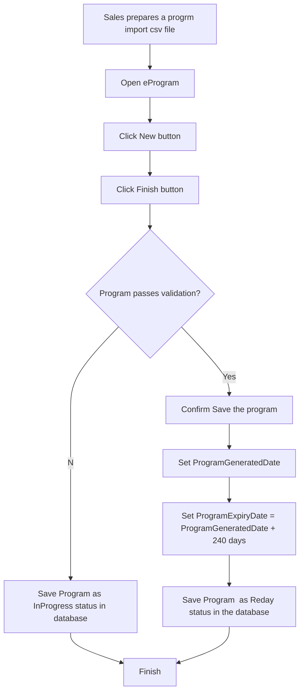

## Solution Proposal - Program Expiry

Sales would like to manage the program status for downstream process.

- [ ] Upon import, a program will default to 8 months (or another reasonable timeframe) that it will remain active. 

- [ ] Upon import, Status = “Ready”
- [ ] After 8 months from import date, status = “Expired”
- [ ] Only “Ready” programs will be available to the Rig Board / Call sheets etc.
- [ ] This expiry date can managed within eProgram 
- [ ] The date can be extended/modified if required
- [ ] An expired program will not be available for call sheet creation or the other functions of the DRB

### Business Process for Program Expiry Status management

### Solution Description

- [x] Add Expired status to eServiceEntityStatus in SanjelCommonLibrary

- [x] Add ProgramExpiryDate to Program Entity in SanjelCommonLibrary

- [ ] Add ProgramExpiryDate  column to PROGRAMS table.

- [ ] Update ProgramDao in eService for database save and read.

- [ ] Update Program Header control to add "Program Expiry Date" control and update presenter correspondingly.

- [ ] Update the logic to determine the program expiry date and status.

  

### UI Mock

- Add "Program Expiry Date" control to Program Header.

- Show new program status properly

### Test File

Under "Program Expiry import files". 

If you need to test import repeatedly, change the Program ID to a different number.

