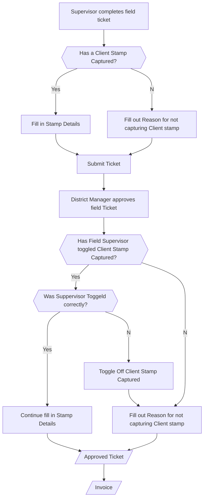

## Solution Proposal for Client stamp tracking

The solution will be implemented in eService application. The tracking flags are mandatory in eService for field ticketing and manager approval. This will help enforce the business process and allow all parties to be aware of client stamp missing  and the causes.

Once the data is submitted to server, it will be exposed to AR and sales in BI dataset for further tracking and analysis.

 This process will not block current process for invoice generation and OVPP processing.

### Business Process for client stamp tracking

### Solution Description

1. Under "Job Package From Local" tab
   1. If the field supervisor has captured client stamp, he will toggle the checkbox "Is a Client Stamp Captured?", the stamp detail data grid is enabled. He may fill in the stamp detail information in the data grid. The data grid must have at least one record.
   2. If for any reason, the field supervisor is not able to capture the client stamp, he needs to fill out the reason in "Reason for not capturing Client Stamp", the stamp detail data grid must be empty and disabled.
   3. The "Client Stamp Details" is mandatory for field ticket.

2. The supervisor submit ticket server, the job will show up under the "Job Packages Awaiting Approval" tab.
3. Under "Job Packages Awaiting Approval" tab
   1. When district manager approves the ticket, the "Has a Client Stamp Captured?" checkbox will carry over the value from "Was a Client Stamp Captured?" in service ticket, district manager can modify it if field flag is wrong.
   2. If for any reason, the checkbox "Has a Client Stamp Captured?"  is not toggled, the district manager needs to fill out the reason in "Reason for not capturing Client Stamp" within "Client Stamp Upon Approval". The stamp detail data grid must be empty and disabled.
   3. If the checkbox "Has a Client Stamp Captured?"  is toggled,  the stamp detail data grid is enabled, district manager can modify the details. The data grid must have at least one record.

4. Once the ticket is approved, the invoice will be generated.
5. All above tracking information will be available in daily job data in PowerBI. Sales and AR can use it for tracking and analysis purpose

### UI Mock

- Job Package From Local
  

  

- Job Packages Awaiting Approval

