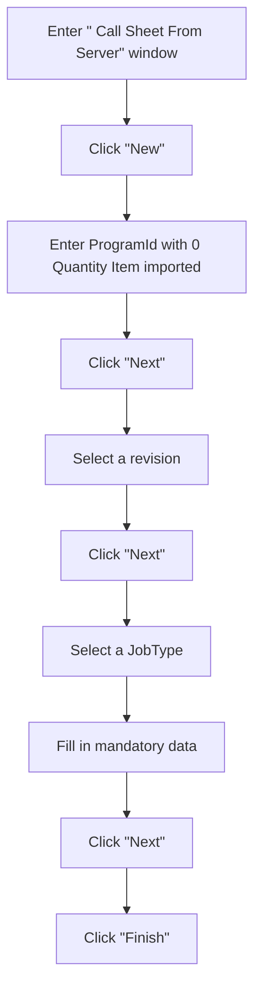

## Solution Proposal - Changes from Price line items with Quantity 0

### Summary

After we allow Import price line items with Quantity 0, the total calculation algorithm is updated. We need to apply these changes in eService and make corresponding changes.

- All 0 quantity items can be carried over from Program to Call Sheet, from Call Sheet to Local Job Package, from Local Job Package to Server Job Package properly, include the 0 quantity items.

  - Adjusted quantity in upstream entity will be carried over to Estimated quantity in downstream entity.

- All related calculation should be correct.

- All display on UI should be correct.

- Service ticket printing rules are changed.

  -  Do not print 0 quantity items if:

    -  If Estimated Quantity is 0  and Adjusted Quantity is 0, do not print this line item.

    -  If Estimated Quantity is 0  and Adjusted Quantity is not 0, print this line item.

    -  If Estimated Quantity is not 0  and Adjusted Quantity is 0, print this line item.

      

### Business Process for client stamp tracking

### Solution Description

- [ ] Fix logic of carrying 0 quantity item in common library
- [ ] Fix Service Ticket printing function.

### UI Mock
