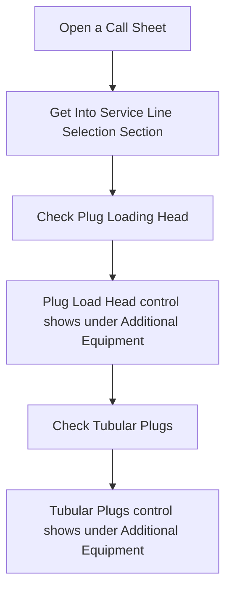
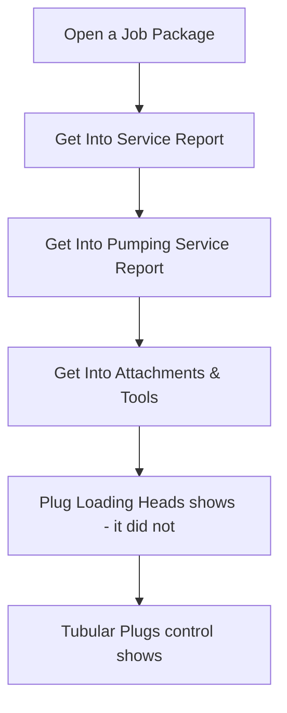

## Solution Proposal - Head and plugs

This requirement is to add more content to two existing controls. These two controls are shown in both Call Sheet and Job Package.

- Plug Loading Head, add following control.

  - Supplier, dropdown list. Use same supplier list in Tubular Plugs control
  - Manufacturer, dropdown list. New control, list data will be provided. Use mock data for development.
  - Type, dropdown list. New control, list data will be provided.   Use mock data for development.
  - If "Third Party" is selected, the Manufacturer dropdown is enabled. Otherwise, it is disabled

- Tubular Plugs, add following control.

  - Manufacturer, dropdown list. Same as above.

  - If "Third Party" is selected, the Manufacturer dropdown is enabled. Otherwise, it is disabled

    

### Business Process for client stamp tracking

- Call Sheet

- Job Package

### Solution Description

- [ ] Add PlugLoadingHeadManufacture entity in SanjelData model.

- [ ] Use PlugLoadingHeadSpecialty for the Type list

- [ ] Add PlugManufacture entity in SanjelData model.

- [ ] Add above two manufacturer entities as CommonType in eService

- [ ] Update common type view for above change

- [ ] Update Control

- [ ] Add Plug Loading Heads control to job package

- [ ] Update eService Entities.

- [ ] Update DAO 

- [ ] Update logic to make the process working

  

### UI Mock

