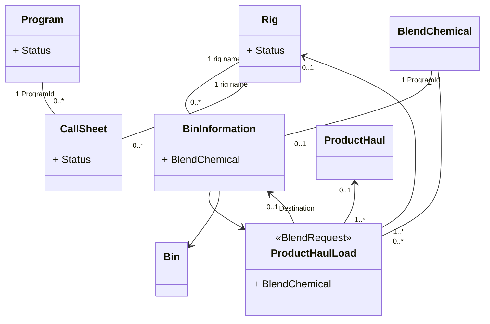

Online

# Fix Haul Blend Function in Bulk Plant Board      #105    

- Fix CS# not showing up
  - If the blend in the bin is only from one blend request which  originated from a call sheet, populate the callsheet number to "Call  Sheet Number" dropdown list as the only value and default as selected.
  
  - If the blend in the bin is from mutiple blend request, the dropdown will show all active call sheet numbers use the same blend.
  
    
  
  Haul Blend操作有3个场景，
  
  1、from Rig Board Blend column Schedule Blend Reqest : 此种情况下：CallsheetNumber，Job，Blend配方已知。
  
  当有新的搅拌申请单时，调度人员在Online的Rig Board中先发起一个搅拌申请单（Schedule Blend），再根据搅拌申请单安排车队调度单（**Haul Blend**），此处创建Schedule Blend Request，会根据Rig信息获取到CallsheetNumber信息，此处Blend Request进行Haul Blend操作时CallsheetNumber存在并唯一。
  
  
  
  2、 from ProgramID to BulkPlant bin: 此种情况下ProgramID，JobType，BulkPlant、Bin 已知。
  
  有的时候调度员知道了Program Id信息，但是还有没有对应的Rig Job信息，这种情况下知道有水泥的需求可以提前安排搅拌和运输工作，此时可在BulkPlant中安排对应的搅拌申请单Schedueld BlendRequest和运输单HaulBlend。此处会出现一个ProgramId对应多个CallsheetNumber的情况。
  
  
  
  3、Blend In Bin :BulkPlant中的Bin是有限的，在安排计划的时候，在同一个Bin 里可能计划存放很多不同的Blend, BulkPlant根据计划安排搅拌任务，搅拌完成后Blend会保存在(Load to Bin)对应的Bin中等待拉走，拉完(Load Product Haul)后会进行BIn的清理（Empty bin）操作，然后才能装入新的Blend。HaulBlend时，会根据Bin中存放的Blend类别去查找所有对应的Callsheet信息，并用于选择。
  
  ```mermaid
  sequenceDiagram
  participant Dispatch on RigBoard-Blend
  participant Dispatch on BulkPlant-Bin
  participant Dispatch LoadtoBin
  Dispatch on RigBoard-Blend ->> BulkPlant: Scheduled Blend Request(CallsheetNumber,Job,Blend)
  BulkPlant ->> BulkPlant: Haul Blend (CallsheetNumber,Job,Blend)
  Dispatch on BulkPlant-Bin ->>BulkPlant: Scheduled Blend Request(ProgramId,JobType,BulkPlant,Bin)
  BulkPlant ->> BulkPlant: Haul Blend (ProgramId,JobType,BulkPlant,Bin)
  Dispatch LoadtoBin->> Dispatch LoadtoBin: load to bin
  Dispatch LoadtoBin->> BulkPlant: Haul Blend (同一种Blend下所有可用的Callsheet)
  ```
  
  
  
  HaulBlend菜单：
  
  以上三种场景展示菜单样式不同：
  
  1、CS1110714 - ECOproteus PRO + Additives-3t
  
  2、PRG210854 - ECOproteus PRO + Additives-3t
  
  3、Blend in Bin - PRODUCTIONmlx LW(SK)+ 0.2% CFR-2+0.25% CFK-3+0.45%CFL-4+0.75%gss-1+0.75%GSS -1+0.75% SCA-7+0.3%cdf-6P+0.3%LRT -3t
  
  
  
  #### 任务
  
  - [x] 场景1中，CallSheetNumber唯一，HaulBlend操作默认显示唯一的CallsheetNumber。
  - [x] 场景2中，HaulBlend操作有多个CallsheetNumber时，下拉框显示ProgramID对应的Callsheet状态为：In progress, Ready ，Locked的CallsheetNumber。
  - [ ] HaulBlend中ProgramID,添加版本号
  - [ ] Haul Blend菜单显示PRGID
  - [ ] 选择CallsheetNumber时
    - [ ] 如Rig下方无Bin时，Go with Crew 默认选择不可修改。
    - [ ] Rig下发有Bin，直接显示Go with Crew 以及Rig对应的Bin.
  
  
  
  
- Add "Haul All" checkbox after Amount textbox, if it is checked, populate the number in Quantity column to Amount textbox.

  UIMock

  #### 任务

  页面上的逻辑变更：

   Schedule BlendRequest from BulkPlant bin、 RigBoardBlend变更说明：
    - [ ] HaulBlend页面中，增加"Haul All" checkbox
    - [ ] 勾选"Haul All" 复选框时回填对应的RemainAmount值到HaulAmount文本框，并不允许修改。
    - [ ] 去掉"Haul All" 复选框的勾选，HaulAmount文本框值清空，并允许输入。
    - [ ] Haul Amount ,RemainAmount,Total Tonnage ，LoadAmount,PodAmount精度保持一致，三位小数

   Schedule Blend Reqest from Blend to bin变更说明：
    - [ ] 勾选"Haul All" 复选框时回填：Quantity值 - 已经运输走的Amount 之和=剩余待运输的Amount    到HaulAmount文本框，并不允许修改。
    - [ ] 去掉"Haul All" 复选框的勾选，HaulAmount文本框值清空，并允许输入。
    - [ ] 

- If there is call sheets available and one is selected,  "Go With  Crew" checkbox should show up, and proper logic should be followed.

  HaulBlend ：有2中场景，场景1提前搅拌好拉过去存放在货场，场景2工程队一起出发（即Go With Crew）。

  #### 任务

  BulkPlant 页面Bin列，进行HaulBlend操作时，HaulBlend页面中CallSheetNumber为空的情况下，不做任何变动。

  HaulBlend页面中CallSheetNumber不为空的情况下增加处理逻辑如下：

- [ ] 增加显示Go With Crew 标签和复选框

  - [ ] 未勾选Go With Crew点击保存提示Bin Load Amount为必填项
  - [ ] 勾选Go With Crew时，
    - [ ] 1、Bin Load Amount数据清零并隐藏
    - [ ] 2、Expected On Location Time、Estimated Travel Time 隐藏，处理逻辑与RigBoard Blend列

- [ ] 增加显示Rig相关Bin Load Amount信息，

- [ ] RigName 禁用

- [ ] ScheduleProductHaul页面下方Expected On Location Time下方有一个冗余加号，删除它。

  

### 疑问：

available 的callsheet状态包括：Ready ,InProgress , Canceled, Locked , Deleted 共5种状态，可用状态为：Ready ，Locked,即不包括,InProgress,Canceled 和Deleted 。

#  Update Bulk Plant Board List      #104    





- Need to differentiate between scheduled blend
  - Add Rig to scheduled blend section
  - Add CS # to scheduled blend section
  - Add Client to scheduled blend section
- Remove “+ Additives” from blend name in "Blend in Bin" and "Scheduled blend" column
- Make some more space on page
  - Shrink Scheduled QTY – Sched QYT / wrap text to 2 lines?
  - Shrink Testing? Column
  - Shrink Quantity Column
  - Shrink Bulk Plant Column
  - Shrink index # Column
- Bin column should be sorted by alphabetical order


### 任务：

1. BulkPlant页面需要做以下调整：
   - [ ] ViewModel的修改eServiceOnline\Source\eServiceOnline\Model\BulkPlantJobViewModel.cs   中新增列：
     - Rig：ProductHaulLoad.RigName
     - CS#：ProductHaulLoad.CallSheetNumber
     - ClientName：ProductHaulLoad.ClientName，
     - BlendScheduled属性进行替换去掉“+ Additives” 后缀
     - BlendInBin属性进行替换去掉“+ Additives” 后缀
   - [ ] View的修改eServiceOnline\Source\eServiceOnline\Views\BulkPlant\Index.cshtml，Schedule blend后方新增数据列
     - Rig
     - CS#
     - ClientName
   - [ ] View的修改eServiceOnline\Source\eServiceOnline\Views\BulkPlant\Index.cshtml缩减Schedule QTY /Sched QYT、Testing? 、Quantity 、Bulk Plant 、index # 数据列的列宽

- [ ] BulkPlantController，BuildBulkPlantViewModels方法中，对于返回的assignedBinSections，按照BinName 以字母升序排序

### 疑问：

- Remove “+ Additives” from blend name in "Blend in Bin" and "Schedule blend" column

1.    +Additives 属性是BlendChemical的name，本次修改是直接更新BlendChemical的name去掉“+ Additives”信息，还是仅仅在页面上不显示“+ Additives”信息呢？
2.   BlendChemical的BlendRecipeName，ProductDescription 存储的值与Name相同，我们暂不做修改。

# Area Filtering      #81    

After talking with ops, here is what we decided:

When an area selection is made, all the districts in that area will be selected
 If one of the districts is deselected, the area selection will be removed
 •	The area is on only when all of the districts are selected.
 If the missing district is selected again, the area will be checked off

When an area is deselected, all districts within that area will be deselected
 Each district can be select/deselected at any time independent of the area selection
 •	When all the districts within an area are selected, the area will be selected
 •	If any/all of the districts within an area are deselected, the area will be deselected

For example:
 •	If LLD and KD are selected, no areas will be selected
 •	If LLB is added, the N. East area will be selected
 •	If SC is selected, no change to the area will occur
 •	If SC and EST are selected, the S. East area will be selected

Eg. 2
 •	LLD, LB, KD, SC and EST are all selected
 •	Both S. East and N. East will be selected
 •	If LLD is deselected, the N. East area will be deselected


CENT = BR+RD+Edm+Eds+NW (NW is referring to Norman Wells)
 N.West = GP+ FSJ
 S.East = EST+SC+KD
 N.East = LLD+LLB

#### 任务

RigBoard页面过滤器变更：

- [ ] 页面增加地区选择过滤器，样式要求见UIMock
- [ ] 联动逻辑：Area下的多个Service Point 与Area是与的关系，勾选Service Point或Area后系统联动更新过滤条件，根据条件筛选数据并展示。