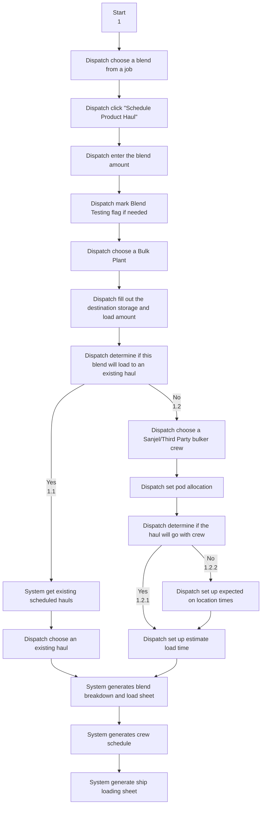
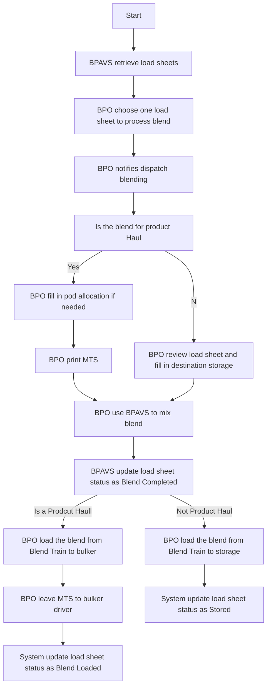
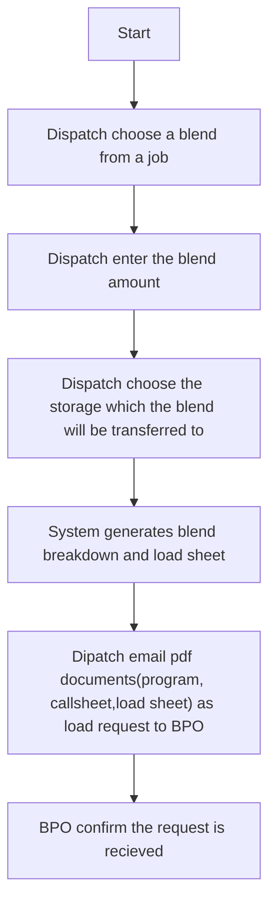
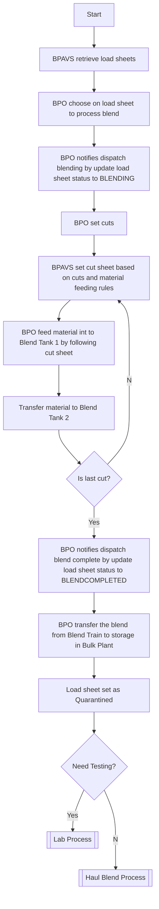
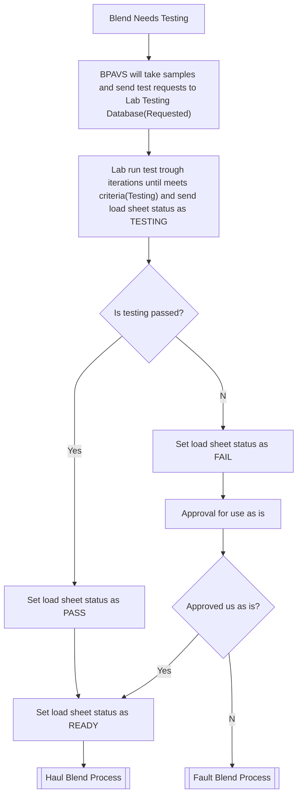

# Product Haul Process 

## Scenarios

### 1. Schedule blend haul from a Rig Job Blend

**Precondition**:

- Rig Job is in Pending, Confirm, Scheduled, Dispatch or In Progress status

  

**Post condition**

- Blend Request is created (ProductHaulLoad)
- Product Haul, shipping loading sheet, crew assignment and schedule are created (ProductHaul, RigJobSanjelCrewSection, SanjelCrewSchedule, ThirdPartyCrewSchedule, ShippingLoadSheet, BlendUnloadSheet,)
- Blend Breakdown Sheet and Load Sheet can be printed from "Product Haul" board
- Blend Breakdown Sheet and Load Sheet are available in BPAVS
- *Material Transfer Sheet (MTS) can be printed from "Product Haul" board* -- not implemented yet.
- Blend color coding on RigBoard is changed according to the status of all blend requests and product hauls over this blend

### Bulk Plant Process

### 3. Schedule a blend for a job and load to a bin attached to bulk plant awaiting blend test (Has call sheet)

#### Dispatch Process

#### Bulk Plant Process

#### Lab Process

### 4. Schedule a haul to transfer pre-blended blend to a bin attached to a rig for a job (Has call sheet)

