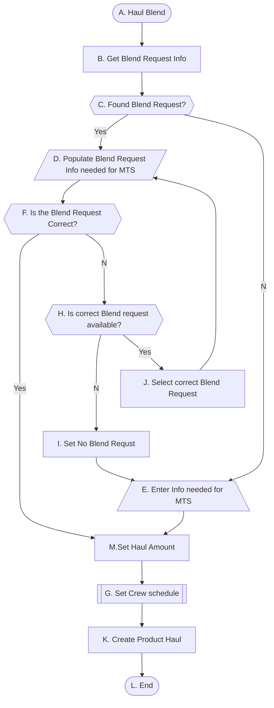
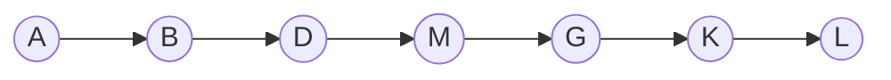
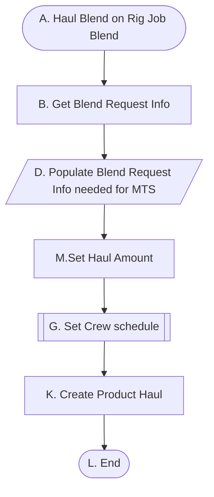
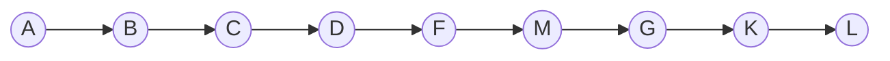
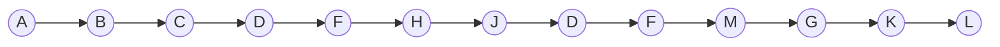
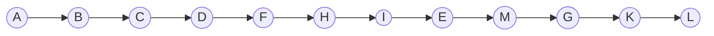

# Haul Blend

## Use Case Scenario Breakdown

Precondition must satisfy all decision nodes' requirement.

### Haul Blend on Rig Job Blend

Start point is on the available blend request in the menu. 

### Haul Blend On Bulk Plant Bin

#### Bin Information has last blend request id and it is the correct one.

#### Bin Information has last blend request id and it is not correct one and correct one is available in the list.

#### Bin Information has last blend request id and it is not correct one and correct one is not available in the list.

#### Bin Information doesn't  has last blend request id and correct one is not available in the list.

