### Domain Model

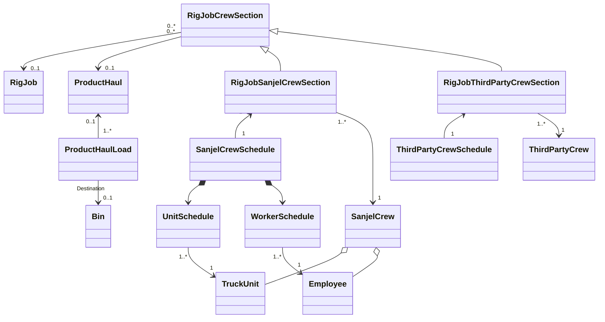

## Refactor version 1

## Domain Model

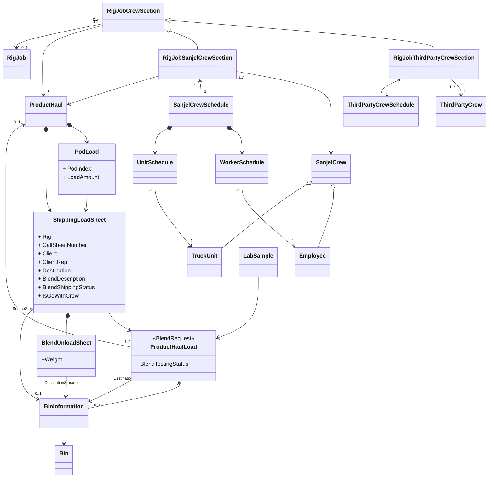
### Product Haul Load State Machine

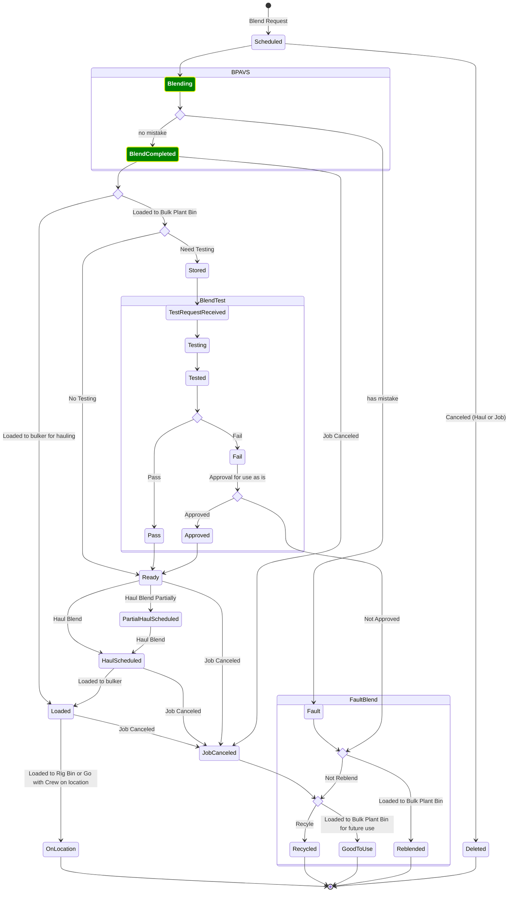

### Product Haul Load State Machine Breakdown

#### Blend Request State Machine

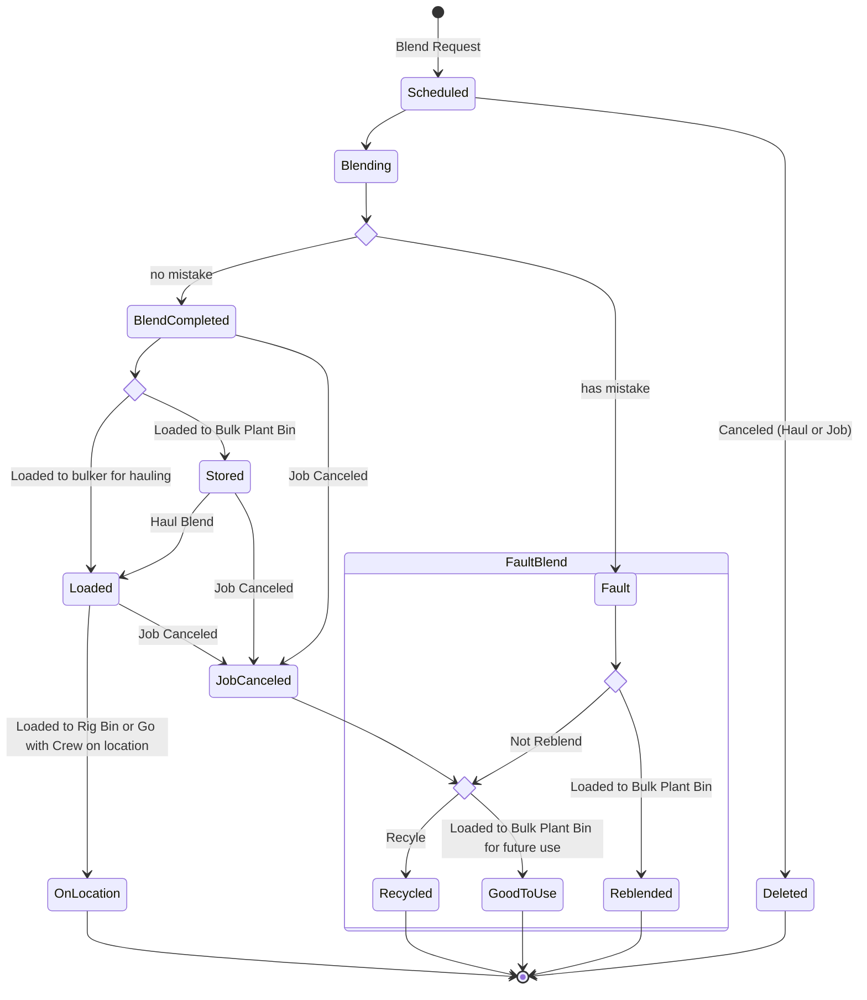

#### Blend Request status Definition

- Scheduled: Blend Request is scheduled.
- Blending: Blend Request is picked by in BPAVS, blending process is started.
- BlendCompleted: Blending process is completed, blend is ready to load to Bins or Bulker
- Loaded: Blend is loaded to Bulker
- Stored: Blend is loaded to Bulk Plant bins.
- OnLocation: Full amount of blend are shipped on location by product hauls.

#### Product Haul Status Definition

- Scheduled: A bulker is scheduled to haul specific blend either from bulk plant bins or blend request.

- Loaded: The blend is loaded to bulker

- OnLocation: The haul is completed, the blend is loaded to rig bins or pumped.

  

#### Blend Shipping State Machine

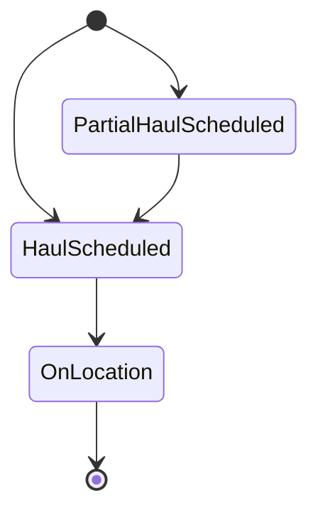

#### Blend Testing State Machine

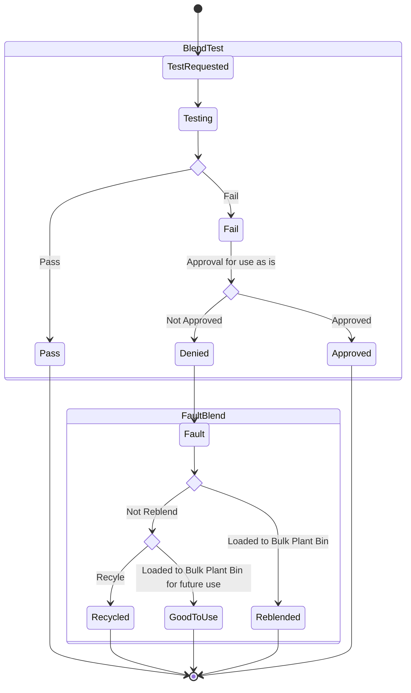

### Shipping Status
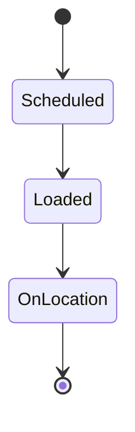
### Lab Sample State Machine

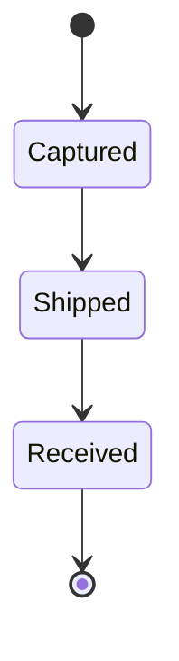

## Process View

## Wish List

- Schedule blend request without bin
  - BPAVS need to fill in the bin and update backend

- Schedule product haul with two bins - spit load
- Destination bins on MTS
- BPAVS need to be able to update "Loaded" status
- BPAVS sampling function and auto log in Lab Database
- Re-blend with blended blend.

### Blend Request Process

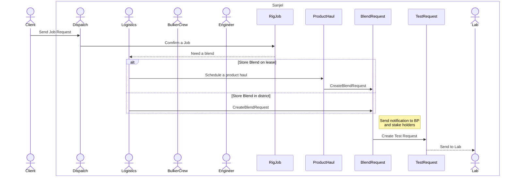

### Blending and Testing Process

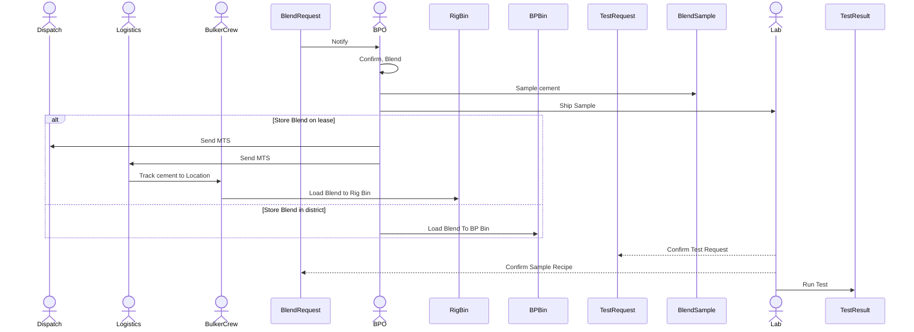

### Client Approval Process

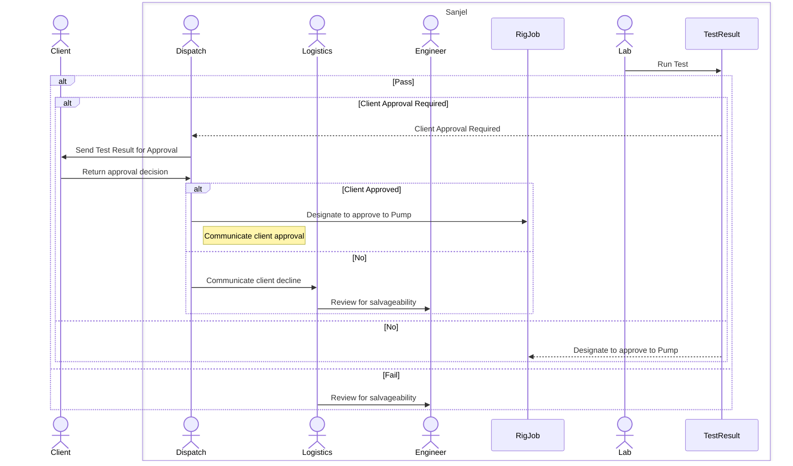

### Review fail blend salvageability

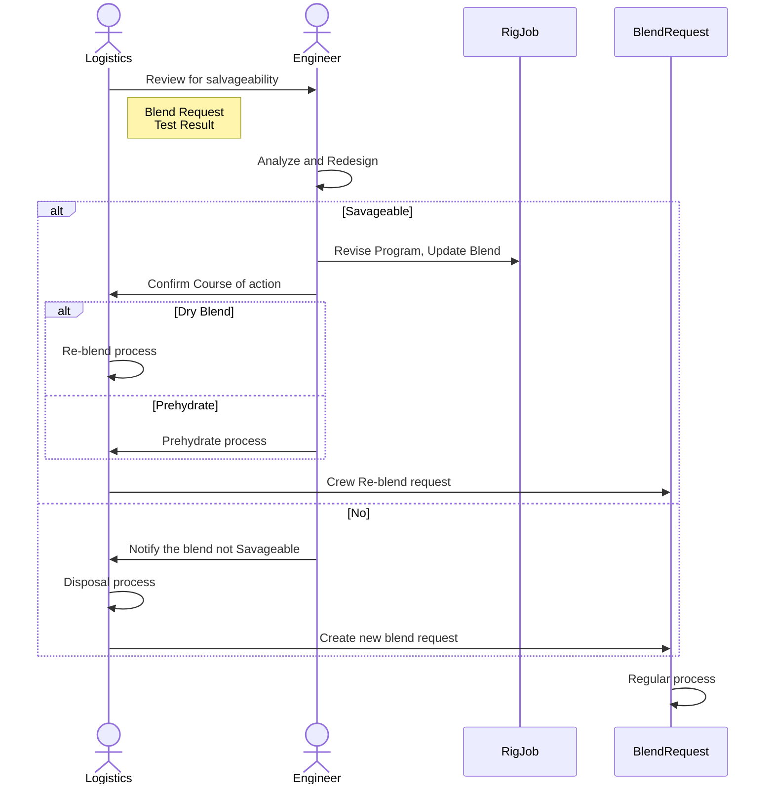

### Integration and trigger Points

- Test Request creation 
  - Currently, test request is submitted from program. This may need to move to blend request creation. It will need to support multiple cuts/re-blend/prehydrate processes. Workflow? Maybe
- Blend Sample login
  - Blend sample data is available to populate blend sample list in Lab Database for the blend sample login process. Workflow?No
- Test Result Publish
  - Pass
    - RigJob testing status update. Workflow: Yes
    - Blend Request testing status update. Workflow: Yes
  - Fail
    - Engineer Approval Request Creation. Data model doesn't exist. New entity is needed.
- Client Approval Request
  - Blend Request blend testing status needs to be enhanced. Workflow: Yes
  - Client Approval Request Creation. Data model doesn't exist. New entity is needed.
- Client Approved
  - RigJob testing status update. Workflow: Yes
  - Blend Request testing status update. Workflow: Yes
- Client Decline
  - RigJob testing status update. Workflow: Yes
  - Blend Request testing status update. Workflow: Yes
  - Engineer Approval Request creation. Workflow: Yes

- Engineer Approved
  - Call Sheet blend update. Process TBD
  - Blend Request turn over
    - Prehydrate
    - Re-blend
- Engineer Decline
  - Blend Request testing status update. 
  - Blend dispose process TBD
  - New blend request creation.

- Blending progress within Test Request in Lab DB. Workflow: No

All trigger point may send out notification.

Approval form can be available on both a mobile notification and eService Applications.
