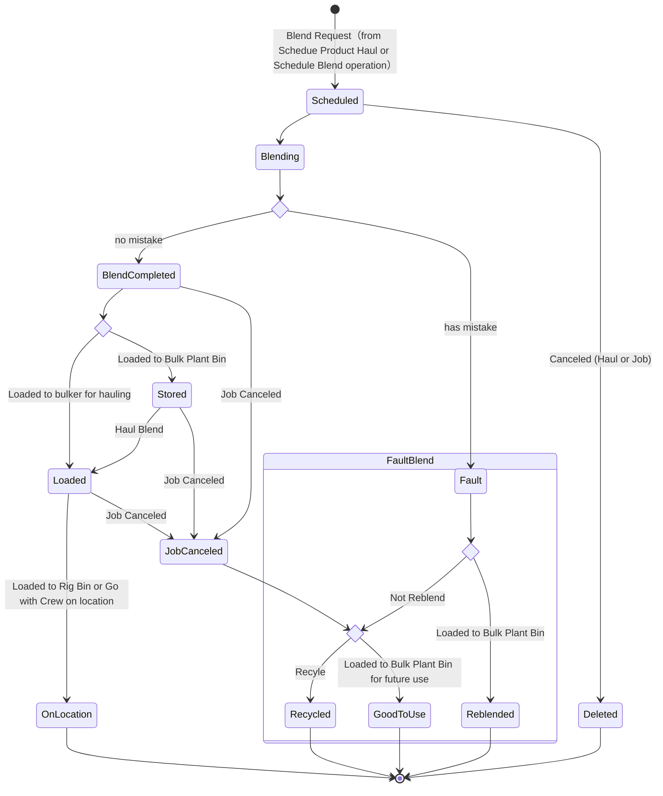
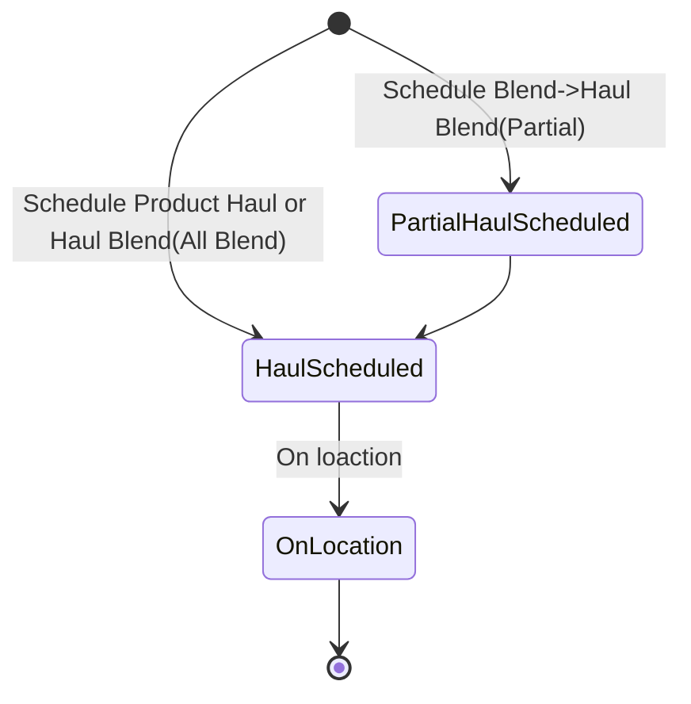
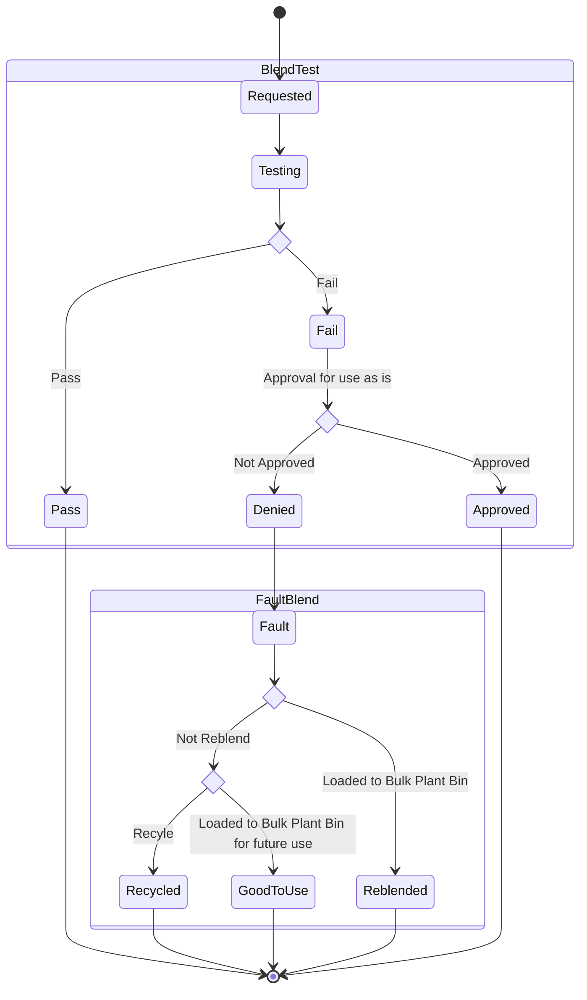

#  Blend Request 搅拌申请单 & Product Haul 运输调度单

##  业务场景

搅拌申请单和车队调度单业务场景描述：

- 场景1：

当有新的搅拌申请单时，调度人员在Online的Rig Board中先发起一个搅拌申请单（Schedule Blend），再根据搅拌申请单安排车队调度单（Haul Blend），并支持一个搅拌申请单对应多个车队调度单。

- 场景2：


当有新的搅拌申请单时，调度人员在Online的Rig Board中发起搅拌&车队调度单（Schedule Product Haul），同时包括了场景1中的搅拌申请单（Schedule Blend）和车队调度单(Haul Blend)。因为一辆运输车可以分装多批次的水泥搅拌，支持选择已存在但未装满的车队调度单。

以上运输到位后调度员在Online中进行On location操作，确认运送到达。至此搅拌申请单以及相关的车队调度单工作完成。

### Domain Model

#### Business Entity


```mermaid
classDiagram
class Bin
class ProductHaul{
+ ProductHaulLifeStatus
}
class ProductHaulLoad {
<<BlendRequest>>
+ BlendTestingStatus
+ ProductHaulLoadLifeStatus（BlendRequest的状态)
+ BlendShippingStatus（Blend运送的状态）
}
class ShippingLoadSheet {
+ Rig
+ CallSheetNumber
+ Client
+ ClientRep
+ Destination
+ BlendDescription
+ IsGoWithCrew
+ ShippingStatus（运输的状态）
+ BlendTestStatus
}
class PodLoad {
+ PodIndex
+ LoadAmount
}
class BlendUnloadSheet {
+Weight
}
class BinInformation 
class LabSample
ProductHaul"0..1"<--"1..*" ProductHaulLoad
ProductHaulLoad"Destination"-->"0..1"BinInformation
ProductHaul *--> ShippingLoadSheet
ProductHaul *--> PodLoad
PodLoad --> ShippingLoadSheet
ShippingLoadSheet"SourceStorage"-->"0..1"BinInformation
ShippingLoadSheet *-- BlendUnloadSheet
ShippingLoadSheet --> ProductHaulLoad
BlendUnloadSheet "DestinationStorage"-->BinInformation
BinInformation -->ProductHaulLoad
LabSample-->ProductHaulLoad
BinInformation-->Bin
```


#### Blend Request State Machine



​	

#### Blend Shipping State Machine（装车单状态机）



#### Blend Testing State Machine




##  业务说明一、从RigJob的blends列开始

【Rig Board】->【Blends列】，鼠标右键菜单显示如下： 


Schedule Prodcut Haul Blend：搅拌申请单&车队调度单

reschedule Product Haul  Blend：修改搅拌申请单&车队调度单

Cancel Product Haul：取消搅拌申请单&车队调度单

Onlocation：水泥送达现场

------

Schedule Blend：发起一个搅拌申请单

Reschedule Blend：修改一个已存在的搅拌申请单

Cancel Blend ：取消一个搅拌申请单

Haul Blend：给搅拌申请单安排车队调度单

分割线以上菜单为场景2中 Schedule Product Blend 的操作，包括

- Schedule Prodcut Haul Blend：搅拌申请单&车队调度单
- reschedule Product Haul  Blend：修改搅拌申请单&车队调度单
- Cancel Product Haul：取消搅拌申请单&车队调度单
- Onlocation：水泥送达现场

分割线以下菜单为场景1中Blend Request 的操作，包括：

- Schedule Blend：发起一个搅拌申请单
- Reschedule Blend：修改一个已存在的搅拌申请单
- Cancel Blend ：取消一个搅拌申请单
- Haul Blend：给搅拌申请单安排车队调度单

### Schedule Blend Request（搅拌申请单）

用于让调度员新建搅拌申请单。

【Rig Board】->【Blends列】，鼠标右键，选择【Schedule Blend Request】打开搅拌任务计划新增页面。


#### 页面样式


#### 参数说明

Call Sheet Number :识别符，哪个工单的的搅拌申请单，根据所选数据系统回填对应数据，不允许修改。

Base Blend：水泥的类型，根据所选的JobType系统加载对应的数据，根据需要选择。

- Base Blend Tonnage:只填写基础数量，最终数量因为会包含添加剂等其他信息大于基础数量。

- Total Blend Tonnage:只填写全部数量，最终数量保持一致。


Amount ：搅拌数量，默认值为0，必填校验。

Mix Water: 水的比例，根据Base Blend所选数据系统回填对应数据，允许修改

BlendTest: 是否进行Blend测试

Bulk Plant ：公司有多个地区的搅拌场，根据搅拌请求选择匹配的搅拌场。在此处选择之后如果保存成功，可在【Bulk Plant -Bin 】中查看到对应的信息。

Load to bin：装到哪个存储管里面，在此处选择之后如果保存成功，可在【Bulk Plant -Bin 】中查看到对应的信息。

Estimated Load Time:预计搅拌的时间，默认为当前日期，格式为：MM/DD/YYYY HH:MM，可以帮助调度员确定搅拌请求的优先级。


#### 业务逻辑

信息填写完成后【Save】保存数据，系统内部处理如下：

1. ProductHaulLoad表新增一条数据，数据【ProductHaulLoadLifeStatus】属性值设置为Scheduled;
2. 如果BlendTest被勾选，只是IsBlendTest设为true。
3. 设置BlendTestingStatus状态为None， BlendTestingStatus是其他系统进行设置的，与本处逻辑无关。
4. 


补充说明：搅拌申请单下发后，状态推送到第三方应用，第三方应用更新状态为【Blending】，状态更新后不允许Reschedule Blend,Cancel Blend操作。

##### 菜单显示

- Blend列有数据时一直显示此菜单。

- 对其菜单的影响：

  - 【Reschedule Blend】可查看新增Schedule Blend的信息。
  - 【Haul Blend】可查看新增Schedule Blend的信息。

- Tooltip

  一个Blend Request创建了，它是ProductHaulLoadLifeStatus是Scheduled 状态，BlendShippingStatus 和BlendTestingStatus都没有设置，Tooltip提示中不显示BlendShippingStatus 状态(BlendShippingStatus =Empty 或 None ) 

  - 【Reschedule Blend】菜单中的tooltip 不显示BlendShippingStatus的信息。
  - 【Haul Blend】菜单中的tooltip 不显示BlendShippingStatus的信息。

#### 后置条件

【Rig Board ->Blend】Reschedule Blend Request中可查看新增的Blend Request信息，二菜单tooltip 状态为:Scheduled

【Rig Board ->Blend】Can Blend Request中可查看新增的Blend Request信息，二菜单tooltip 状态为:Scheduled

【Rig Board ->Blend】Haul Blend Request中可查看新增的Blend Request信息，二菜单tooltip 状态为:Scheduled

【Bulk Plant ->Bin】查看对应的Bulk Plant 的Load to bin中新增一条记录，状态为:Scheduled

【Bulk Plant ->Bin】对应的Bulk Plant 右点击【Reschedule Blend】菜单显示对应的菜单项，置灰不允许操作，tooltip 状态为:Scheduled。

【Bulk Plant ->Bin】对应的Bulk Plant 右点击【Cancel Blend】菜单显示对应的菜单项，置灰不允许操作，tooltip 状态为:Scheduled。

【Bulk Plant ->Bin】对应的Bulk Plant 右点击【Haul Blend】菜单显示对应的菜单项，置灰不允许操作，tooltip 状态为:Scheduled。


##### 疑问

BlendTestingStatus是其他系统进行设置的，与本处逻辑无关。但是目前系统实现中BlendTestingStatus被设置为Requested,是否需要修改呢？

答：需要修改，设置状态为None

### Reschedule Blend Request（编辑搅拌申请单）

用于让调度员 修改状态为Scheduled 的Blend 搅拌申请单。

#### 页面样式

于Schedule Blend Request相同。

#### 参数说明

Call Sheet Number :识别符，哪个工单的的搅拌申请单，根据所选数据系统回填对应数据，不允许修改。

Base Blend：水泥的类型，根据所选数据系统回填对应数据，不允许修改。

Amount ：搅拌数量，默认值为0，必填校验，可修改。

Mix Water: 水的比例，根据所选数据系统回填对应数据，可修改

BlendTest: 是否进行Blend测试，可修改

Bulk Plant ：公司有多个地区的搅拌场，根据搅拌请求选择匹配的搅拌场，可修改。

Load to bin：装到哪个存储管里面，可修改

Estimated Load Time:预计搅拌的时间，默认为当前日期，格式为：MM/DD/YYYY HH:MM。

Comments：备注信息可修改。

#### 业务逻辑

- 修改ProductHaulLoad.ProductHaulLoadLifeState=Scheduled状态的搅拌申请单，
- ProductHaulLoadLifeState状态为Blending 、BlendCompleted的搅拌申请单不允许修改，但可通过右键菜单查看状态。

##### 菜单显示

1. 显示条件

   - 有已存在的搅拌申请单则显示此菜单。
   - 无任何搅拌申请单时【Reschedule Blend Request】菜单置灰，不可操作。

2. 点击【Reschedule Blend Request】菜单，显示二级菜单,二级菜单可查看已有的搅拌申请单（Blend Request）信息，显示格式为：【Base Blend】+【Additives】+【Amount】比如：【PRODUCTIONmix EC + Additives-2t】。

3. 鼠标点击【Reschedule Blend Request】菜单时，显示所有的Blend Request ,

   - 状态为Scheduled ,允许【Reschedule Blend Request】操作，菜单字体颜色：#E6C600。
   - 状态非Scheduled，菜单字体颜色：#9E6D61，不允许任何操作。

4. Tooltip

   - 鼠标放到二级菜单上，提示信息显示格式为【ProductHaulLoad.ProductHaulLoadLifeStatus|ProductHaulLoad .BlendShippingStatus|ProductHaulLoad .BlendTestingStatus】比如：【Scheduled|ParttialHaulScheduled】
   
   注: 每个二级菜单上的tooltip的格式都是一样格式的。
   
   不同状态显示的菜单字体颜色不同：
   
   Load状态：
   
   
   
   OnLoaction状态：
   
   
   
   Blending状态：
   
   
   
   Scheduled状态：
   
   
   
   BlendCompleted状态：
   
   

#### 问题（？？？）

rig board bin列，bulk plant bin列的菜单需要根据状态显示对应的字体颜色吗？

### Cancel Blend Request（取消搅拌申请单）

用于让调度员取消Scheduled状态的搅拌申请单。


#### 业务逻辑

- ProductHaulLoadLifeStatus=Scheduled可以进行Cancel Blend操作
- Cancel Blend的实现是删除这个Blend Request。系统设置effective_end_datetime 字段为当前时间，而且Entity_Status设置为1。不需要设置ProductHaulLoad.ProductHaulLoadLifeStatus为Canceled。

##### 菜单显示

1. 显示条件

   - 有已存在的搅拌申请单则显示此菜单，用于让调度员查看、Cancel已存在的搅拌申请单信息。
   - 无任何搅拌申请单时【Cancel Blend Request】菜单置灰，不可操作。

2. 鼠标点击【Cancel Blend Request】菜单时，显示所有的Blend Request ,

   - 状态为Scheduled ,允许【Cancel Blend Request】操作，菜单字体颜色：#E6C600。
   - 状态Blending、BlendCompleted，置灰显示，不允许任何操作。
   - 状态Onlocation不显示。
3. Tooltip
   - 鼠标放到二级菜单上，提示信息显示格式为【ProductHaulLoadLifeStatus|BlendShippingStatus】比如：【Scheduled|ParttialHaulScheduled】
4. 取消搅拌计划后，【Reschedule Blend Request】菜单的二级菜单中不再显示对应的Schedule Blend信息。

#### 后置条件

【Rig Board ->Blend】Reschedule Blend Request中查看不到已取消的Blend Request信息

【Rig Board ->Blend】Can Blend Request中查看不到已取消的Blend Request信息

【Rig Board ->Blend】Haul Blend Request中查看不到已取消的Blend Request信息

【Bulk Plant ->Bin】查看对应的Bulk Plant 的Load to bin中删除一条记录

【Bulk Plant ->Bin】对应的Bulk Plant 右点击【Reschedule Blend】菜单查看不到已取消的Blend Request信息

【Bulk Plant ->Bin】对应的Bulk Plant 右点击【Cancel Blend】菜单查看不到已取消的Blend Request信息

【Bulk Plant ->Bin】对应的Bulk Plant 右点击【Haul Blend】菜单查看不到已取消的Blend Request信息

##### 问题

1. Cancel操作时系统设置effective_end_datetime 字段为当前时间，未更新ProductHaulLoad.ProductHaulLoadLifeStatus更新为：Canceled，这种情况还需要修改吗？

   答: 我们目前Cancel Blend的实现是删除这个Blend Request。系统设置effective_end_datetime 字段为当前时间，而且Entity_Status设置为1。不需要设置ProductHaulLoad.ProductHaulLoadLifeStatus为Canceled。

2. BlendTestingStatus状态为None时，搅拌请求被取消，系统还需要做其他逻辑处理吗？

   不需要。如果水泥没有完成搅拌，它的BlendTestingStatus是不会有值的。

   

### Haul Blend（安排车队调度单）

#### 页面样式


#### 参数说明

Bulk Plant---Remains Amount是获取到的Bland、CallSheet、Program的信息并回填，仅作为显示，不允许修改。

Haul Amount： 拉多少水泥，水泥的数量。

Go With Crew： 施工人员，勾选后，部分信息不用填写。

说明：有2中场景，场景1提前搅拌好拉过去存放在货场，场景2工程队一起出发（Go With Crew）。

Rig:施工现场的标识。

Bin 2123M Load Amount：有几个存储罐，放在那个罐子里。
Load to An Existing Haul ：是否放在已调度好的车上 ，一个车可以放多个批次的水泥，最多四种（Pod1-Pod4）。选择
已存在的运输信息时，系统显示已设置Pod的信息，且不允许修改。
Estimated Load Time：装车时间
Expected On Location Time：送达时间
Estimated Travel Time：运输路程所需的时间
Crew：车队信息

Remains Amount：剩余需要运输的数量，在一次或多次运输后，如果此数量> 0.1 则认为部分装运，如果此数量<  0.1则认为全部装运。

Pod1-Pod4

#### 业务逻辑

新增一个【Haul Blend】,即为搅拌申请单安排了车队调度单，等同场景2，保存成功后:

1. ShippingLoadSheet表中新增一条数据，BlendShippingStatus（运输状态）属性值更新：
   - 如果Remains Amount <0.1 即为全部运输，ProductHaulLoad.BlendShippingStatus =Haul Scheduled,返回查看【Haul Blend】菜单中，对应的【Schedule Blend】置灰不可操作。

   - 如果Remains Amount >0.1即为部分运输，ProductHaulLoad.BlendShippingStatus =PartialHaul Scheduled,返回查看【Haul Blend】菜单中对应的【Schedule Blend】显示，可继续进行【Haul Blend操作】
2. ProductHau表中新增一条数据，新增数据【ProductHaul.ProductHaulLoadLifeStatus】属性值设置为Scheduled;

##### 菜单显示

1. 显示条件

   - 有已存在的搅拌申请单则显示此菜单。
   - 无任何搅拌申请单时【Haul Blend】菜单置灰，不可操作。

2. 点击【Haul Blend】菜单时，显示所有的Blend Request ,

   - 状态为Scheduled ,允许【Haul Blend】操作，菜单字体颜色：#E6C600。
   - 状态Blending、BlendCompleted，置灰显示，不允许任何操作。
   - 状态Onlocation不显示。

3. Tooltip

   - 鼠标放到二级菜单上，提示信息显示格式展示：

     【ProductHaulLoad. ProductHaulLoadLifeStatus】 |【ProductHaulLoad.BlendShippingStatus】|【BlendTestingStatus】，比如：【Scheduled|ParttialHaulScheduled|Requested】

4. Haul Blend成功后，对Cancel Product Haul 、Reschedule Product Haul、Onlocation的影响

   - 二级菜单可查看新安排的车队调度信息
   - 三级菜单中查看到装车单
#### 后置条件


##### 疑问

系统中鼠标悬浮【Haul Blend】菜单时，显示所有的Blend Request的Tooltip显示以下2中：

PartialHauleScheduled | Empty - 这个显示是错的

Scheduled |ParttialHaulScheduled - 这个显示是对的

1. 此处的提示信息应该是什么？感觉应该是【ProductHaulLoadLifeStatus | BlendShippingStatus | BlendTestingStatus】

   答： 这个格式是对的

2. 但是ParttialHaulScheduled应该只在Blend Request 中的 BlendShippingStatus状态中，为什么会显示前面，又显示到后面呢？

   答： 现在显示的是错的

3. Empty 表示的是Blend test的状态，还是Blend运输状态，因为 BlendShippingStatus状态好像没有Empty这个状态 

   答： Empty 或 None 就不显示出来了。比如一个Blend Request创建了，它是的	ProductHaulLoadLifeStatus是Scheduled 状态，BlendShippingStatus 和BlendTestingStatus都没有设置，就不显示了。

   另外： ProductHaulLoadLifeStatus的状态现在只有0-4是有效的。

4. 操作描述：Blend请求搅拌数量110t,

   第一次Haul Blend 10吨车队1，查看BlendShippingStatus状态是ParttialHaulScheduled，

   第二次Haul Blend100吨，车队2，查看BlendShippingStatus状态是HaulScheduled，

   问题：

   此时再查看第一次Haul Blend10吨的BlendShippingStatus状态是HaulScheduled，这个状态切换是正确的吗？如果是正确的，那onloaction的时候如何判定是全部到达还是部分到达呢？

   第二次Haul Blend操作时，Remain Amount = 100.58，相当于大于实际搅拌的数量，这个对吗？

   答：对。

   

5. 当一个Blend Request 请求在Haul Blend 安排全部运输后，状态为：Scheduled|HaulScheduled还可以进行Haul Blend操作吗？

   答：可以。相当于超运，给一个提示，但是可以继续。这主要是为了提供一个贮藏罐中还有同种水泥剩余。

6. 测试过程中发现Haul Blend 二级菜单顺序会变化，变化是遵循什么样的规则呢？

   答：应该按ID排从小到大。

   


### Schedule Product Haul（车队调度单）

#### 页面样式


#### 参数说明

Call Sheet Number :识别符，哪个工单的的搅拌申请单，根据所选数据系统回填对应数据，不允许修改。

Base Blend：水泥的类型，根据所选数据系统回填对应数据，不允许修改。

- Base Blend Tonnage:只填写基础数量，最终数量因为会包含添加剂等其他信息大于基础数量。
- Total Blend Tonnage:只填写全部数量，最终数量保持一致。

Amount ：搅拌数量，默认值为0，必填校验。

Mix Water: 水的比例，根据所选数据系统回填对应数据，允许修改

BlendTest: 是否进行Blend测试

Bulk Plant ：公司有多个地区的搅拌场，根据搅拌请求选择匹配的搅拌场。

Go With Crew： 施工人员，勾选后，部分信息不用填写。

说明：有2中场景，场景1提前搅拌好拉过去存放在货场，场景2工程队一起出发（Go With Crew）。

Rig:施工现场的标识。

Bin 2123M Load Amount：显示已有的存储罐，填写存储罐装多少数量。

Load to An Existing Haul ：是否放在已调度好的车上 。

Estimated Load Time：装车时间。

Expected On Location Time：送达时间。

Estimated Travel Time：运输路程所需的时间。

Third Party：第三方车队信息

Crew：车队信息

Pod1-Pod4：一个车可以放多个批次的水泥，最多四种（Pod1-Pod4）。选择已存在的运输信息时，系统显示已设置Pod的信息，且不允许修改。

Comments：备注信息。

#### 业务逻辑

进行Schedule Product Haul操作时系统处理如下：

- ProductHaulLoad 表新增一条数据，ProductHaulLoadLifeStatus（搅拌状态）、BlendShippingStatus(Blend运输状态)属性更新为：Scheduled
- ShippingLoadSheet表新增一条数据，ShippingStatus 属性更新状态为：Scheduled
- ProductHaul表新增一条数据，ProductHaulLifeStatus 属性更新状态为：Scheduled

##### 菜单显示

1. Blend列有数据时一直显示此菜单。

2. 对其菜单的影响：
   - 【Reschedule Product Haul】可查看新增Product Haul的信息。

   - 【Cancle Product Haul】可查看新增Product Haul的信息。

   - 【On Location】可查看新增Product Haul的信息。

   - 【Reschedule Blend Request】可查看ProductHaulLoad的信息

   - 【Cancel Blend Request】可查看ProductHaulLoad的信息
   
   - 【Haul Blend】可查看ProductHaulLoad的信息


##### 疑问

Haul Blend中也应该可查看ProductHaulLoad的信息吧？

答：Haul Blend在二级菜单中显示

### Re-schedule Prodcut Haul(编辑车队调度单)

显示Scheduled状态的Product Haul信息，并进行修改。

#### 页面样式


#### 业务逻辑

##### 菜单显示

1. 显示条件

   - 有已存在的【Schedule Prdocut Haul】则显示此菜单，用于让调度员查看、Reschedule Product Haul 已存在的【Schedule Prdocut Haul】信息。
   - 无任【Schedule Prdocut Haul】时【Reschedule Prdocut Haul】菜单置灰，不可操作。

2. 【Re-schedule Product Haul】菜单下的二级菜单显示的是的车队调度单信息，显示格式为：【Crew + Estimated Load Time】比如：【446096|746096 10月12  14:04-16:06】

3. 【Re-schedule Product Haul】菜单下的三级菜单显示的是装车单，显示格式为：【Base Blend】+【Additives】+【Haul Amount】比如：【PRODUCTIONmix EC + Additives-2t】。

4. 三级菜单只允许查看，不允许进行操作。

5. Tooltip鼠标放到二级菜单上，提示信息显示格式，【ProductHaul.ProductHaulLifeStatus】，比如：【Scheduled】

6. Tooltip鼠标放到三级菜单上，提示信息显示格式：

   - 当Blend Test被选择显示：ShippingLoadSheet对应的【ProductHaulLoad.ProductHaulLoadLifeStatus】|【ProductHaulLoad .BlendShippingStatus】|【ProductHaulLoad BlendTestingStatus】

     比如：【Blending| PartialHaulScheduled|Test Requested】。

   - 当Blend Test未被选择显示：【ProductHaulLoad.ProductHaulLoadLifeStatus】|【ProductHaulLoad.BlendShippingStatus】

   比如：【Blending| PartialHaulScheduled】

7. 点击【Re-schedule Product Haul】菜单时，显示所有的Schedule Prdocut Haul 

   - 状态为Scheduled ,允许【Re-schedule Product Haul】操作。
   - 状态Blending、BlendCompleted，置灰显示，不允许任何操作。
   - 状态Onlocation不显示。

##### 疑问

昨天沟通，如果Schedule Blend->Haul Blend操作之后，那么数据应该有BlendShippingStatus状态了，因此应该可以在Reschedule Product Haul中看到对应的二级、三级菜单才对，但是实际上，Reschedule Product Haul置灰显示，不能查看任何信息

答：所以实现是错的，需要改。

Reschedule Product Haul 的二级菜单上的tooltip信息是【ProductHaulLoad .ProductHaulLoadLifeState】还是【ProductHaul .ProductHaulLoadLifeState】？

答 : 二级菜单对应实体是ProductHaul，属性名ProductHaulLifeStatus，枚举类型 ProductHaulStatus。目前实现是对的，不要改。

三级菜单对应实体是ShippingLoadSheet。所需显示的状态是相关的ProductHaulLoad的三个状态。

### Cancel Prodcut Haul（取消车队调度单）


#### 业务逻辑

用于让调度员查看、Cancel Product Haul 已存在的【Schedule Prdocut Haul】信息。

1. Scheduled 状态下允许取消，其他状态只允许查看，不能进行操作。
2. Cancel  Prdocut Haul的实现是删除这个Product Haul，及与其相关的ShippingLoadSheet信息。系统设置Product Haul表中effective_end_datetime 字段为当前时间，而且Entity_Status设置为1。不需要设置ProductHaul.ProductHaulLifeStatus为Canceled。
3. Cancel  Prdocut Haul第三级菜单即ShippingLoadSheet的Cancel操作，在ResccheduleProductHaul中，把该ShippingLoadSheet去掉勾选保存即可。

##### 菜单显示

1. 显示条件

   - 有已存在的【Schedule Prdocut Haul】则显示此菜单，用于让调度员查看、Cancel Product Haul 已存在的【Schedule Prdocut Haul】信息。
   - 无任【Schedule Prdocut Haul】时【Cancel Prdocut Haul】菜单置灰，不可操作。

2. 【Cancel Product Haul】菜单下的二级菜单显示的是的车队调度单信息，显示格式为：【Crew + Estimated Load Time】比如：【446096|746096 10月12  14:04-16:06】

3. 【CancelProduct Haul】菜单下的三级菜单显示的是装车单，显示格式为：【Base Blend】+【Additives】+【Haul Amount】比如：【PRODUCTIONmix EC + Additives-2t】。

4. 三级菜单只允许查看，不允许进行操作，

5. Tooltip鼠标放到三级菜单上，提示信息显示格式：

   - 当Blend Test被选择显示：【ProductHaulLoadLifeState】|【BlendShippingStatus】|【BlendTestingStatus】

   - 当Blend Test未被选择显示：【ProductHaulLoadLifeState】|【BlendShippingStatus】

   比如：【Scheduled | PartialHaulScheduled】

6. 点击【Cancel Product Haul】菜单时，显示所有的Schedule Prdocut Haul ,

   - 状态为Scheduled ,允许【Cancel Product Haul】操作。
   - 状态非Scheduled，置灰显示，不允许任何操作。

##### 问题

1. 一个Product Haul有多个装车单时，cancel 其中一个，另一个是怎么处理呢？

   答：在Re-Schedule Product Haul中，勾掉其中的一个
   
1. Cancale Product Haul 是取消车队调度单，如果一个车队调度单中有多个ShippingLoadSheet信息，则提示是否要同步删除ShippingLoadSheet对应的Blend request,如果勾选则同步删除Blend request，如果不勾选，只删除ProductHaul 、ShippingLoadSheet信息，Blend request保留是这样吗？如果是这样的，提示信息是否修改下更合适：The haul has *product haul load* following: Are you sure you want to delete the haul and these *product haul load* ?修改为

   The haul has *blend request* following: Are you sure you want to delete the haul and these *blend request*  ?
   
   
   
1. 看您在usecase名称中添加了request的描述，系统中的菜单名称，操作页面title是否需要同步修改？

   答：我来改吧
   
   


###  On Location 

#### 页面参数说明

On Location Time：实际运输的到达时间。

#### 业务逻辑

1. Scheduled状态下的车队调度单可进行操作，其他状态只允许查看不允许操作。
2. On Location 三级菜单如果有多个ShippingLoadSheet，允许单独操作。业务逻辑是这样的:

   - 如果一个ProductHaul在二级菜单上被执行了On Location操作，它下面的所有ShippingLoadSheet都要被执行On Location操作。

   - 如果一个ProductHaul下面有多个ShippingLoadSheet，每个ShippingLoadSheet 允许独立操作，已经On Location的ShippingLoadSheet不允许操作。如果所有ShippingLoadSheet全部On Location了，ProductHaul也自动设为OnLocation。

   - 如果一个ProductHaul下面只有一个ShippingLoadSheet，三级菜单也允许单独操作，ProductHaul也就同时On Location 了。
3. 进行On Location操作时更新相关状态，
   - ProductHaul 中的ProductHaulLifeStatus更新状态为：OnLocation
   - ProductHaulLoad中的BlendShippingStatus(Blend运输状态)则更新
     -  如果是全部到了，则更新状态为：OnLocation
     - 如果是部分到了则不更新状态。
   - ShippingLoadSheet中的ShippingStatus 更新状态为：OnLocation

##### 菜单显示

1. 显示条件

   - 有已存在的【Schedule Prdocut Haul】则显示此菜单，用于让调度员查看、On Location 已存在的【Schedule Prdocut Haul】信息。
   - 无任【Schedule Prdocut Haul】时【On Location 】菜单置灰，不可操作。

2. 【On Location】菜单下的二级菜单显示的是的车队调度单信息，显示格式为：【Crew + Estimated Load Time】比如：【446096|746096 10月12  14:04-16:06】

3. 【On Location】菜单下的三级菜单显示的是装车单，显示格式为：【Base Blend】+【Additives】+【Haul Amount】比如：【PRODUCTIONmix EC + Additives-2t】。

4. 三级菜单允许操作，producthaul这部分涉及三级菜单的就这个允许操作，因为如果一个车拉的是两个井的东西，会一个井一个井的到，必须能分步安排每一个shippingLoadSheet。

5. Tooltip鼠标放到三级菜单上，提示信息显示格式：

   - 当Blend Test被选择显示：【ProductHaulLoadLiftState】|【BlendShippingStatus】|【BlendTestingStatus】

   - 当Blend Test未被选择显示：【ProductHaulLoadLiftState】|【BlendShippingStatus】

   比如：【Scheduled | PartialHaulScheduled】

6. 点击【On Location】菜单时，显示所有的Schedule Prdocut Haul ,

   - 状态为Scheduled ,允许【On Location】操作。
   
   - 状态Blending、BlendCompleted，置灰显示，不允许任何操作。
   
   - 状态Onlocation不显示。
   
     ### 问题？？？
   
     1. Onlocation 操作中，二级菜单和三级菜单目前的操作结果不同，在这里三级菜单的操作需要保留，还是要设置为不允许进行操作呢？
     
        答： On Location 三级菜单如果有多个ShippingLoadSheet，允许单独操作。业务逻辑是这样的:
     
        - 如果一个ProductHaul在二级菜单上被执行了On Location操作，它下面的所有ShippingLoadSheet都要被执行On Location操作。
        - 如果一个ProductHaul下面有多个ShippingLoadSheet，每个ShippingLoadSheet 允许独立操作，已经On Location的ShippingLoadSheet不允许操作。如果所有ShippingLoadSheet全部On Location了，ProductHaul也自动设为OnLocation。
        - 如果一个ProductHaul下面只有一个ShippingLoadSheet，三级菜单也允许单独操作，ProductHaul也就同时On Location 了。
     
     2. On Location 三级菜单有多个ShippingLoadSheet，其中一个进行了On Location 操作，剩下一个还可以继续进行Reschedule Product Haul,Cancel Product Haul吗？当前系统实现：ProductHaul状态显示Scheduled，但是不允许进行Reschedule Product Haul,Cancel Product Haul操作，可以执行On Location 操作。
     
     
     
     
     
     

##  Phase45 变更内容

- [x] 【Re-schedule Product Haul】的三级菜单不允许进行任何操作，仅作为数据展示

- [x] 【Re-schedule Product Haul】显示内容来源变更，修改前获取的是BlendRequest 信息，修改后为获取Shipping Load Sheet中的相关信息，对外展示格式不变

- [x] 【Re-schedule Product Haul】三级菜单格式中的数量修改：原本为【BlendRuquest.Amount】改为 【Haul Blend.Amount】

- [x] 历史数据显示: Reschedule Blend, Cancel Blend, Reschedule Product haul ,cancel Product haul四个菜单中，需要显示所有已存在的历史数据，根据状态控制是否可操作，Scheduled的状态可进行操作，其他状态置灰，不可操作，但是可用于信息查看，tooltip显示对应的状态信息。

- [x] Reschedul Blend、Cancel Blend、Haul Blend的 二级菜单中，组装Tooltip信息时，如果[BlendShippingStatus]状态为Emtpy，或None时，添加处理：不显示Emtpy，或None。比如：修改前tooltip显示：【Scheduled|Empty】，修改后tooltip显示：【Scheduled】

- [x] Onlocation 操作：

   ProductHaulLoad中的BlendShippingStatus(Blend运输状态)更新逻辑

   \-  如果是全部到了，则更新状态为：OnLocation
   \-  如果是部分到了则不更新状态。
   
- [ ] 

------

##  业务说明二、从RigJob的Bin列开始

### 业务场景

需要给一个已知的Bin 运输水泥，也就给指定的目的地运输水泥，这种情况下我们有ProgramId信息，而且需要运输的不是当前的JOB，是预先给下个JOB运输，因此在BIN列，对于指定的BIN可以进行Schedule Product Haul相关的操作，此种场景并不清楚Job信息，因此数据在Blend列中的菜单不可见。

【Rig Board】->【BIN列】，鼠标右键菜单显示如下： 

Schedule Prodcut Haul ：搅拌申请单&车队调度单

Reschedule Product Haul  ：修改搅拌申请单&车队调度单

Cancel Product Haul：取消搅拌申请单&车队调度单


### Schedule Product Haul（车队调度单）

调度员为已知的Bin创建车队调度单，需要知道对应的ProgramId 信息。

#### 页面样式

[]()

#### 参数说明

Program Id :识别符，输入需要添加车队调度单的ProgramId信息。

Customer :输入Program Id后点击系统自动回填显示。

Job Type :输入Program Id后点击系统自动回填显示:Surface Casing 、2-Stage Production可根据实际情况进行选择。

Base Blend：水泥的类型，根据所选的JobType系统加载对应的数据，根据需要选择。

- Base Blend Tonnage:只填写基础数量，最终数量因为会包含添加剂等其他信息大于基础数量。

- Total Blend Tonnage:只填写全部数量，最终数量保持一致。

  *注意：当Job Type=Surface Casing时，Base Blend不能选择Freflush- Fresh Water.*

Amount ：搅拌数量，默认值为0，必填校验。

Mix Water: 水的比例，根据Base Blend所选数据系统回填对应数据，允许修改

BlendTest: 是否进行Blend测试

Bulk Plant ：公司有多个地区的搅拌场，根据搅拌请求选择匹配的搅拌场。

*Go With Crew： 因为Job不存在，我们也就不知道随哪个工程队一起出发，此处没有Go With Crew的选择，需要将其隐藏。*

Rig:施工现场的标识。

Bin 2123M Load Amount：显示已有的存储罐，填写存储罐装多少数量。

Load to An Existing Haul ：是否放在已调度好的车上 。

Estimated Load Time：装车时间。

Expected On Location Time：送达时间。

Estimated Travel Time：运输路程所需的时间。

Third Party：第三方车队信息

Crew：车队信息

Pod1-Pod4：一个车可以放多个批次的水泥，最多四种（Pod1-Pod4）。选择已存在的运输信息时，系统显示已设置Pod的信息，且不允许修改。

Comments：备注信息。

#### 业务逻辑

进行Schedule Product Haul操作时系统处理如下：

- ProductHaulLoad 表新增一条数据，ProductHaulLoadLifeStatus（搅拌状态）、BlendShippingStatus(Blend运输状态)属性更新为：Scheduled
- ShippingLoadSheet表新增一条数据，ShippingStatus 属性更新状态为：Scheduled
- ProductHaul表新增一条数据，ProductHaulLifeStatus 属性更新状态为：Scheduled

##### 菜单显示

1. Bin列有数据时一直显示此菜单，直到这个ProductHaul置为OnLocation状态后48小时。

#### 后置条件

【Rig Board ->Bin】Reschedule Product Haul中可查看新增的Product Haul信息，tooltip显示状态为：Scheduled。

【Rig Board ->Bin】Cancel Product Haul中可查看新增的Product Haul信息，tooltip显示状态为：Scheduled。

#### 问题（？？？）

Bin列有数据时一直显示此菜单，直到这个ProductHaul置为*OnLocation状态后48小时*，此处是Rig Board Bin列的操作，没有OnLocation的菜单，那这里的product haul是在哪里Onlocation的呢？

###### 重要提示：

在每个用例的最后应当是描述后置状态，即此用例执行结束后，各个相关的检查点应该是什么样的。此处，应该是新创建的ProductHaul在菜单中展现出的是什么样子的。此处描述可以做为后面描述的前置条件。

### Re-schedule Prodcut Haul(编辑车队调度单)

修改Scheduled状态的Product Haul信息，点击【Re-schedule Prodcut Haul】菜单的二级菜单。

#### 页面样式


#### 参数说明

Go With Crew：不允许操作。

Estimated Load Time：装车时间，系统回显已有数据，允许修改。

Expected On Location Time：送达时间，系统回显已有数据，允许修改。

Estimated Travel Time：运输路程所需的时间，系统回显已有数据，允许修改。

Third Party：第三方车队信息，系统回显已有数据，允许修改。

Crew：车队信息，系统回显已有数据，允许修改

ShippingLoadSheet1(装车单信息)

Call Sheet Number:系统回显已有数据，允许修改。

Blend:系统回显已有数据，允许修改。

Load Amont:系统回显已有数据，允许修改。

Go with Crew:????

Rig:施工现场的标识。

Bin 2141M Load Amount：显示已有的存储罐，填写存储罐装多少数量。

Pod1-Pod4：一个车可以放多个批次的水泥，最多四种（Pod1-Pod4），输入存放数量。

#### 问题（？？？）

此处的Go with Crew上方不可操作，下方的是可操作，并与上方保持一致，这里是不是也需要隐藏才对呢？

#### 业务逻辑

##### 菜单显示

1. 显示条件

   - 有已存在的【Schedule Prdocut Haul】则显示此菜单，用于让调度员查看、Reschedule Product Haul 已存在的【Schedule Prdocut Haul】信息。
   - 无任【Schedule Prdocut Haul】时【Reschedule Prdocut Haul】菜单置灰，不可操作。

2. 【Re-schedule Product Haul】菜单下的二级菜单显示的是的车队调度单信息，显示格式为：【Crew + Estimated Load Time】比如：【446096|746096 10月12  14:04-16:06】

3. 【Re-schedule Product Haul】菜单下的三级菜单显示的是搅拌申请单信息，显示格式为：【Base Blend】+【Additives】+【Haul Amount】比如：【PRODUCTIONmix EC + Additives-2t】。

4. 三级菜单允许进行操作。

5. Tooltip鼠标放到二级菜单上，提示信息显示格式，【ProductHaul.ProductHaulLifeStatus】，比如：【Scheduled】

6. Tooltip鼠标放到三级菜单上，提示信息显示格式：

   - 当Blend Test被选择显示：ShippingLoadSheet对应的【ProductHaulLoad.ProductHaulLoadLifeStatus】|【ProductHaulLoad .BlendShippingStatus】|【ProductHaulLoad BlendTestingStatus】

     比如：【Blending| PartialHaulScheduled|Test Requested】。

   - 当Blend Test未被选择显示：【ProductHaulLoad.ProductHaulLoadLifeStatus】|【ProductHaulLoad.BlendShippingStatus】

   比如：【Blending| PartialHaulScheduled】

7. 点击【Re-schedule Product Haul】菜单时，显示所有的Schedule Prdocut Haul 

   - 状态为Scheduled ,允许【Re-schedule Product Haul】操作。
   - 状态Blending、BlendCompleted，置灰显示，不允许任何操作。
   - 状态Onlocation不显示。

### Re-schedule Prodcut Haul(编辑搅拌申请单)

修改Scheduled状态的Blend Request 信息，点击【Re-schedule Prodcut Haul】菜单的三级菜单。

#### 页面样式


#### 参数说明

Program Id :识别符，系统回显已有数据，不允许修改。

Customer :系统回显已有数据，不允许修改。

Job Type :系统回显已有数据，不允许修改。

Base Blend：水泥的类型，系统回显已有数据，不允许修改。

- Base Blend Tonnage:只填写基础数量，最终数量因为会包含添加剂等其他信息大于基础数量，可修改。
- Total Blend Tonnage:只填写全部数量，最终数量保持一致，可修改。

Amount：系统回显已有数据，可修改。

Mix Water：系统回显已有数据，可修改。

Blend Test：系统回显已有数据，不允许修改。

Bulk Plant：系统回显已有数据，不允许修改。

Comments：系统回已有显数据，可修改。

#### 业务逻辑

#### 菜单显示

#### 问题（？？）

reschedule product haul 三级菜单，修改amount 小于新增时的值之后于Product Haul中的 load amount、Pod数值未同步修改

schedule product haul amount = 10,reschedule blend request  amount = 8,此时 Product haul 中的 load amount 、Pod还是10,数据不一致了，必现手动修改才行，这里需要增加提示信息吗？

reschedule product haul 三级菜单，修改amount 大于新增时的值之后查看blend request状态还是HaulScheduled，是不是应该更新为PartialHaulScheduled？

### Cancel Prodcut Haul（取消车队调度单）

#### 页面样式


#### 业务逻辑

用于让调度员Cancel Product Haul 已存在的【Schedule Prdocut Haul】信息。

1. Scheduled 状态下允许取消，其他状态只允许查看，不能进行操作。
2. Cancel  Prdocut Haul的实现是删除这个Product Haul，及与其相关的ShippingLoadSheet信息。系统设置Product Haul表中effective_end_datetime 字段为当前时间，而且Entity_Status设置为1。不需要设置ProductHaul.ProductHaulLifeStatus为Canceled。
3. Cancel  Prdocut Haul即取消全部的信息，包括ShippingLoadSheet、Product Haul、ProductHaulLoad的数据

##### 菜单显示

1. 显示条件

   - 有已存在的【Schedule Prdocut Haul】则显示此菜单，用于让调度员查看、Cancel Product Haul 已存在的【Schedule Prdocut Haul】信息。
   - 无任【Schedule Prdocut Haul】时【Cancel Prdocut Haul】菜单置灰，不可操作。

2. 【Cancel Product Haul】菜单下的二级菜单显示的是的车队调度单信息，显示格式为：【Crew + Estimated Load Time】比如：【446096|746096 10月12  14:04-16:06】

3. 【CancelProduct Haul】菜单下的三级菜单显示的是装车单，显示格式为：【Base Blend】+【Additives】+【Haul Amount】比如：【PRODUCTIONmix EC + Additives-2t】。

4. 三级菜单只允许查看，不允许进行操作，

5. Tooltip鼠标放到三级菜单上，提示信息显示格式：

   - 当Blend Test被选择显示：【ProductHaulLoadLifeState】|【ShippingStatus】|【BlendTestingStatus】

   - 当Blend Test未被选择显示：【ProductHaulLoadLifeState】|【ShippingStatus】

   比如：【Scheduled | PartialHaulScheduled】

6. 点击【Cancel Product Haul】菜单时，显示所有的Schedule Prdocut Haul ,

   - 状态为Scheduled ,允许【Cancel Product Haul】操作。
   - 状态Blending、BlendCompleted，置灰显示，不允许任何操作。
   - 状态Onlocation不显示。

#### 后置条件

【Rig Board ->Bin】Reschedule Product Haul中不可查看已取消的Product Haul信息。

【Rig Board ->Bin】Cancel Product Haul中不可查看已取消的Product Haul信息。

#### 疑问

1. 菜单不可操作样式有3中，如图：

   

   所以三级菜单不可操作应该是哪一种？当前实现是1，但是1这种是历史数据的显示格式，这里有什么统一的要求吗？

2. Cancle Product Hual的时候，会提示是否删除对应的Blend Request，在Rig Board Bin列没有Haul Blend Request菜单，如果不勾选删除Blend Request，那么这个Blend Request在哪里可以看到？


###  On Location 

#### 页面参数说明

On Location Time：实际运输的到达时间。

#### 业务逻辑

1. Scheduled状态下的车队调度单可进行操作，其他状态只允许查看不允许操作。
2. On Location 三级菜单如果有多个ShippingLoadSheet，允许单独操作。业务逻辑是这样的:

   - 如果一个ProductHaul在二级菜单上被执行了On Location操作，它下面的所有ShippingLoadSheet都要被执行On Location操作。

   - 如果一个ProductHaul下面有多个ShippingLoadSheet，每个ShippingLoadSheet 允许独立操作，已经On Location的ShippingLoadSheet不允许操作。如果所有ShippingLoadSheet全部On Location了，ProductHaul也自动设为OnLocation。

   - 如果一个ProductHaul下面只有一个ShippingLoadSheet，三级菜单也允许单独操作，ProductHaul也就同时On Location 了。
3. 进行On Location操作时更新相关状态，
   - ProductHaul 中的ProductHaulLifeStatus更新状态为：OnLocation
   - ProductHaulLoad中的BlendShippingStatus(Blend运输状态)则更新
     -  如果是全部到了，则更新状态为：OnLocation
     -  如果是部分到了则不更新状态。
   - ShippingLoadSheet中的ShippingStatus 更新状态为：OnLocation

##### 菜单显示

1. 显示条件

   - 有已存在的【Schedule Prdocut Haul】则显示此菜单，用于让调度员查看、On Location 已存在的【Schedule Prdocut Haul】信息。
   - 无任【Schedule Prdocut Haul】时【On Location 】菜单置灰，不可操作。

2. 【On Location】菜单下的二级菜单显示的是的车队调度单信息，显示格式为：【Crew + Estimated Load Time】比如：【446096|746096 10月12  14:04-16:06】

3. 【On Location】菜单下的三级菜单显示的是装车单，显示格式为：【Base Blend】+【Additives】+【Haul Amount】比如：【PRODUCTIONmix EC + Additives-2t】。

4. 三级菜单允许操作，producthaul这部分涉及三级菜单的就这个允许操作，因为如果一个车拉的是两个井的东西，会一个井一个井的到，必须能分步安排每一个shippingLoadSheet。

5. Tooltip鼠标放到三级菜单上，提示信息显示格式：

   - 当Blend Test被选择显示：【ProductHaulLoadLiftState】|【BlendShippingStatus】|【BlendTestingStatus】

   - 当Blend Test未被选择显示：【ProductHaulLoadLiftState】|【BlendShippingStatus】

   比如：【Scheduled | PartialHaulScheduled】

6. 点击【On Location】菜单时，显示所有的Schedule Prdocut Haul ,

   - 状态为Scheduled ,允许【On Location】操作。

   - 状态Blending、BlendCompleted，置灰显示，不允许任何操作。

   - 状态Onlocation不显示。

##  Phase45 变更内容

- [ ] Rig Board -Bin Schedule Product Haul 内容更改，因为Job不存在，我们也就不知道随哪个工程队一起出发，
  - [ ] Go With Crew 属性设置为隐藏，
- [ ] 


##  业务说明三、从Bulk Plant的Bin列开始

### 业务场景

​        有的时候调度员知道了Program Id信息，但是还有没有对应的Rig Job信息，这种情况下如果知道有水泥的需求可以提前安排搅拌和运输工作，此时可在BulkPlant中安排对应的车队调度单和搅拌申请单。

【Bulk Plant】->【Bin列】，鼠标右键菜单显示如下： 

Schedule Blend：发起一个搅拌申请单

Reschedule Blend：修改一个已存在的搅拌申请单

Cancel Blend ：取消一个搅拌申请单

Haul Blend：给搅拌申请单安排车队调度单

------

Reschedule Product Haul  Blend：修改搅拌申请单&车队调度单

Cancel Product Haul：取消搅拌申请单&车队调度单

Onlocation：水泥送达现场


### Schedule Blend Request（搅拌申请单）

用于让调度员新建搅拌申请单。

【Bulk Plant】->【Bin列】，鼠标右键，选择【Schedule Blend Request】打开搅拌任务计划新增页面。

#### 页面样式


#### 参数说明

Program Id :识别符，输入需要添加车队调度单的ProgramId信息。

Customer :输入Program Id后点击系统自动回填显示。

Job Type :输入Program Id后点击系统自动回填显示,可根据实际情况进行选择。

Base Blend：水泥的类型，根据所选的JobType系统加载对应的数据，根据需要选择。

- Base Blend Tonnage:只填写基础数量，最终数量因为会包含添加剂等其他信息大于基础数量。

- Total Blend Tonnage:只填写全部数量，最终数量保持一致。

Amount ：搅拌数量，默认值为0，必填校验。

Mix Water: 水的比例，根据Base Blend所选数据系统回填对应数据，允许修改

BlendTest: 是否进行Blend测试

Bulk Plant ：公司有多个地区的搅拌场，系统回填显示，不允许修改

Load to bin：装到哪个存储管里面，系统回填显示，不允许修改。

Comments: 说明信息。

#### 业务逻辑

信息填写完成后【Save】保存数据，系统内部处理如下：

1. ProductHaulLoad表新增一条数据，数据【ProductHaulLoadLifeStatus】属性值设置为Scheduled;
2. 如果BlendTest被勾选，只是IsBlendTest设为true。
3. 设置BlendTestingStatus状态为None， BlendTestingStatus是其他系统进行设置的，与本处逻辑无关。


补充说明：搅拌申请单下发后，状态推送到第三方应用，第三方应用更新状态为【Blending】，状态更新后不允许Reschedule Blend,Cancel Blend操作。

##### 菜单显示

- Bin列有数据时一直显示此菜单。

- 对其菜单的影响：

  - 【Reschedule Blend】可查看新增Schedule Blend的信息。
  - 【Haul Blend】可查看新增Schedule Blend的信息。

- Tooltip

  一个Blend Request创建了，它是的	ProductHaulLoadLifeStatus是Scheduled 状态，BlendShippingStatus 和BlendTestingStatus都没有设置，Tooltip提示中不显示BlendShippingStatus 状态(BlendShippingStatus =Empty 或 None ) 

  - 【Reschedule Blend】菜单中的tooltip 不显示BlendShippingStatus的信息。
  
  - 【Haul Blend】菜单中的tooltip 不显示BlendShippingStatus的信息。
  
    

#### 后置条件

【Bulk Plant】面板中，对应的Bluk Plant的Bin中新增一条记录


【Bulk Plant->Reschedule Blend Request】二级菜单新增一条记录，tooltip状态显示为：Scheduled

【Bulk Plant->Cancel Blend Request】二级菜单新增一条记录，tooltip状态显示为：Scheduled

【Bulk Plant->Haul Blend Request】二级菜单新增一条记录，tooltip状态显示为：Scheduled


### Reschedule Blend Request（编辑搅拌申请单）

用于让调度员 修改状态为Scheduled Blend 搅拌申请单。

#### 页面样式


#### 参数说明

Program Id :识别符，系统回显已有数据，不允许修改。

Customer :系统回显已有数据，不允许修改。

Job Type :系统回显已有数据，不允许修改。

Base Blend：系统回显已有数据，不允许修改。

- Base Blend Tonnage:只填写基础数量，最终数量因为会包含添加剂等其他信息大于基础数量，允许修改。
- Total Blend Tonnage:只填写全部数量，最终数量保持一致，允许修改。

Amount ：搅拌数量，系统回显已有数据，允许修改。

Mix Water: 水的比例，系统回显已有数据，允许修改。

BlendTest: 是否进行Blend测试，系统回显已有数据，允许修改。

Bulk Plant ：公司有多个地区的搅拌场，系统回显已有数据，不允许修改

Load to bin：装到哪个存储管里面，系统回显已有数据，不允许修改。

Comments：说明信息。

#### 业务逻辑

- 修改ProductHaulLoad.ProductHaulLoadLifeState=Scheduled状态的搅拌申请单，
- ProductHaulLoadLifeState状态为Blending 、BlendCompleted的搅拌申请单不允许修改，但可通过右键菜单查看状态。

##### 菜单显示

1. 显示条件

   - 有已存在的搅拌申请单则显示此菜单。
   - 无任何搅拌申请单时【Reschedule Blend Request】菜单置灰，不可操作。

2. 在【Rig Board -> Blend】列添加的数据，在这里置灰显示，不允许进行任何操作。

3. 在【Bulk -> Bin列添加的数据，允许进行任何操作。

4. 点击【Reschedule Blend Request】菜单，显示二级菜单,二级菜单可查看已有的搅拌申请单（Blend Request）信息，显示格式为：【Base Blend】+【Additives】+【Amount】比如：【PRODUCTIONmix EC + Additives-2t】。

5. 鼠标点击【Reschedule Blend Request】菜单时，显示所有的Blend Request ,

   - 状态为Scheduled ,允许【Reschedule Blend Request】操作，菜单字体颜色：#E6C600。
   - 状态Blending、BlendCompleted，置灰显示，不允许任何操作。
   - 状态Onlocation不显示。

6. Tooltip

   - 鼠标放到二级菜单上，提示信息显示格式为【ProductHaulLoad.ProductHaulLoadLifeStatus|ProductHaulLoad .BlendShippingStatus|ProductHaulLoad .BlendTestingStatus】比如：【Scheduled|ParttialHaulScheduled】

   注: 每个二级菜单上的tooltip的格式都是一样格式的。

### Cancel Blend Request（取消搅拌申请单）

用于让调度员取消Scheduled状态的搅拌申请单。


#### 业务逻辑

- ProductHaulLoadLifeStatus=Scheduled可以进行Cancel Blend操作
- Cancel Blend的实现是删除这个Blend Request。系统设置effective_end_datetime 字段为当前时间，而且Entity_Status设置为1。不需要设置ProductHaulLoad.ProductHaulLoadLifeStatus为Canceled。

##### 菜单显示

1. 显示条件

   - 有已存在的搅拌申请单则显示此菜单，用于让调度员查看、Cancel已存在的搅拌申请单信息。
   - 无任何搅拌申请单时【Cancel Blend Request】菜单置灰，不可操作。

2. 在【Rig Board -> Blend】列添加的数据，在这里置灰显示，不允许进行任何操作。

3. 在【Bulk -> Bin】列添加的数据，允许进行任何操作。
4. 鼠标点击【Cancel Blend Request】菜单时，显示所有的Blend Request ,
   - 状态为Scheduled ,允许【Cancel Blend Request】操作，菜单字体颜色：#E6C600。
   - 状态非Scheduled，菜单字体颜色：#9E6D61，不允许任何操作。
5. Tooltip
   - 鼠标放到二级菜单上，提示信息显示格式为【ProductHaulLoadLifeStatus|BlendShippingStatus】比如：【Scheduled|ParttialHaulScheduled】
6. 取消搅拌计划后，【Reschedule Blend Request】菜单的二级菜单中不再显示对应的Schedule Blend信息。

#### 后置条件

【Bulk Plant】面板中，对应的Bluk Plant的Bin中删除对应的记录。

【Bulk Plant->Reschedule Blend Request】二级菜单不显示对应的记录。

【Bulk Plant->Cancel Blend Request】二级菜单不显示对应的记录。

【Bulk Plant->Haul Blend Request】二级菜单不显示对应的记录。

【Bulk Plant->Reschedule Product Haul】二级菜单不显示对应的记录。

【Bulk Plant->Cancel Product Haul】二级菜单不显示对应的记录。

【Bulk Plant->On Loaction】二级菜单不显示对应的记录。

### Haul Blend（安排车队调度单）

#### 页面样式


#### 参数说明

Bulk Plant---获取到的Program的信息并回填，系统回显已有数据，不允许修改。

From Storage:来源于新增页面的Load to bin属性。系统回显已有数据，不允许修改。

Customer：客户名称，系统回显已有数据，不允许修改。

Program：系统回显已有数据，不允许修改。

Job Type：系统回显已有数据，不允许修改。

Category : 系统回显已有数据，不允许修改。

Base Blend : 系统回显已有数据，不允许修改。

Call Sheet Number：系统回显已有数据，如有多个可以选择。

Load Sheet Id：根据Call Sheet Number回显数据，如有多个可以选择。

Blend Amount : 系统回显已有数据，不允许修改。

Remains Amount : 系统回显已有数据，不允许修改。

Haul Amount： 拉多少水泥，水泥的数量，根据需要设置。

Blend Amount:搅拌申请单中的搅拌数量，系统回显已有数据，不允许修改。

Remains Amount：剩余需要运输的数量，在一次或多次运输后，如果此数量> 0.1 则认为部分装运，如果此数量<  0.1则认为全部装运。

Go With Crew： 施工人员，勾选后，部分信息不用填写。

说明：有2中场景，场景1提前搅拌好拉过去存放在货场，场景2工程队一起出发（Go With Crew）。

Rig:施工现场的标识，系统回显已有数据，不允许修改。

Load to An Existing Haul ：是否放在已调度好的车上 ，一个车可以放多个批次的水泥，最多四种（Pod1-Pod4）。选择已存在的运输信息时，系统显示已设置Pod的信息，且不允许修改。

Estimated Load Time：装车时间，系统回显已有数据，运行修改。

Expected On Location Time：送达时间，系统回显已有数据，运行修改。

Estimated Travel Time：运输路程所需的时间，系统回显已有数据，运行修改。

Third Party :第三方运输，系统回显已有数据，运行修改。

Crew：车队信息，系统回显已有数据，可以选择修改。

Pod1-Pod4：一个车可以放多个批次的水泥，最多四种（Pod1-Pod4），默认为空，允许修改。选择已存在的运输信息时，系统显示已设置Pod的信息，且不允许修改。

#### 业务逻辑

新增一个【Haul Blend】,即为搅拌申请单安排了车队调度单，保存成功后:

1. ShippingLoadSheet表中新增一条数据，BlendShippingStatus（运输状态）属性值更新：
   - 如果Remains Amount <0.1 即为全部运输，ProductHaulLoad.BlendShippingStatus =Haul Scheduled,返回查看【Haul Blend】菜单中，对应的【Schedule Blend】置灰不可操作。

   - 如果Remains Amount >0.1即为部分运输，ProductHaulLoad.BlendShippingStatus =PartialHaul Scheduled,返回查看【Haul Blend】菜单中对应的【Schedule Blend】显示，可继续进行【Haul Blend操作】
2. ProductHau表中新增一条数据，新增数据【ProductHaul.ProductHaulLoadLifeStatus】属性值设置为Scheduled;

##### 菜单显示

1. 显示条件

   - 有已存在的搅拌申请单则显示此菜单。
   - 无任何搅拌申请单时【Haul Blend】菜单置灰，不可操作。

2. 在【Rig Board -> Blend】列添加的数据，在这里置灰显示，不允许进行任何操作。

3. 在【Bulk -> Bin列添加的数据，允许进行任何操作。

4. 点击【Haul Blend】菜单时，显示所有的Blend Request ,

   - 状态为Scheduled ,允许【Haul Blend】操作，菜单字体颜色：#E6C600。
   - 状态Blending、BlendCompleted，置灰显示，不允许任何操作。
   - 状态Onlocation不显示。

5. Tooltip

   - 鼠标放到二级菜单上，提示信息显示格式展示：

     【ProductHaulLoad. ProductHaulLoadLifeStatus】 |【ProductHaulLoad.BlendShippingStatus】|【BlendTestingStatus】，比如：【Scheduled|ParttialHaulScheduled|Requested】

6. Haul Blend成功后，对Cancel Product Haul 、Reschedule Product Haul、Onlocation的影响

   - 二级菜单可查看新安排的车队调度信息
   - 三级菜单中查看到装车单

#### 后置条件

【Bulk Plant->Reschedule Blend Request】二级菜单显示对应的记录，tooltip显示状态为：Scheduled |ParitialHaulScheduled 或者Scheduled |Scheduled 。

【Bulk Plant->Haul Blend Request】二级菜单显示对应的记录，tooltip显示状态为：Scheduled |ParitialHaulScheduled或者Scheduled |Scheduled 。

【Bulk Plant->Cancel Blend Request】二级菜单显示对应的记录，tooltip显示状态为：Scheduled |ParitialHaulScheduled或者Scheduled |Scheduled 。

【Bulk Plant->Reschedule Product Haul】二级菜单显示对应的记录，tooltip显示状态为：Scheduled 。

【Bulk Plant->Reschedule Product Haul】三级菜单显示对应的记录，不运行操作，tooltip显示状态为：Scheduled |ParitialHaulScheduled或者Scheduled |Scheduled  。

【Bulk Plant->Cancel  Product Haul】二级菜单显示对应的记录，tooltip显示状态为：Scheduled 。

【Bulk Plant->Cancel Product Haul】三级菜单显示对应的记录，不允许操作，tooltip显示状态为：Scheduled |ParitialHaulScheduled或者Scheduled |Scheduled  。

【Bulk Plant->Onlcation】二级菜单显示对应的记录，tooltip显示状态为：Scheduled 。

【Bulk Plant->Onlcation】三级菜单显示对应的记录，不允许操作，tooltip显示状态为：Scheduled |ParitialHaulScheduled或者Scheduled |Scheduled  。

#### 疑问（？？？）

1. Bulk Plant bin中schedule blend request->Haul Blend request，选择Call Sheet Number 的时候没有数据，会导致此操作不能继续，这种情况是否需要做个筛选，有call sheet number的才允许进行 Schedule blend request操作呢？

### Re-schedule Prodcut Haul(编辑车队调度单)

显示Scheduled状态的Product Haul信息，并进行修改。

#### 页面样式


#### 参数说明

Go With Crew ：系统回显已有数据，不允许修改。

Estimated Load Time：系统回显已有数据，允许修改。

Expected On Loaction Time：系统回显已有数据，可修改。

Estimated Travel Time：系统回显已有数据，可修改。

Third Party：系统回显已有数据，可修改。

Crew：系统回显已有数据，可修改。

Call Sheet Number：系统回显已有数据，可修改。

Blend：系统回显已有数据，可修改。

Load Amount：系统回显已有数据，可修改。

Go With Crew：系统回显已有数据，可修改。

Rig：系统回显已有数据，不允许修改。

Bin 1543 Load Amount：系统回显已有数据，不允许修改。

Bin 1743 Load Amount：系统回显已有数据，不允许修改。

Pod1 -Pod4：系统回显已有数据，不允许修改。

#### 业务逻辑

##### 菜单显示

1. 显示条件

   - 有已存在的【Schedule Prdocut Haul】则显示此菜单，用于让调度员查看、Reschedule Product Haul 已存在的【Schedule Prdocut Haul】信息。
   - 无任【Schedule Prdocut Haul】时【Reschedule Prdocut Haul】菜单置灰，不可操作。

2. 【Re-schedule Product Haul】菜单下的二级菜单显示的是的车队调度单信息，显示格式为：【Crew + Estimated Load Time】比如：【446096|746096 10月12  14:04-16:06】

3. 【Re-schedule Product Haul】菜单下的三级菜单显示的是装车单，显示格式为：【Base Blend】+【Additives】+【Haul Amount】比如：【PRODUCTIONmix EC + Additives-2t】。

4. 三级菜单只允许查看，不允许进行操作。

5. Tooltip鼠标放到二级菜单上，提示信息显示格式，【ProductHaul.ProductHaulLifeStatus】，比如：【Scheduled】

6. Tooltip鼠标放到三级菜单上，提示信息显示格式：

   - 当Blend Test被选择显示：ShippingLoadSheet对应的【ProductHaulLoad.ProductHaulLoadLifeStatus】|【ProductHaulLoad .BlendShippingStatus】|【ProductHaulLoad BlendTestingStatus】

     比如：【Blending| PartialHaulScheduled|Test Requested】。

   - 当Blend Test未被选择显示：【ProductHaulLoad.ProductHaulLoadLifeStatus】|【ProductHaulLoad.BlendShippingStatus】

   比如：【Blending| PartialHaulScheduled】

7. 点击【Re-schedule Product Haul】菜单时，显示所有的Schedule Prdocut Haul 

   - 状态为Scheduled ,允许【Re-schedule Product Haul】操作。
   - 状态Blending、BlendCompleted，置灰显示，不允许任何操作。
   - 状态Onlocation不显示。

### Cancel Prodcut Haul（取消车队调度单）


#### 业务逻辑

用于让调度员Cancel Product Haul 已存在的【Prdocut Haul】信息。

1. Scheduled 状态下允许取消，其他状态只允许查看，不能进行操作。
2. Cancel  Prdocut Haul的实现是删除这个Product Haul，及与其相关的ShippingLoadSheet信息。系统设置Product Haul表中effective_end_datetime 字段为当前时间，而且Entity_Status设置为1。不需要设置ProductHaul.ProductHaulLifeStatus为Canceled。
3. Cancel  Prdocut Haul第三级菜单即ShippingLoadSheet的Cancel操作，在ResccheduleProductHaul中，把该ShippingLoadSheet去掉勾选保存即可。

##### 菜单显示

1. 显示条件

   - 有已存在的【Schedule Prdocut Haul】则显示此菜单，用于让调度员查看、Cancel Product Haul 已存在的【Schedule Prdocut Haul】信息。
   - 无任【Schedule Prdocut Haul】时【Cancel Prdocut Haul】菜单置灰，不可操作。

2. 【Cancel Product Haul】菜单下的二级菜单显示的是的车队调度单信息，显示格式为：【Crew + Estimated Load Time】比如：【446096|746096 10月12  14:04-16:06】

3. 【CancelProduct Haul】菜单下的三级菜单显示的是装车单，显示格式为：【Base Blend】+【Additives】+【Haul Amount】比如：【PRODUCTIONmix EC + Additives-2t】。

4. 三级菜单只允许查看，不允许进行操作，

5. Tooltip鼠标放到三级菜单上，提示信息显示格式：

   - 当Blend Test被选择显示：【ProductHaulLoadLifeState】|【BlendShippingStatus】|【BlendTestingStatus】

   - 当Blend Test未被选择显示：【ProductHaulLoadLifeState】|【BlendShippingStatus】

   比如：【Scheduled | PartialHaulScheduled】

6. 点击【Cancel Product Haul】菜单时，显示所有的Schedule Prdocut Haul ,

   - 状态为Scheduled ,允许【Cancel Product Haul】操作。
   - 状态非Scheduled，置灰显示，不允许任何操作。

#### 后置条件

未勾选Blend Request确认操作:

【Bulk Plant->Reschedule Product Haul】二级菜单不显示对应的记录。

【Bulk Plant->Cancel  Product Haul】二级菜单不显示对应的记录。

【Bulk Plant->Onlcation】二级菜单不显示对应的记录。

勾选Blend Request确认操作:

【Bulk Plant->Reschedule Blend Request】二级菜单不显示对应的记录。

【Bulk Plant->Cancel  Blend Request】二级菜单不显示对应的记录。

【Bulk Plant->Haul Blend Request】二级菜单不显示对应的记录。

###  On Location 

#### 页面参数说明

On Location Time：实际运输的到达时间。

#### 业务逻辑

1. Scheduled状态下的车队调度单可进行操作，其他状态只允许查看不允许操作。
2. On Location 三级菜单如果有多个ShippingLoadSheet，允许单独操作。业务逻辑是这样的:

   - 如果一个ProductHaul在二级菜单上被执行了On Location操作，它下面的所有ShippingLoadSheet都要被执行On Location操作。

   - 如果一个ProductHaul下面有多个ShippingLoadSheet，每个ShippingLoadSheet 允许独立操作，已经On Location的ShippingLoadSheet不允许操作。如果所有ShippingLoadSheet全部On Location了，ProductHaul也自动设为OnLocation。

   - 如果一个ProductHaul下面只有一个ShippingLoadSheet，三级菜单也允许单独操作，ProductHaul也就同时On Location 了。
3. 进行On Location操作时更新相关状态，
   - ProductHaul 中的ProductHaulLifeStatus更新状态为：OnLocation
   - ProductHaulLoad中的BlendShippingStatus(Blend运输状态)则更新
     -  如果是全部到了，则更新状态为：OnLocation
     - 如果是部分到了则不更新状态。
   - ShippingLoadSheet中的ShippingStatus 更新状态为：OnLocation

##### 菜单显示

1. 显示条件

   - 有已存在的【Schedule Prdocut Haul】则显示此菜单，用于让调度员查看、On Location 已存在的【Schedule Prdocut Haul】信息。
   - 无任【Schedule Prdocut Haul】时【On Location 】菜单置灰，不可操作。

2. 【On Location】菜单下的二级菜单显示的是的车队调度单信息，显示格式为：【Crew + Estimated Load Time】比如：【446096|746096 10月12  14:04-16:06】

3. 【On Location】菜单下的三级菜单显示的是装车单，显示格式为：【Base Blend】+【Additives】+【Haul Amount】比如：【PRODUCTIONmix EC + Additives-2t】。

4. 三级菜单允许操作，producthaul这部分涉及三级菜单的就这个允许操作，因为如果一个车拉的是两个井的东西，会一个井一个井的到，必须能分步安排每一个shippingLoadSheet。

5. Tooltip鼠标放到三级菜单上，提示信息显示格式：

   - 当Blend Test被选择显示：【ProductHaulLoadLiftState】|【BlendShippingStatus】|【BlendTestingStatus】

   - 当Blend Test未被选择显示：【ProductHaulLoadLiftState】|【BlendShippingStatus】

   比如：【Scheduled | PartialHaulScheduled】

6. 点击【On Location】菜单时，显示所有的Schedule Prdocut Haul ,

   - 状态为Scheduled ,允许【On Location】操作。
   - 状态Blending、BlendCompleted，置灰显示，不允许任何操作。
   - 状态Onlocation不显示。
   

#### 问题（？？）

Bulk Plant面板，Onlocation操作后页面返回到Rig Borad页面，这是正确的吗？

一个车队调度单有多个装车单，其中一个装车单Onlocation之后，状态为【Scheduled | PartialHaulScheduled】，还可以继续Onlocation操作吗？


##  Phase45 变更内容

- [ ] 【Re-schedule Product Haul】三级菜单格式中的数量修改：原本为【BlendRuquest.Amount】改为 【Haul Blend.Amount】

- [ ] On Loaction后的历史数据显示，实际实现：onlocation的历史数据不显示。

   