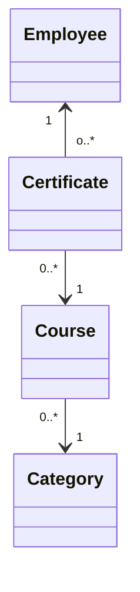

# Learning System Model Abstraction

```mermaid
classDiagram
class Category
class Course
class Employee
class Certificate
Course "0..*" --> "1" Category
Employee "1" <-- "o..*" Certificate
Certificate "0..*" --> "1" Course
```

