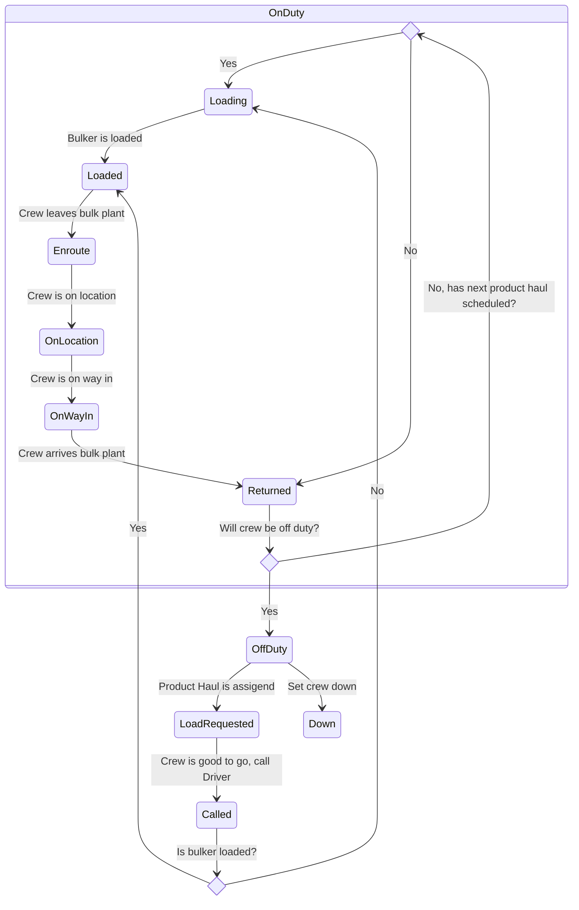
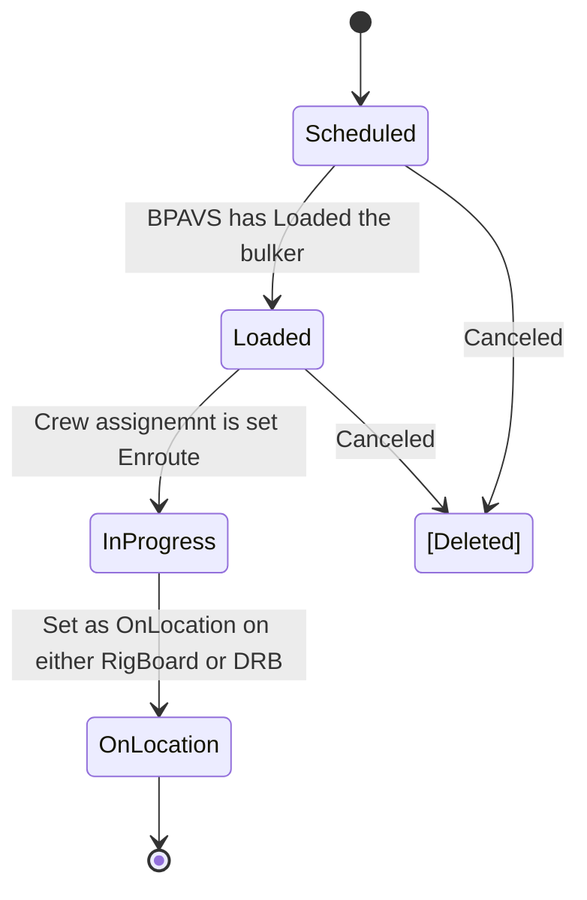
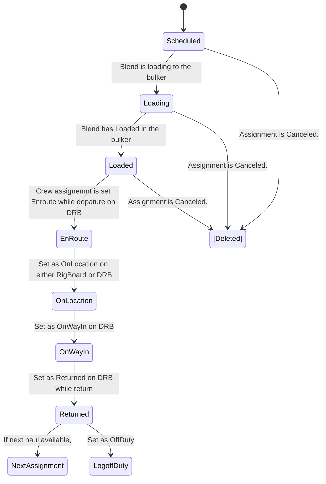

## Crew Working Cycle (Bulker Crew Log)

## Product Haul Working Cycle (Shipping status)

## Crew Assignment Life Cycle

## Status Alignment Rules

All actions are against "Current Product Haul" ONLY.

### Rig Board Actions
Product   Haul Action | Current Status        | Target Status | Description | Assignment   Status(Current) | Assignment   Status (Target) | Bulker Crew Log   Status (Current) | Bulker Crew Log   Status (Target)
-- | -- | -- | -- | -- | -- | -- | -- 
Schedule |  | Scheduled |  |                                        | Scheduled | OffDuty | LoadRequested
OnLocation [Disabled] | Scheduled, InProgress | OnLocation |  | Scheduled,   Loading, Loaded, Enroute, | OnLocation | LoadRequested, Called, Loading,   Loaded, EnRoute | OnLocation
Cancel | Scheduled | Scheduled |  | Scheduled | [Deleted] | LoadRequested, Called | OffDuty, if no   previous returned haul, no next haul
Cancel | Scheduled | Scheduled |  | Scheduled | [Deleted] | LoadRequested | LoadRequested, if   no previous returned haul, if next haul available
Cancel | Scheduled | Scheduled |  | Scheduled | [Deleted] | Called | Called, if   no previous returned haul, if next haul available 
Cancel | Scheduled | Scheduled |  | Scheduled | [Deleted] | LoadRequested,   Called | Returned, if there   are previous returned haul, no next haul available
Cancel | Scheduled | Scheduled |  | Scheduled | [Deleted] | Other statuses | No Change, scenarios other than above 4 
Reschedule | Scheduled | Scheduled | Change Expected On Location Time, Estimated Load Time, Estimate Travel Time. GoWithCrew | Scheduled | Scheduled | Any status | No Change.                                                   
Reschedule | Scheduled | Scheduled | Change   Sanjel crew (Crew 1) to another Sanjel crew (Crew 2) | Scheduled | Crew 1 follows cancel action, Crew 2, follows schedule action | Crew 1 follows cancel action, Crew 2 follows schedule action | Crew 1 follows cancel action, Crew 2, follows schedule action 
Reschedule | Scheduled | Scheduled | Change  Sanjel Crew ( Crew 1) to Third party crew (Crew 2) | Scheduled | Crew 1 follows cancel action, Crew 2, follows schedule action | Crew 1 follows cancel action, Crew 2 N/A | Crew 1 follows cancel action, Crew 2 N/A 
Reschedule | Scheduled | Scheduled | Change  Third party crew (Crew 1) to  Sanjel crew ( Crew 2) | Scheduled | Crew 1 follows cancel action, Crew 2, follows schedule action | Crew 1 N/A,  Crew 2 follows schedule action | Crew 1 N/A,  Crew 2 follows schedule action 
Reschedule | Scheduled | Scheduled | Change  Third party crew (Crew 1) to another  Third Party crew ( Crew 2) | Scheduled | Scheduled | N/A                                                          | N/A                                                          

### Bulker Assignment Board Actions

| Bulker Crew Action | PreStatus | Assignment Status(Current) | Assignment Status (Target) | Product Haul Status (Current) |  Product Haul Status (Target)  |
| ---- | ---- | -------------------------------- | ---- | ---- | ---- |
| Load Requested | Last Haul Returned or Off Duty | Scheduled | Scheduled | Scheduled | Scheduled |
| Called | Load Requested | Scheduled | Called                                                       | Scheduled | Scheduled |
| Loading | Retuned | Scheduled | Loading                                                      | Scheduled | Scheduled |
| Loading | Called | Called | Loading | Scheduled                     | Scheduled |
| Loaded | Returned | Scheduled | Loaded | Scheduled | Scheduled |
| Loaded | Called                         | Called                     | Loaded | Scheduled                     | Scheduled |
| Loaded | Loading | Loading | Loaded | Scheduled                     | Scheduled |
| EnRoute | Loaded | Loaded  | EnRoute | Scheduled                     | InProgress |
| OnLocation | Loaded                                   | Loaded | OnLocation | Scheduled | OnLocation |
| OnLocation | Enroute |  Enroute | OnLocation | InProgress | OnLocation                   |
| OnWayIn | Loaded | Loaded | OnWayIn | Scheduled | OnLocation |
| OnWayIn | Enroute | Enroute | OnWayIn | InProgress | OnLocation                   |
| OnWayIn | OnLocation | OnLocation | OnWayIn | OnLocation                    | OnLocation                   |
| Returned | Loaded | Loaded | Returned | Scheduled | Returned |
| Returned | Enroute | Enroute            | Returned | InProgress                    | Returned                     |
| Returned | OnLocation | OnLocation | Returned | OnLocation                    | Returned           |
| Returned | OnWayIn | OnWayIn | Returned | Returned             | Returned           |
| OffDuty | Returned | Returned | LogOffDuty. All of the crew's returned assignments are set as LogOffDuty | N/A      | N/A                          |
| Down | OffDuty | N/A | N/A |                               |                              |
|  |  |  |  |                               |                              |

### General Rules for multiple Hauls

- Bulker Crew Log 
  - LoadRequested status can only be set automatically when next product haul assignment is available.
  - Returned status is mandatory to allow next haul being picked up
  - Down must be flagged when Crew is OffDuty. Any reason causes crew down will be handled in proper processes, these processes will be discovered later.
  - Setting  Crew status OffDuty will set all "Returned" assignment status as LogOffDuty
- Rig Board
  - Product Haul status change only affects LoadRequested, OnLocation, OffDuty status's of Bulker Crew Log under certain circumstances. Most of Bulker Crew status's will be skipped. The logic of status skipping won't be triggered to update Assignement status and product haul status.
