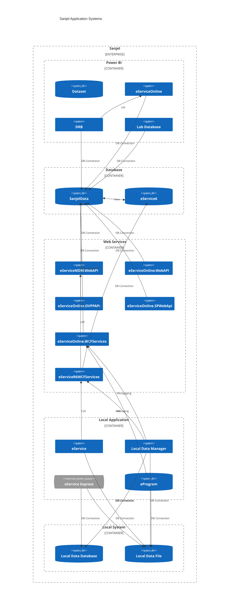

```mermaid
C4Context
      title Sanjel Application Systems
      Enterprise_Boundary(b0, "Sanjel") {
        Container_Boundary(bi, "Power BI") {
        	SystemDb(Dataset, "Dataset")
        	System(ESO, "eServiceOnline")
        	System(DRB, "DRB")
        	System(LABDB, "Lab Database")
		}
        Container_Boundary(DB, "Database") {
        	SystemDb(SDDB, "SanjelData")
		    SystemDb(ESDB, "eService6")
        }
        Container_Boundary(wsc, "Web Services") {
        	System(MDMAPI, "eServiceMDM.WebAPI")
        	System(ESOAPI, "eServiceOnline.WebAPI")
        	System(OVPPAPI, "eServiceOnline.OVPPAPI")
        	System(SPWebApi, "eServiceOnline.SPWebApi")
        	System(ESOWCF, "eServiceOnline.WCFServices")
        	System(ESWCF, "eServiceR6WCFServices")
		}
        Container_Boundary(LA, "Local Application") {
        	System(eS, "eService")
        	System(LM, "Local Data Manager")
        	SystemQueue_Ext(eSe, "eService Express")
		    SystemDb(EPRG, "eProgram")
	    }
        Container_Boundary(LS, "Local System") {
        	SystemDb(LDB, "Local Data Database")
        	SystemDb(ESXML, "Local Data File")
	    }
      }

	Rel(eS, ESWCF, "Call")
	Rel(ESWCF, ESDB, "DB Connection")
	Rel(eS, ESXML, "DB Connection")
	Rel(eSe, LDB, "DB Connection")
	Rel(eSe, ESXML, "DB Connection")
	Rel(EPRG, ESXML, "DB Connection")
	Rel(LM, ESWCF, "Messaging")
	Rel(LM, ESOWCF, "Messgaging")
	Rel(EPRG, ESOWCF, "call")
	Rel(DRB, ESO, "call")
	Rel(ESWCF, MDMAPI, "call")
	Rel(LM, LDB, "DB Connection")
	Rel(LM, ESXML, "DB Connection")
	Rel(ESO, SDDB, "DB Connection")
	Rel(DRB, SDDB, "DB Connection")
	Rel(LABDB, SDDB, "DB Connection")
	Rel(MDMAPI, SDDB, "DB Connection")
	Rel(ESOAPI, SDDB, "DB Connection")
	Rel(OVPPAPI, SDDB, "DB Connection")
	Rel(SPWebApi, SDDB, "DB Connection")
	Rel(ESOWCF, SDDB, "DB Connection")
	
	BiRel(SDDB, ESDB, "View")
	
      UpdateLayoutConfig($c4ShapeInRow="6", $c4BoundaryInRow="1")
      
```