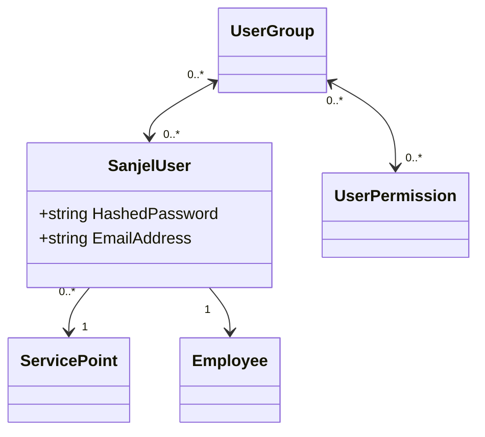

# Sanjel Security Model

## Default value for old database

### User

BusinessUnit =0

LanguageType=0

SanjelCompanyId=1

SanjeCompanyName="Sanjel Energy Services Inc."

## Goal for new model

- Migrate old security data to new model equally.
- Be sufficient to provide permission query, HasPermission(string userName, string permission)
- All entities should be versioned for tracking purpose.