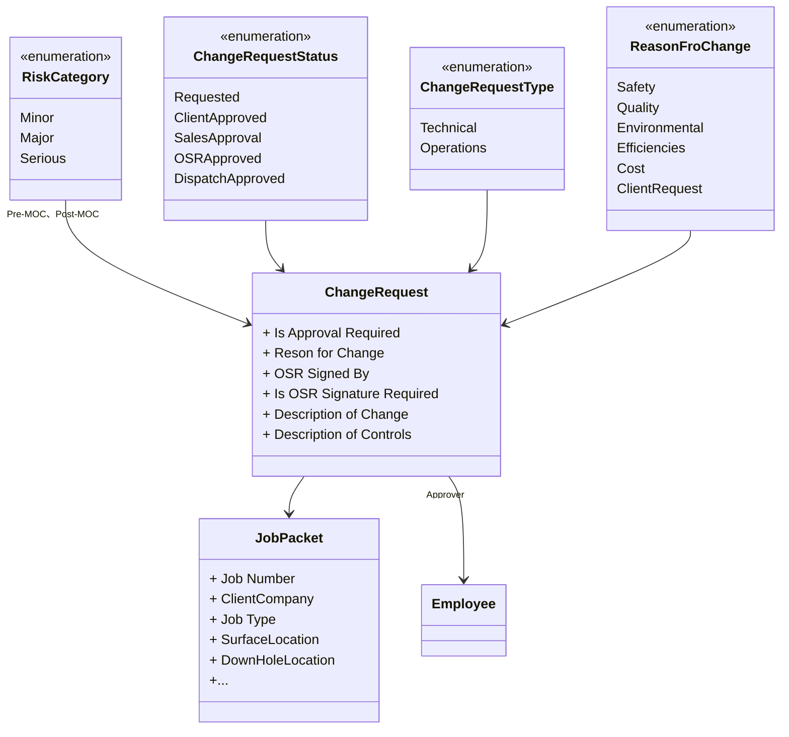

# Express MOC

## Domain Model

## Change Request

### Data Grid,Add ,edit, delete

Source of demand:

https://github.com/Sanjel-Energy-Services/eServiceExpress/issues/6

根据Phase 49 - Management of Change/Change Management UI Mock.png实现如下功能：

一、 增加/修改记录的功能。这个控件本身的弹窗功能就已经满足了需要。

二、 选中一行，显示详细内容。上面是列表，下面是详细内容。这写我给你的MOCK 是一致的。

然后是锦上添花的要求。

因为下面的内容显示框与弹窗的内容是完全一致。那么是否直接把弹窗显示在下面而不用弹出来。

1. 增加，显示一个空内容页。显示保存和取消按钮。
2. 修改，加载选中的一行记录的详细数据，数据项可以修改。显示保存和取消按钮。
3. 显示，显示选中的一行记录的详细数据，所有数据项只读，不显示任何按钮。

### Print

Source of demand：

https://github.com/Sanjel-Energy-Services/eServiceExpress/issues/8

Here is the desired print layout:

Background color：

Red    RGB :#74223c
Black RGB :#262626

 Date = Job date from eService
 Job Number, Client, Job Type, SF Location, DH Location - all from eService job package entry
 The remainder should be data entered into eService express

# EService

MOC Details

- MOC Completed: 

  - Yes 

  - No

- TYPE of MOC: 

  - Technical 

  -  Operations

- Is approval required: 

  - Yes 

  - No

- MOC Approver: 

  - If Technical - Sales & Engineering

  - If Operations – List of operations Supervisor and up (supervisor, assistant mg, mg, ops mg, ast ops mg, dispatcher)
    - If this is hard to do, leave sales, engineering and supervisor up for both

- Reason for Change: 

  - Safety

  - Quality

  - Environmental

  - Efficiencies

  - Cost

  - Client Request

- Risk Pre-MOC: 

  - Minor

  - Major

  - Serious

-  Risk Post MOC: 

  - Minor

  - Major

  - Serious

- Is OSR Signature Required? 

  - Yes

  - No

- Add another MOC – ability to fill out the same form more than once.

Control location:

Sanjel-Energy-Services\SanjelCommonLibrary\Source\Sanjel.Common.WinUI\Common\FollowPerDesign.cs

add  MOCChangeRequestView.cs    Sanjel.Common.UIProcess\Common\Presenters\MOCChangeRequestView.cs

add  IMOCChangeRequestView.cs.cs   Sanjel.Common.UIProcess\Common\Views\IMOCChangeRequestView.cs

add  MockMOCChangeRequestView.cs   Sanjel.Common.MockViews\Common\MockMOCChangeRequestView.cs

add  MockMOCChangeRequestView.cs   Sanjel.Common.WinUI\Common\MOCChangeRequest.cs

Update ServiceReportPumpingSection 

If multiple MOCs can be added, should you use the following format？

