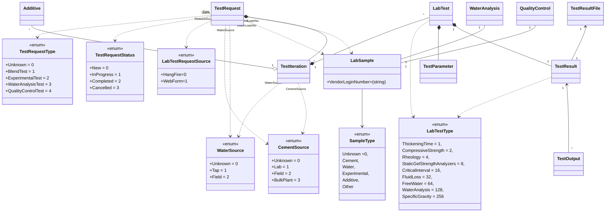
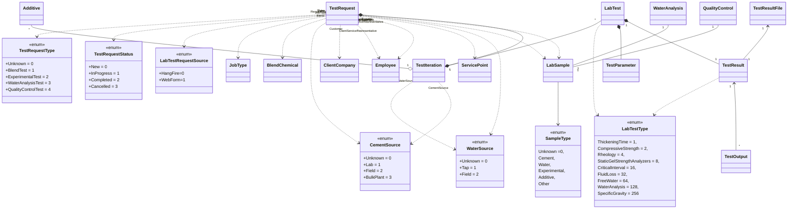

# Lab Database Domain Model

## Simplified Version

```mermaid
classDiagram
graph LR

class TestRequest
class TestIteration
class TestResult

class TestOutput
class TestResultFile


class Additive
class LabTest
class TestParameter

class LabSample{
+VendorLoginNumber=(string)
}
class WaterAnalysis
class QualityControl

class TestRequestType{
<<enum>> 
+Unknown = 0
+BlendTest = 1
+ExperimentalTest = 2
+WaterAnalysisTest = 3
+QualityControlTest = 4
}
class LabTestRequestSource{
<<enum>> 
+HangFire=0
+WebForm=1
}
class TestRequestStatus{
<<enum>>
  +New = 0
  +InProgress = 1
  +Completed = 2
  +Cancelled = 3
}
class WaterSource{
<<enum>> 
+Unknown = 0
+Tap = 1
+Field = 2
}
class CementSource{
<<enum>> 
+Unknown = 0
+Lab = 1
+Field = 2
+BulkPlant = 3 
}
class LabTestType{
    <<enum>>
    ThickeningTime = 1,
    CompressiveStrength = 2,
    Rheology = 4,
    StaticGelStrengthAnalyzers = 8,
    CriticalInterval = 16,
    FluidLoss = 32,
    FreeWater = 64,
    WaterAnalysis = 128,
    SpecificGravity = 256
}
class SampleType{
    <<enum>>
    Unknown =0,
    Cement,
    Water,
    Experimental,
    Additive,
    Other
}


TestRequest "Type"..> TestRequestType
TestRequest "Status"..> TestRequestStatus
TestRequest "RequestSource"..>LabTestRequestSource
TestRequest..>CementSource
TestRequest"WaterSource"..>WaterSource
TestRequest"WaterLoginNo"..>LabSample
TestRequest"CementLoginNo"..>LabSample

TestRequest "1" *-- "*" TestIteration

TestIteration"WaterSource"..>WaterSource
TestIteration"CementSource"..>CementSource

Additive "*" --o "1" TestIteration
LabTest "*" --* "1" TestIteration
TestResult ..> LabTestType
LabTest ..> LabTestType
LabTest *-- TestParameter
LabTest"1" *-- "1"TestResult

TestResult "1"<-- "*" TestOutput

TestResultFile "1" <-- "1" TestResult


WaterAnalysis "1"-- "1" LabSample
QualityControl "1"-- "1" LabSample

LabSample --> SampleType

```

## Detailed version

```mermaid
classDiagram
graph LR

class TestRequest
class TestIteration
class TestResult

class TestOutput
class TestResultFile


class Additive
class LabTest
class TestParameter

class LabSample
class WaterAnalysis
class QualityControl

class TestRequestType{
<<enum>> 
+Unknown = 0
+BlendTest = 1
+ExperimentalTest = 2
+WaterAnalysisTest = 3
+QualityControlTest = 4
}
class LabTestRequestSource{
<<enum>> 
+HangFire=0
+WebForm=1
}
class TestRequestStatus{
<<enum>>
  +New = 0
  +InProgress = 1
  +Completed = 2
  +Cancelled = 3
}
class WaterSource{
<<enum>> 
+Unknown = 0
+Tap = 1
+Field = 2
}
class CementSource{
<<enum>> 
+Unknown = 0
+Lab = 1
+Field = 2
+BulkPlant = 3 
}
class LabTestType{
    <<enum>>
    ThickeningTime = 1,
    CompressiveStrength = 2,
    Rheology = 4,
    StaticGelStrengthAnalyzers = 8,
    CriticalInterval = 16,
    FluidLoss = 32,
    FreeWater = 64,
    WaterAnalysis = 128,
    SpecificGravity = 256
}
class SampleType{
    <<enum>>
    Unknown =0,
    Cement,
    Water,
    Experimental,
    Additive,
    Other
}
class JobType
class ClientCompany
class Employee
class ServicePoint
class BlendChemical


TestRequest "Type"..> TestRequestType
TestRequest "Status"..> TestRequestStatus
TestRequest "RequestSource"..>LabTestRequestSource
TestRequest "JobType"..> JobType
TestRequest "Blend"..> BlendChemical
TestRequest..>CementSource
TestRequest"Customer"..>ClientCompany
TestRequest"ClientServiceRepresentative"..>Employee
TestRequest"TechnicalServiceRepresentative"..>Employee
TestRequest"WellServicePoint"..>ServicePoint
TestRequest"WaterSource"..>WaterSource
TestRequest"WaterLoginNo"..>LabSample
TestRequest"CementLoginNo"..>LabSample

TestRequest "1" *-- "*" TestIteration

TestIteration"WaterSource"..>WaterSource
TestIteration"CementSource"..>CementSource

Additive "*" --o "1" TestIteration
LabTest "*" --* "1" TestIteration
TestResult ..> LabTestType
LabTest ..> LabTestType
LabTest *-- TestParameter
LabTest"1" *-- "1"TestResult

TestResult "1"<-- "*" TestOutput

TestResultFile "1" <-- "1" TestResult


WaterAnalysis "1"-- "1" LabSample
QualityControl "1"-- "1" LabSample

LabSample --> SampleType

```