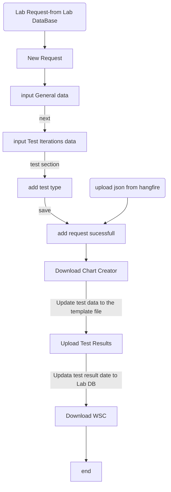
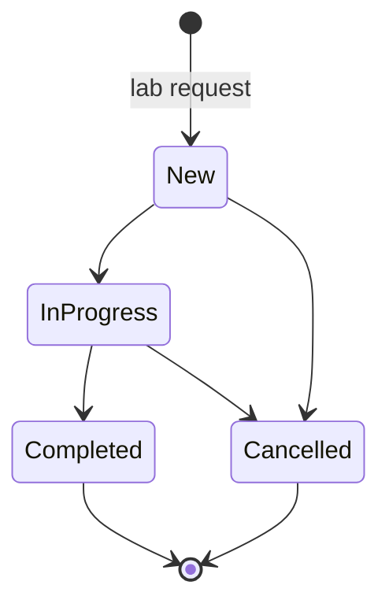

# Lab Request

## Business Description

After obtaining the Sample login, an lab request will be created. There are two ways to create a lab request

1. Lab personnel manually create a lab request directly in the lab database application.
2. Import a JSON file into a lab request.

After the lab request is successfully created, the lab personnel will upload the test data and test results to the system.

 If multiple test are required, you can continue to create test iterations in the lab request, add test types and upload test results as needed.

## Business Process

## State diagram

## Data list

The list displays the request data list, supports pagination, 20 pieces of data per page,

request id:system automatically generates it, supports fuzzy search, and clears the search criteria to display all data.

Blend:support fuzzy search, and clear the search criteria to display all data.。

Client Name:support fuzzy search, and clear the search criteria to display all data.。

Program No:Program ID,support fuzzy search, and clear the search criteria to display all data.。

Request On:Request submission time, automatically generated by the system, does not support search

Test Type: including the test type in all iterations of the lab request, deduplicated display, does not support search.

Only the abbreviations to be shown in the grid

ThickeningTime = TT
 FluidLoss = FL
 FreeWater = FW
 Rheology = Rheo
 CompressiveStrength = CS
 StaticGelStrengthAnalyzers = SGSA
 CriticalInterval = CI
 WaterAnalysis = WA
 SpecificGravity = SG。

Date Required：does not support search。

Requested By：The system automatically generates during manual entry, and the field is empty when the Json file is imported.

status：The default status of new data is New, and search is not supported.

## New Request

The lab request has two parts of data, General is the default request information, and Test Iterations is the default test iteration data。

### General

General is the default request information, including:：

Program Number: lab request Corresponding Program id。

Date Required:date control。

Client:client name，Support for fuzzy search。

CS Rep: Support for fuzzy search。

Well Name：text box。

LSD：location information，text box。

Blend Source：text box。

Job Type：text box。

BHCT：temperature information，A text box that only allows numeric values to be entered。

BHST：temperature information，A text box that only allows numeric values to be entered。

Blend Base：Support for fuzzy search，required fields。

Pressure：，A text box that only allows numeric values to be entered。

TMD： text box。

TVD：A text box that only allows numeric values to be entered。

District(service point)：Support for fuzzy search。

TS Rep：dropdown list box。

Land and Go：The display type is switch , the default value is No。

One Page Report：The display type is switch , the default value is No。

Comments:text area。

### Test Iterations

When adding a new lab request, there will be one test iteration data by default, including:

Meet Requirements：The display type is switch , the default value is No。

Target Density：，required fields。

SG Slurry：

Salt：dropdown list box：NaCI、KCI。

Salt Concentration：

Cement Source，dropdown list box：BulkPlant 、Field 、Lab，required fields。

Cement Login：Number corresponding to Sampl login，text box，Support for fuzzy search。

Water Source：dropdown list box：Field,Tap。

Water Login：Number corresponding to Sampl login，text box，Support for fuzzy search。

#### Additives Section：

Name：Support for fuzzy search。

Concentration：

Pre-Hyd：The display type is switch , the default value is No。

#### Test Section

Test Types,There are 7 test types ，A type can be added only once。

Test Types：

- CompressiveStrength

  min：Min value，Input text box。

  max：Max value，Input text box。

  UCA：The display type is switch , the default value is Yes，Allow editing。If it is blank, the default value is Yes when Import from JSON 。

- FluidLoss 

  min：Min value，Input text box。

  max：Max value，Input text box。

- FreeWater

  min：Min value，Input text box。

  max：Max value，Input text box。

  angle：

- Rheology

  min：Min value，Input text box。

  max：Max value，Input text box。

  Bob Type：dropdown list：B1、 B5。

  Surface Rheo：The display type is switch , the default value is NO，Allow editing。If it is blank, the default value is No when Import from JSON 。

- SpecificGravity

  min：Min value，Input text box。

  max：Max value，Input text box。

- StaticGelStrengthAnalyzers

  min：Min value，Input text box。

  max：Max value，Input text box。

  criticalinterval：The display type is switch , the default value is NO，Allow editing。

  criticalinterval_max：When the criticalintervalswitch is Yes, editing is allowed 。

- ThickeningTime

  100：The display type is switch , the default value is NO，Allow editing。

  100min：When the 100 switch is Yes, editing is allowed，Min value，Input text box。

  100max：When the 100 switch is Yes, editing is allowed，Max value，Input text box。

  70：The display type is switch , the default value is NO，Allow editing。

  70min：When the 70 switch is Yes, editing is allowed，Min value，Input text box。

  70max：When the 70 switch is Yes, editing is allowed，Max value，Input text box。。

  40：The display type is switch , the default value is NO，Allow editing。

  40min：When the 40 switch is Yes, editing is allowed，Min value，Input text box。

  40max：When the 40 switch is Yes, editing is allowed，Max value，Input text box。。

  Hesitation：The display type is switch , the default value is NO，Allow editing。If it is blank, the default value is No when Import from JSON。When the three switches 100, 70 and 40 are all turned off, this attribute is ignored 。

### Test Result

测试结果查看。

### Detail

Details page

#### General

#### Test Iterations

The iteration information is displayed on the left, and the data of Test Iterations 1 is loaded by default. 

Click other iteration names to display the corresponding Test Iterations data.

 Test Iterations data is displayed in four parts: Basic Information, Test Section, Additives, and Comments

##### Download Chart Creator

There are four types of downloads chart :

- Thickening Time
- Compressive Strength
- Rheology
- Static Gel Strength Analyzers

Download the corresponding excel file, you need to supplement the test results in the file.

##### Upload Result

up load test result file。

##### Download WSC

No yet。。

##### Edit

Only the following four attribute information are allowed to be modified:

Cement Source，dropdown list box：BulkPlant 、Field 、Lab，required fields.

Cement Login：Number corresponding to Sampl login，text box，Support for fuzzy search.

Water Source：dropdown list box：Field,Tap.

Water Login：Number corresponding to Sampl login，text box，Support for fuzzy search.

Other properties cannot be edited.

##### Clone

Click the request ID number in the Lab Request data list to enter the details page, and use the Clone function in the Test Iterations tab to copy the current iteration data and recreate a test iteration.

The data is consistent with the current test iterations, and all data is allowed to be edited and modified.

In the test type of Clone, the new attribute value is the default value.

