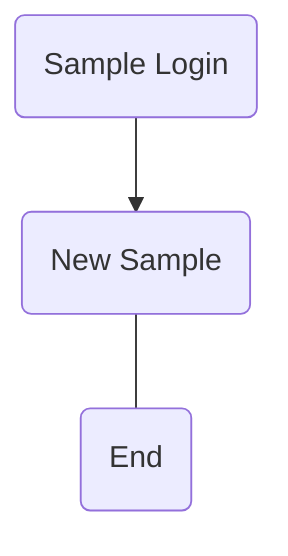
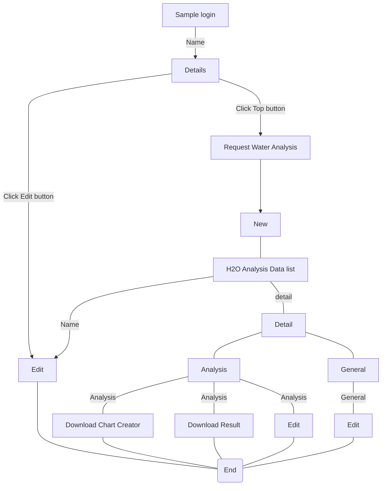
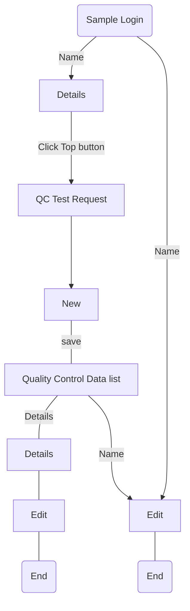
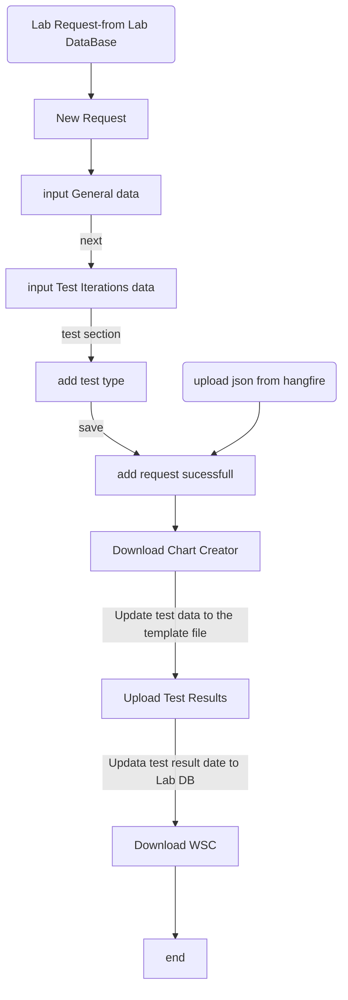
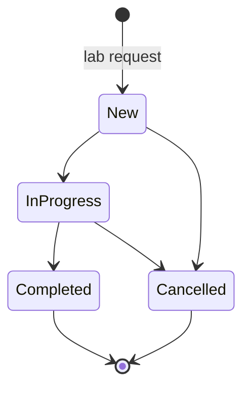

## Sample Login业务流程

```mermaid
graph TB;

A(Sample Login)
A-->B(New Sample)
B---J3(End)
```

# H2O analysis新增流程

```mermaid
graph TB;

A[Sample login]
A--Name-->B[Details]
B--Click Edit button--->C[Edit]
B--Click Top button--->H[Request Water Analysis]
H--->K[New]
K---M[H2O Analysis Data list] 
M--Name--->C[Edit]
M--detail---O2[Detail]
O2---Q1[Analysis]
O2---Q2[General]
Q1--Analysis---Q11[Download Chart Creator]
Q1--Analysis---Q12[Download Result]
Q1--Analysis---Q13[Edit]
Q2--General---Q21[Edit]
Q11---J(End)
Q12---J(End)
Q13---J(End)
Q21---J(End)
C---J(End)
```

# Quality Control 新增流程

```mermaid
graph TB;

A(Sample Login)
A--Name-->B[Details]
A--Name-->C[Edit]
B--Click Top button--->D[QC Test Request]
D--->E[New]
E--save---F[Quality Control Data list] 
F--Details---F1[Details]
F--Name--->C[Edit]
F1---F11[Edit]
C---J(End)
F11---H(End)
```

# Lab Request业务流程

```mermaid
graph TB;
A(Lab Request-from Lab DataBase)
A-->B[New Request]
B-->C[input General data]
C--next-->D[input Test Iterations data]
D--test section-->E[add test type ]
E--save-->F[add lab request sucessfull ]
E1(upload json from hangfire)
E1-->F[add request sucessfull]
F-->G[Download Chart Creator]
G--Update test data to the template file--->H[Upload Test Results]
H--Updata test result date to Lab DB--->F4[Download WSC]
F4--->f5[end]
```

状态图

```mermaid
stateDiagram

s1: New
s2: InProgress
s3: Completed
s4: Cancelled

[*]-->s1: lab request
s1-->s2
s1-->s4
s2-->s3
s2-->s4
s3-->[*]
s4-->[*]
```

