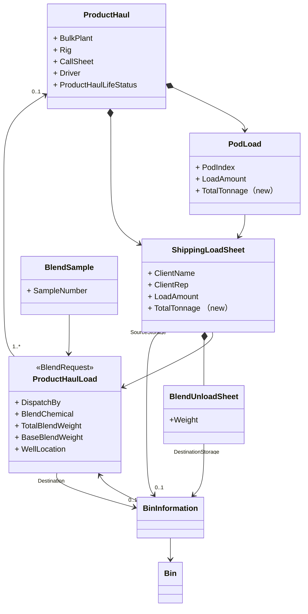
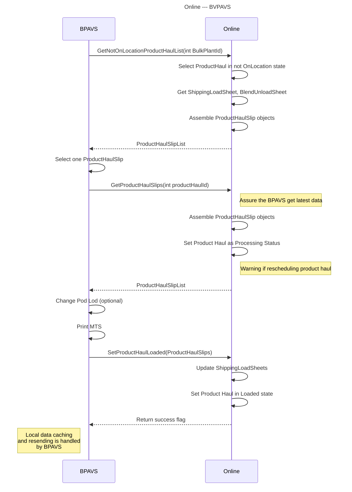

# MTS（装车单）

Generate MTS based on the existing ProductHaul-related online business entity and push it to BPAVS through Web API. 

# Domain Model



> 首先梳理概念模型，做得很好。在本次开发中，我们最大的修改是解耦了ProductHaul和BlendRequest，但是由于历史原因，BlendRequest的代码类名还是叫做ProductHaulLoad。所以后面中提到的都是ProductHaul，需要特别小心，除非特别标明BlendRequest

> 在一个ProductHaul中，一个CallSheetNumber对应的所有ShippingLoadSheet构成一个MTS

Business Process



## MTS-Number

MTS- [ProductHaul.Id]-L[ShippingLoadSheet Sequence]-[ShippingLoadSheet.CallSheetNumber]

E.g. MTS-42918-L1-1107407
>
> ​                                                                      MTS-[Product Haul Id]-L[Shipping Load Sheet Group Order]-[CallSheetNumber], e.g. MTS-42918-L1-1111467.


## Header

> Header 信息中全部来自ProductHaul

Date: CurrentTime

Unit: ProductHaul.TractorName or ProductHaul.ThirdPartyUnitNumber

Driver:ProductHaul.Driver or ProductHaul.ContractorCompanyName


Gowith Crew:ProductHaul.IsGoWithCrew

Est Load Time: ProductHaul.EstimateLoadTime

Exp On Location Time：ProductHaul.ExpectedOnLocationTime


Station:ProductHaul.BulkPlant

~~Best Bin:~~

Client:ShippingLoadSheet.ClientName、

Client Rep: ShippingLoadSheet.ClientRepresentative


Rig: ShippingLoadSheet.Rig

Location :CallSheet.WellLoaction

Dispatched By: ProductHaul.ModifiedUserName


## TABLE1 BULKER POD LOADS

| Pod # | Total Tonnage | PRODUCT                                                      | Base Tonnage | Temp |
| ----- | ------------- | ------------------------------------------------------------ | ------------ | ---- |
| 1     | 8t            | ECOprime + 0.8% CFL-11 + 0.5% SCA-6 + 0.5% SCA-7 + 0.25% MCR-7 + 0.3% ASM-3 +1% FWC-2 + 0.2% CDF-6P | 8.28t        |      |
| 2     | 3t            | ECOprime + 0.8% CFL-11 + 0.5% SCA-6 + 0.5% SCA-7 + 0.25% MCR-7 + 0.3% ASM-3 +1% FWC-2 + 0.2% CDF-6P | 3.11t        |      |
| 3     | 5m3           | Visweep DM IS + 433kg/m3 Bulk Ground Silica + 7kg/m3 WG-6P + 20kg/m3 WWS-7P +5kg/m3 SA-2P + 20kg/m3 MT-1 + 5kg/m3 MT-2 + 6kg/m3 DF-6P | 3.97t        |      |
| 4     |               |                                                              |              |      |

> Pod是从ProductHaul.PodLoad获得，在一个MTS中只显示与当前ShippingLoadSheet有关联的Pod的数据

Pod: PodLoad.PodIndex+1

BaseTonnage: Pod.TotalTonnage 

> 今天SanjelData中新增这个属性

Product : ShippingLoadsheet.BlendDescription

Total Tonnage:Pod.LoadAmount

Temp: This field currently has no data and will be automatically populated by BPAVS in the future.。


## TABLE2 TOTAL WEIGHT & SAMPLE #

| Blend Request # | Total Tonnage | PRODUCT                                                      | Base Tonnage | Sample# | Requested By | Blended By |
| --------------- | ------------- | ------------------------------------------------------------ | ------------ | ------- | ------------ | ---------- |
| 45678           | 11t           | ECOprime + 0.8% CFL-11 + 0.5% SCA-6 + 0.5% SCA-7 + 0.25% MCR-7 + 0.3% ASM-3 +1% FWC-2 + 0.2% CDF-6P | 8.28t        |         |              |            |
| 12345           | 5m3           | Visweep DM IS + 433kg/m3 Bulk Ground Silica + 7kg/m3 WG-6P + 20kg/m3 WWS-7P +5kg/m3 SA-2P + 20kg/m3 MT-1 + 5kg/m3 MT-2 + 6kg/m3 DF-6P | 3.97t        |         |              |            |
|                 |               |                                                              |              |         |              |            |

Blend Request #: ShippingLoadSheet.ProductHaulLoad.Id

Base Tonnage: ShippingLoadSheet.TotalTonnage 

> 今天SanjelData中新增这个属性

Product : ShippingLoadsheet.BlendDescription

Total Tonnage :ShippingLoadsheet.LoadAmount

Sample #: Obtain from BlendSample.SampleNumber

RequestedBy：ShippingLoadSheet.ProductLoad.ModifiedUserName

BlendedBy： BlendLog.BulkPlantOperator， BlendLog can be retrieved by ProductHaulLoad.Id

### Question

~~Sample:Blend test为True,Sample显示为Lab吗？看文档中有的显示Lab，有的显示为1，不太清楚值得来源和依据？~~

> 我会近期下达一个实现BlendSample的任务，这个任务SampleNumber会与从BlendSample中取得
>


## TABLE3 UNLOAD INSTRUCTION

| Bin # | Total Tonnage | Product                                                      | Base Tonnage |
| ----- | ------------- | ------------------------------------------------------------ | ------------ |
| 2169  | 5.5t          | ECOprime + 0.8% CFL-11 + 0.5% SCA-6 + 0.5% SCA-7 + 0.25% MCR-7 + 0.3% ASM-3 +1% FWC-2 + 0.2% CDF-6P | 4.14t        |
| 2170  | 5.5t          | ECOprime + 0.8% CFL-11 + 0.5% SCA-6 + 0.5% SCA-7 + 0.25% MCR-7 + 0.3% ASM-3 +1% FWC-2 + 0.2% CDF-6P | 4.14t        |
| 2180  | 5m3           | Visweep DM IS + 433kg/m3 Bulk Ground Silica + 7kg/m3 WG-6P + 20kg/m3 WWS-7P +5kg/m3 SA-2P + 20kg/m3 MT-1 + 5kg/m3 MT-2 + 6kg/m3 DF-6P | 3.97t        |


| Printed by | S Farthing | Loaded By: |      |
| ---------- | ---------- | ---------- | ---- |

Bin#:BlendUnloadSheet.DestinationStorage

Base Tonnage : BlendUnloadSheet.ShippingLoadSheet.TotalTonnage 

Product : ShippingLoadsheet.BlendDescription

Total Tonnage :Pod.LoadAmount

Printed by :The currently logged-in user, this property is empty when pushing data through the API.

Loaded by: Leave blank for operator signature or to be filled in by BPAVS at a later time。

## Print Rule

- MTS print is requested by product haul id.
- One page MTS call sheet if ShippingLoadSheet.CallSheetNumber is not 0, group shipping loadsheets by call sheet number.
- If ShippingLoadSheet.CallSheetNumber is 0, one page MTS per ShippingLoadSheet
- MTS Serials number format is MTS-[Product Haul Id]-L[Shipping Load Sheet Group Order]-[CallSheetNumber], e.g. MTS-42918-L1-1111467.

## Tasks

- [ ] Synchronize the new attributes Pod.TotalTonnage and ShippingLoadSheet.TotalTonnage to the Online system

  - [ ] Pod.TotalTonnage属性在创建Pod的时候赋值，值来源：ProductHaulLoad.BaseBlendWeight、 ShippingLoadSheet.TotalTonnage。

  - [ ] ShippingLoadSheet.TotalTonnage属性值获取方式通过看视频是ShippingLoadsheet.BlendDescription相同时对Pod.TotalTonnage求和而得出。Pod.LoadAmount也是同样的获取方式。

    > 视频中是现在的系统，在我们提供下载ProductHaul数据后，视频中的数据录入功能就不存在了，而是直接加载下载到的数据记录

- [ ] GetNotOnLocationProductHaulList(int BulkPlantId)

  返回ProductHaul.ProductHaulLifeStatus!=Onloaction状态的所有数据列表。

  - [ ] 新定义一个ProductHaulSlips 的ViewModel用于存放组装后的数据
  - [ ] Generation of MTS-Number， The format is ：MTS-ProductHaul.Id-ShippingLoadSheet.CallSheetNumber
  - [ ] GetMTSHead()
  - [ ] GetBulkerPodLoads()
  - [ ] GetTotalWeightAndSample()
  - [ ] GetUnLoadInstruction()
  - [ ] Also obtain the unit information corresponding to the transportation quantity（t）

- [ ] SetProductHaulInprogress(ProductHaulSlips)

  - [ ] Update the ProductHaul status to Inprogress.

- [ ] SetProductHaulLoaded(ProductHaulSlips)

  - [ ] Add a new 'Loaded' status to the enumeration for ProductHaul status
  - [ ] Update the LoadAmount and Tonnage information for ShippingLoadSheet and PodLoad.
  - [ ] Update the ProductHaul status to Loaded.
  - [ ] Update the Shippingloadsheetstatus to Loaded.

  > BPAVS端能改的数据并不多，只有Table 2中的每个Pod中的Base Tonnage和Total Tonnage. 不需要全部回传。这个与任务一是重复的。

  > BPAVS端数据处理不归我们管，我们只要每次通过API提供最新数据即可

  ### 问题

  在极端情况下同步存在时差，导致数据冲突，例如数据 PorductHaul A按顺序进行如下操作：

  1. BPAVS同步 V1

  2. Online 端进行了update操作V2，

  3. BPAVS回传更新数据V3

     此种情况下存会在数据冲突，目前还没想到好的解决办法。
     
     > 不会出现这种极端情况的，业务流程上这两步是顺序进行的，一般不会出现交叉的。在BPAVS加载了一条记录进行处理，我们可以给ProductHaul服务器端设一个状态来禁止Reschedule操作。
     >
     > 另外，下载也是分两步的，在进入MTS处理时，首先下载的是ProductHaul的列表，而在选中一个ProductHaul后，重新下载选中的ProductHaul和ShippingLoadSheet, BlendUnloadSheet这些细节。BPAVS可能会要在列表下载时得到全部数据，放在本地缓存，但是用到细节时，要求重新下载细节。只有在断线时，才直接使用缓存中的数据。
     >
     > 你需要把业务流程画一下，用交互图，这样可以识别出交互的接口。这是两个系统的集成，不能按一个系统的思路去考虑。
     
  
- [ ] **Product Haul JSON Structure**

  ```json
  {
  	"Id": 42918,
  	"EstimatedLoadTime": "7/11/2023 7:00:00 PM",
  	"ExpOnLoactionTime": "7/11/2023 7:00:00 PM",
  	"Crew": "Jonathan Sajtos | 446135 | 746135",
  	"ProductHaulDescription": "Haul 26.5t PRODUCTIONmix LW on Jul 13,2023;Offload 26.5t to Bin 1869.",
      "Rig":"Bonanza 2/Ensign 886",
      "WellLocation":"102/7-16-31-19w3",
  	"GoWithCrew": "Yes",
  	"Station": "GP Bulk Plant",
      "Status":"Scheduled"
  }
  ```
  
- [ ] **Product Haul List API**

```c#
ActionResult GetScheduledProductHaulListByBulkPlant(int bulkPlantId)
```

​     

- [ ] **Product Haul Details Json  Structure:**

  ```json
  {
  	"Id": 42918,
  	"Date": "[Current Time when printing]",
  	"Unit": "[Bulk Unit Number or Third Party Company Name]",
  	"Driver": "[Driver Name]",
  	"GoWithCrew": "Yes",
  	"Station": "GP Bulk Plant",
  	"ShippingLoadSheet1": {
  		"Id": 2798,
  		"GoWithCrew": "No",
  		"EstimatedLoadTime": "7/11/2023 7:00:00 PM",
  		"ExpOnLoactionTime": "7/11/2023 7:00:00 PM",
  		"Client": "Arc Resources Ltd.",
  		"ClientRep": "Rick Finkle",
  		"Rig": "Ensign 886",
  		"Loaction": "102/05-17-031-21W3/00",
  		"DispatchedBy": "Jordan Parish",
  		"OffloadInstruction": {
  			"Bin1": {
  				"Bin": "1985",
  			"BaseTonnage": 8,
  			"BaseTonnageUnit": "t",
  			"Product": "ECOprime + 0.5% SCA-7 + 0.25% MCR-7 + 0.3% ASM-3 +1% FWC-2 + 0.2% CDF-6P",
  			"TotalTonnage": 8.28,
  			"TotalTonnageUnit": "t",
  			},
  			"Bin2": {
  				"Bin": "1958",
  			"BaseTonnage": 3,
  			"BaseTonnageUnit": "t",
  			"Product": "ECOprime + 0.5% SCA-7 + 0.25% MCR-7 + 0.3% ASM-3 +1% FWC-2 + 0.2% CDF-6P",
  			"TotalTonnage": 3.11,
  			"TotalTonnageUnit": "t",
  			}
  		}
  	},
  	"ShippingLoadSheet1": {
  		"ShippingLoadSheetId": 2799,
  		"GoWithCrew": "Yes",
  		"EstimatedLoadTime": "7/11/2023 7:00:00 PM",
  		"ExpOnLoactionTime": "7/11/2023 7:00:00 PM",
  		"Client": "Whitecap Resources Inc.",
  		"ClientRep": "Morgan Sweeting",
  		"Rig": "Bonanza 2",
  		"Loaction": "102/7-16-31-19w3",
  		"DispatchedBy": "Jordan Parish",
  		"OffloadInstruction": {}
  		}
  	},
  	"BulkerPodLoad": {
  		"Pod1": {
  			"PodIndex": 0,
  			"ShippingLoadSheetId": 2798,
  			"BaseTonnage": 8,
  			"BaseTonnageUnit": "t",
  			"Product": "ECOprime + 0.5% SCA-7 + 0.25% MCR-7 + 0.3% ASM-3 +1% FWC-2 + 0.2% CDF-6P",
  			"TotalTonnage": 8.28,
  			"TotalTonnageUnit": "t",
  			"Temp": 18.5
  		},
  		"Pod2": {
  			"PodIndex": 1,
  			"ShippingLoadSheetId": 2798,
  			"BaseTonnage": 3,
  			"BaseTonnageUnit": "t",
  			"Product": "ECOprime + 0.5% SCA-7 + 0.25% MCR-7 + 0.3% ASM-3 +1% FWC-2 + 0.2% CDF-6P",
  			"TotalTonnage": 3.11,
  			"TotalTonnageUnit": "t",
  			"Temp": 19
  		},
  		"Pod3": {
  			"PodIndex": 2,
  			"ShippingLoadSheetId": 2799,
  			"BaseTonnage": 5,
  			"BaseTonnageUnit": "m3",
  			"Product": "Visweep DM + 400.1kg/m3 Bulk Ground Silica + 3.5kg/m3 WG-4P + 1kg/m3 SCA-5 + 1.5kg/m3 DF-6P",
  			"TotalTonnage": 2.03,
  			"TotalTonnageUnit": "t",
  			"Temp": 15
  		},
  		"Pod4": {
  			"PodIndex": 3,
  			"ShippingLoadSheetId": 0,
  			"BaseTonnage": 0,
  			"Product": "",
  			"TotalTonnage": 0,
  			"TotalTonnageUnit": "",
  			"Temp": 0
  		}
  	},
  	"TotalWeightsSample": {
  		"Blend1": {
  			"BlendRequestId": 46400,
  			"BaseTonnage": 11,
  			"BaseTonnageUnit": "t",
  			"Product": "ECOprime + 0.5% SCA-7 + 0.25% MCR-7 + 0.3% ASM-3 +1% FWC-2 + 0.2% CDF-6P",
  			"TotalTonnage": 11.39,
  			"TotalTonnageUnit": "t",
  			"Sample": "",
  			"RequestedBy": "",
  			"BlendedBy": "jshaw"
  		},
  		"Blend2": {
  			"BlendRequestId": 46399,
  			"BaseTonnage": 5,
  			"BaseTonnageUnit": "m3",
  			"Product": "Visweep DM + 400.1kg/m3 Bulk Ground Silica + 3.5kg/m3 WG-4P + 1kg/m3 SCA-5 + 1.5kg/m3 DF-6P",
  			"TotalTonnage": 2.03,
  			"TotalTonnageUnit": "t",
  			"Sample": "",
  			"RequestedBy": "",
  			"BlendedBy": "jshaw"
  		}
  	}
  }
  ```
  
- [ ] **Product Haul Details API**

  ```c#
  ActionResult GetProductHaulDetail(int productHaulId)
  ```

  

