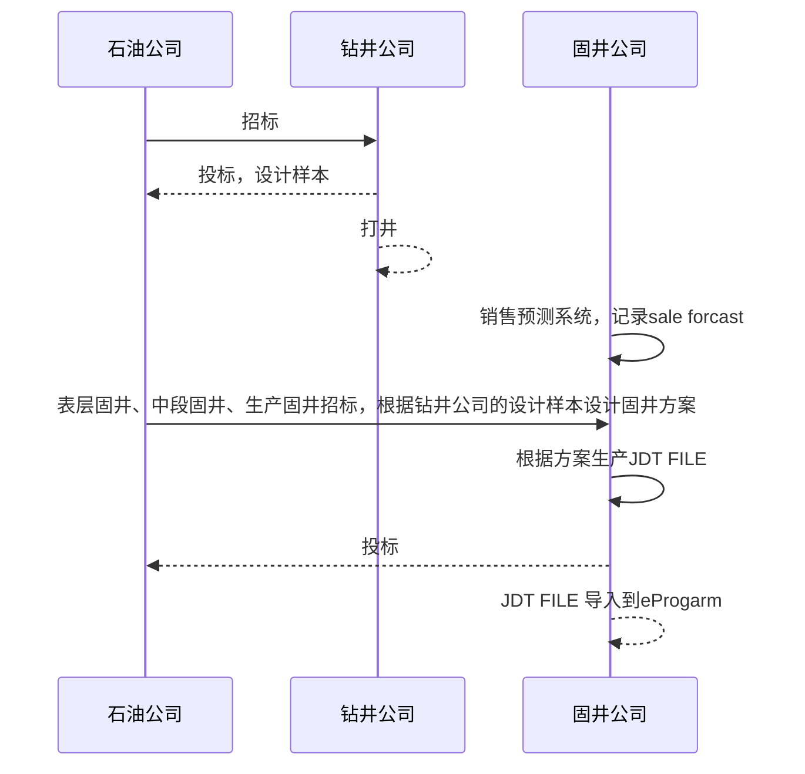
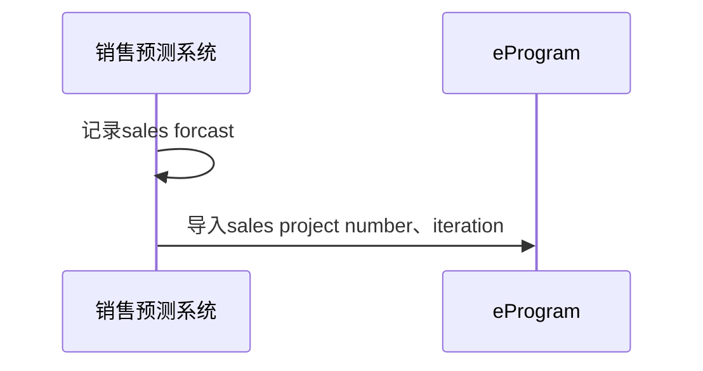
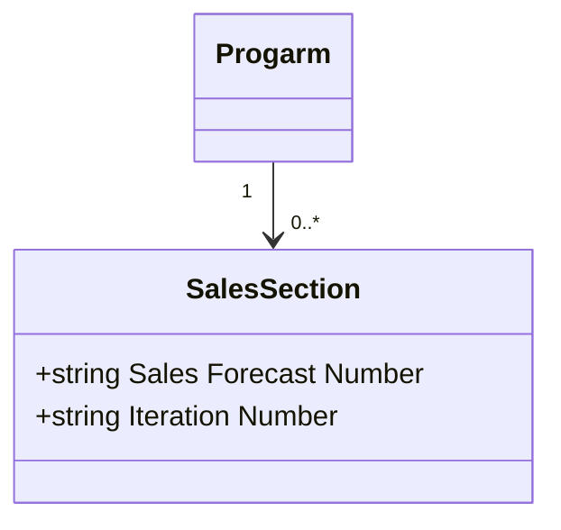

# Domain Business

Domain Model

**Use Cases**

**Use case 1**: Import Sales Forecast Numbers and Iterations

Actors: E-program User

Description: This use case enables E-program User to import sales forecast number and iteration number into E-program.

Preconditions:

* The user has access to E-program and has permissions to import sales forecast project information into E-program.

Postconditions:

* The Sales Forecast Project information could be imported successfully in to E-program, including Sales Forecast Number and Iteration Number.

Flow of Events:

* The  E-program User login E-program system and click on NEW button on left corner.

* The system will display a window with click button. User should be able to click on Browse button to select the file  containing the sales forecast numbers and iteration number.

* The user selects the file and uploads it to the system.

* The system verifies the data and displays any errors or warning.

* If there are no errors or warnings, the system imports the sales forecast numbers and  iteration numbers into E-program.

* The system notifies the user that the import was successful.

  **Use Case 2**: Add/Edit Sales Forecast References

Actors: E-program User

Description: This use case enables the E-program User to manually add or edit sales forecast references for a program in E-Program.

Preconditions: 

- The user  should be able to login E-program.
- The user has the necessary permissions to add or edit Sales Forecast Number and Iteration Number.

Postconditions: 

- The sales forecast references are successfully added or edited for the selected program in E-Program.

Flow of Events:

1. The E-program User clicks one program in E-program platform. 
2. The user could add or edit sales forecast number.
3. The user clicks the "Finish" button.
4. The system verifies the data and displays any errors or warnings.
5. If there are no errors or warnings, the system adds or edits the sales forecast reference for the selected program in E-Program.
6. The system notifies the user that the sales forecast reference was successfully added or edited.

