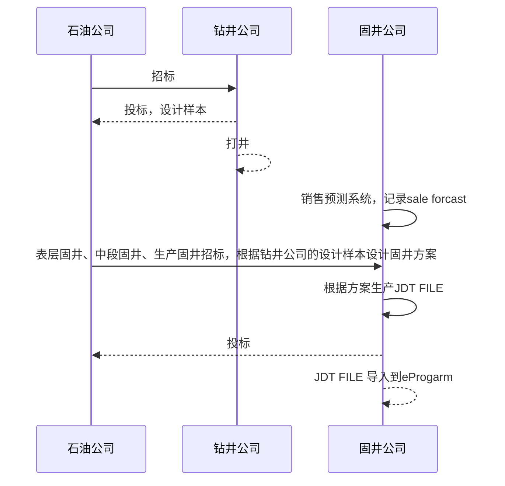
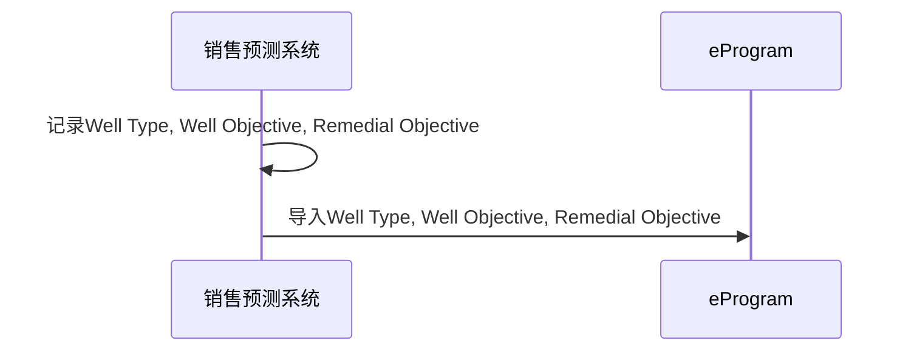
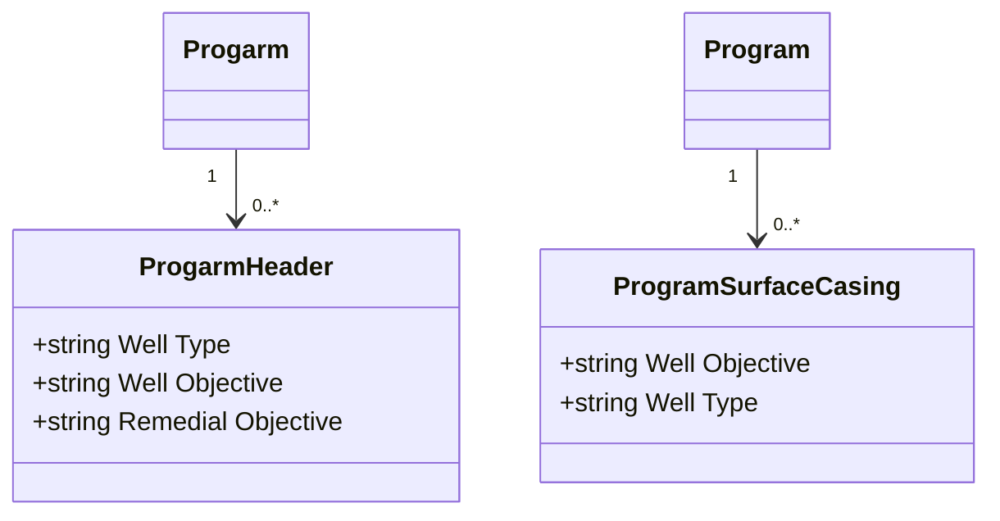

# Domain Business

Domain Model

**Use Cases**

**Use Case 1**: Import the data of Well Type, Well Objective and Remedial Objective into E-program

Actors: E-program User

Description: This use case enables the E-program User to import the data of Well Type, Well Objective and  Remedial Objective into E-Program.

Preconditions: 

- The user is logged in to E-Program.
- The user has the necessary permissions to import  Well Type, Well Objective and  Remedial Objective.

Postconditions: 

- The data of  Well Type, Well Objective and  Remedial Objective are successfully imported into Remedial Objective.

Flow of Events:

1. The  E-program User login E-program system and click on NEW button on left corner.

2. The system will display a window with click button. User should be able to click on Browse button to select the file  containing Well Type, Well Objective and  Remedial Objective 

3. The user selects the file and uploads it to the system.

4. The system verifies the data and displays any errors or warnings.

5. If there are no errors or warnings, the system imports the sales forecast numbers and iterations into E-Program.

6. The system notifies the user that the import was successful.

   **Use Case 2**: Add/Edit  Well Type, Well Objective and  Remedial Objective

   Actors: E-program User

   Description: This use case enables the E-program User to manually  edit  Well Type, Well Objective and  Remedial Objective for a program in E-Program.

   Preconditions: 

   - The user  should be able to login E-program.
   - The user has the necessary permissions to add or edit Well Type, Well Objective and  Remedial Objective.

   Postconditions: 

   - The  value of Well Type, Well Objective and  Remedial Objective are successfully  edited for the selected program in E-Program.

   Flow of Events:

   1. The E-program User clicks one target program in E-program platform. 
   2. The user could  edit the value of  Well Type, Well Objective and  Remedial Objective.
   3. The user clicks the "Finish" button.
   4. The system verifies the data and displays any errors or warnings.
   5. If there are no errors or warnings, the system  saves the revised data of Well Type, Well Objective and  Remedial Objective for the selected program in E-Program.
   6. The system notifies the user that the revised data of Well Type, Well Objective and  Remedial Objective had been successfully  edited.
