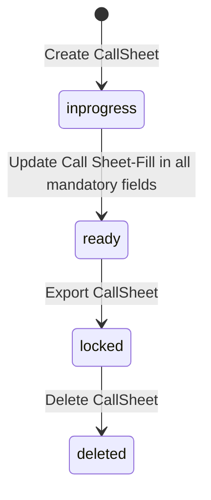
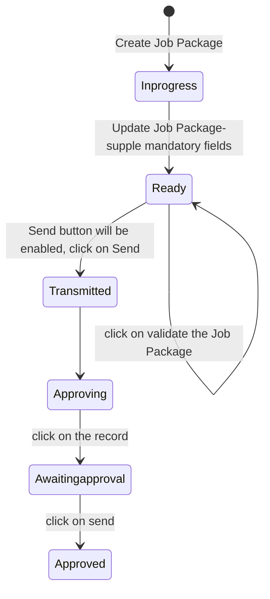

Status Change Flow

Call Sheet Status Flow :

```mermaid
stateDiagram
State Createcallsheet
State Fillinmandatoryfields
State Exportcallsheet
State Deletecallsheet

S1:inprogress
S2:ready
S3:locked
S4:deleted 

[*]-->S1: Create CallSheet
S1-->S2: Update Call Sheet-Fill in all mandatory fields
S2-->S3: Export CallSheet
S3-->S4: Delete CallSheet
```

Job Package Status Flow:

```mermaid
stateDiagram
state create_Jobpackage  
state fill_inmandatoryfileds  
state sendtoApprovalList  
state Approval 
S1: Inprogress
S2: Ready
S3: Transmitted
S4: Approving
S5: Awaitingapproval
S6: Approved


[*]-->S1:Create Job Package
S1-->S2:Update Job Package-supple mandatory fields
S2-->S2:click on validate the Job Package
S2-->S3:Send button will be enabled, click on Send
S3-->S4
S4-->S5:click on the record
S5-->S6:click on send
```

