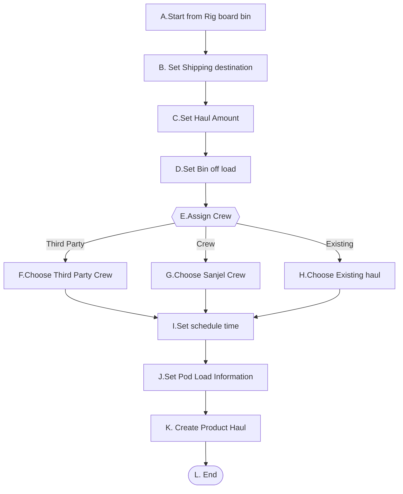

# 1. Back Haul 

它的前提条件是在Rig 分配的Bin中有Blend已经存在。

- Blend 已经存在, 场景是Back haul in Rig Bin。这个场景的上游场景有On locaiton和Adjust Blend Amount,Transfer Blend。

  

## 1-1. Back Haul Blend in Rig Bin

### High Level Workflow

### Detail Workflow

### Use Case

**前置条件：**

1. Rig的Bin中存有Blend

**基本流程：**

**步骤：**

1. Dispatch 在Rig 的Bin列选择需要运输的Bin，右点鼠标显示Back Haul菜单,并点击
2. 打开Back Haul 页面，显示对应的Blend 、Quantity信息
3. Dispatch 设置目的BulkPlant
4. Dispatch 设置Bin offload amount信息
5. Dispatch 设置Haul Amount
6. Dispatch 选择一个Crew
7. Dispatch  选择装车时间, 选择预期到达时间，预计行程时间
8. Dispatch  设置Bulker中各Pod装入数量
9. Dispatch  确认并保存Product haul信息
10. 保存Product Haul

**替代流程**

##### 1-1-FI: Assign a third part crew

6a. Dispatch check Third Party checkbox, Crew dropdown is replaced by Third Party Crew Dropdownlist

6a.1 Dispatch select a third party crew

Step 7

##### 1-1-HJ: Use Existing Haul

6b Dispatch check Load to An Exisiting Haul checkbox

- Crew dropdown,  装车时间, 选择预期到达时间，预计行程时间 disppear. 
- Existing Haul dropdownlist shows up

6b.1 Dispatch select an exisitng haul

Step7

**后置条件**:

1. Product Haul 的状态为Scheduled

2. Shipping load sheet 的状态为Scheduled

3. Blend unload sheet信息设置成功

   

**补充约束**

1. 行程默认时间为4h

2. Shipping destination默认为BulkPlant，取值默认为空, 必填

3. back to Bin默认为空,选择destination后自动加载， 必填

4. Quantity is the number of rig bin

5. Crew or Third Party Crew or Existing Haul 其中之一必填

6. Blend Request Id should be referenced in Rig bin

7. Shipping load sheet Rig name为目的地，BulkPlantName为出发地点。当BackHaul时，需要正确的存储相关信息。

   
