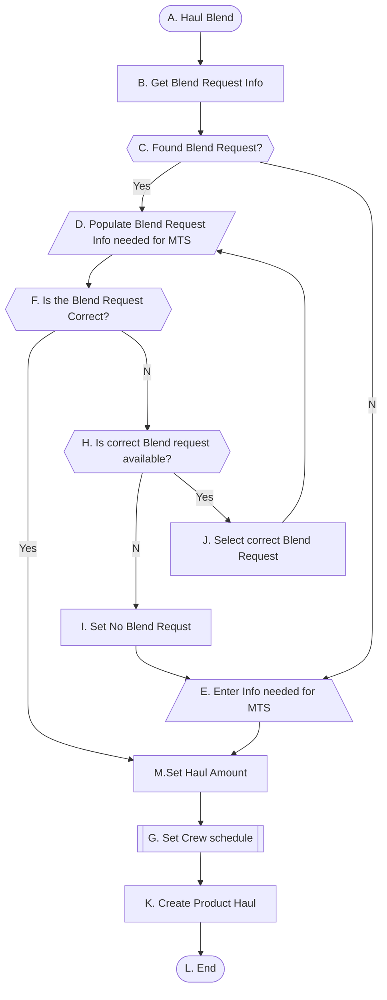
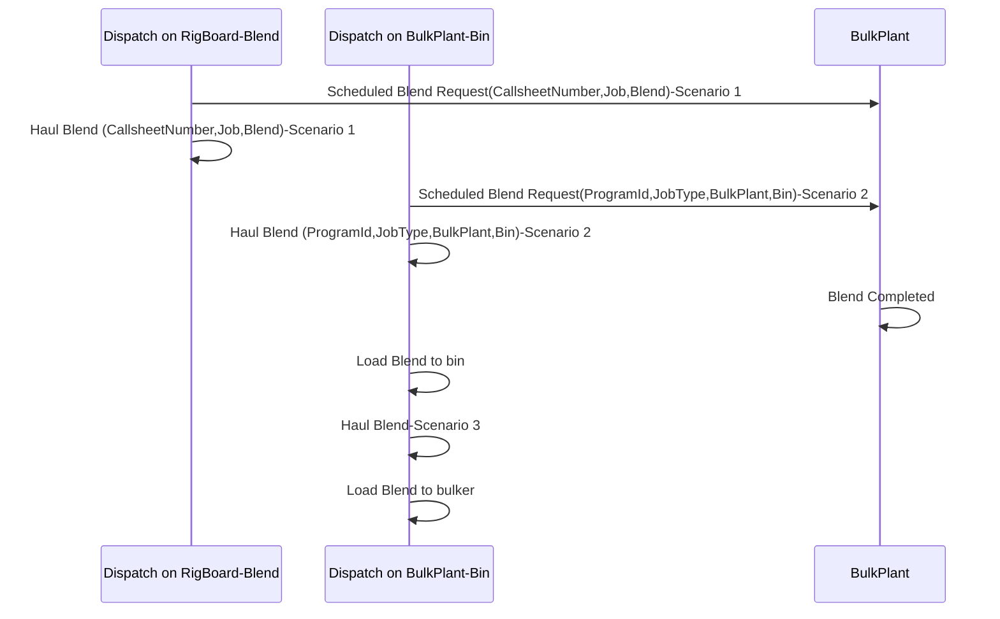
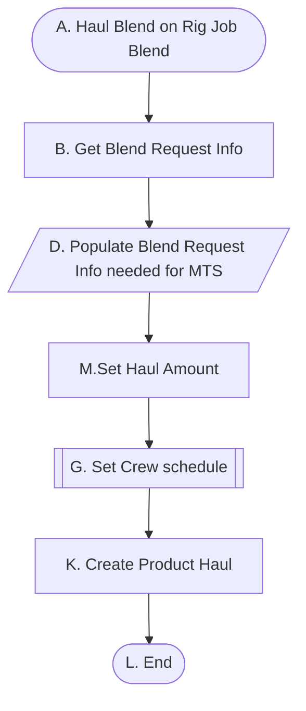

# Haul Blend

## Use Case Scenario Breakdown

Precondition must satisfy all decision nodes' requirement.

### Haul Blend on Rig Job Blend

Start point is on the available blend request in the menu. 

Go With Crew

- 与CallSheet呼应，当有Job 的时候才存在Go With Crew的选项，同理无CallSheet时，无Go With Crew选项

- Go With Crew被选中，Expected On Location Time，Estimated Travel Time将隐藏清空不显示。

- Go With Crew取消勾选或CallSheet设置为None，Expected On Location Time，Estimated Travel Time将显示,默认值为当前最新系统时间。

##### Scenario 1 HaulBlend from Callsheet

**前置条件**

1. 在Rig Blend中选择一个Job，Scheduled Blend Request 成功
2. BlendRequest 状态为Scheduled,运输状态BlendShippingStatus为Empty，CallSheetNumber不为空。

**步骤：**

1. 在RigBlend列，选择前置条件1中的Job,鼠标右键，显示HaulBlend菜单
2. 点击HaulBlend 菜单右方箭头，显示Blend Request List
3. 选择对应的Blend Request ，打开Haul Blend页面
4. 系统加载BlendReqeust，Rigbin，CallSheetNumber信息,
5. 输入HaulAmount,
6. 输入 Bin Amount
7. 选择Crew信息
8. 输入Pod信息
9. 保存成功

**后置条件：**

BlendRequest 状态为Scheduled,运输状态BlendShippingStatus为HaulScheduled

ProductHaul 状态为Scheduled,ProductHaul.description更新

Shippingloadsheet状态为Scheduled，Shippingloadsheet.description更新，Shippingloadsheet.CallsheetNumber不为空

CSH_UNIT_SCTNS.PRODUCT_HAUL_DESC新增记录

- 

  - Amount、RemainAmount、Pod精度3位小数
  - RIG bin 非空
  - checkbox默认值不勾选
    - HaulAll不勾选
    - Gowithcrew不勾选
    - Load to an existing Haul不勾选
    - Thrid Party不勾选
  - HaulAll测试
    - 勾选回填Amount=RemainAmount ，不可编辑
    - 不勾选，可编辑
  
- HaulBlend  RigBin  is Empty-Has CallSheet

  - Gowithcrew 默认必填

- HaulBlend  GowithCrew-Has CallSheet

  - 勾选Gowithcrew ，RigBin隐藏，值清空，
  - 去掉勾选，RigBin可正确显示

- HaulBlend Load to an existing Haul-Has CallSheet 

  - Crew信息隐藏，展示Existing Haul
  - 选择Crew，Pod信息回显，不允许修改
  - Crew状态逻辑

- HaulBlend  Crew as a Thrid Party-Has CallSheet

  - 勾选 Thrid Party，显示 Thrid PartyCrew信息勾选正常保存

- HaulBlend Context Menu

  - 格式
  - 状态显示：

  

### Haul Blend On Bulk Plant Bin

#### Bin Information has last blend request id and it is the correct one.

#### Bin Information has last blend request id and it is not correct one and correct one is available in the list.

#### Bin Information has last blend request id and it is not correct one and correct one is not available in the list.

#### Bin Information doesn't  has last blend request id and correct one is not available in the list.

##### Scenario 2：HaulBlend form Program

**前置条件**

1. 在BulkPlan Bin列Scheduled Blend Request 成功
2. BlendRequest 状态为Scheduled,运输状态BlendShippingStatus为Empty，CallSheetNumber为空。
3. ProgramId信息已知。

**步骤：**

1. 在BulkPlant Bin列，选择前置条件1中的Bin,鼠标右键，显示HaulBlend菜单
2. 点击HaulBlend 菜单右方箭头，显示Blend Request List:PRGxxx+Blend+Amount
3. 选择对应的Blend Request ，打开Haul Blend页面,
4. 系统加载BlendReqeust、Rig bin信息加载默认数据
5. 输入HaulAmount,
6. 修改Rig bin, Bin Amount
7. 选择Crew信息
8. 输入Pod信息
9. 保存成功

**后置条件：**

BlendRequest 状态为Scheduled,运输状态BlendShippingStatus为HaulScheduled

ProductHaul 状态为Scheduled,ProductHaul.description更新

Shippingloadsheet状态为Scheduled，Shippingloadsheet.description更新，Shippingloadsheet.CallsheetNumber为空

CSH_UNIT_SCTNS.PRODUCT_HAUL_DESC新增记录

测试关注点:

- HaulBlend -Has Progarm
  - 正常流程
  - 非空验证
  - Amount、RemainAmount、Pod精度3位小数
  - CallSheet 有值且唯一（Program，JobType下有CallSheet且状态为：Inprgress,Locked,Ready中的一种）
  - RIG bin 加载
  - checkbox默认值不勾选
    - HaulAll不勾选
    - **Gowithcrew不显示**
    - Load to an existing Haul不勾选
    - Thrid Party不勾选
  - HaulAll测试
    - 勾选回填Amount=RemainAmount ，不可编辑
    - 不勾选，可编辑
- HaulBlend  RigBin  is Empty-Has Progarm，
  - CallSheet 有值且多选（Program，JobType下有多个CallSheet且状态为：Inprgress,Locked,Ready中的一种）
  - Gowithcrew 默认必填
- HaulBlend  RigBin  is Empty-Has Progarm，no Callsheet
  - 保存失败提示不满足条件
- HaulBlend  GowithCrew-Has Progarm
  - 勾选Gowithcrew ，RigBin隐藏，值清空，
  - 去掉勾选，RigBin可正确显示
  - RigBin精度3位小数
- HaulBlend Load to an existing Haul-Has Progarm
  - Crew信息隐藏，展示Existing Haul
  - 选择Crew，Pod信息回显，不允许修改
  - Crew状态逻辑
- HaulBlend  Crew as a Thrid Party-Has Progarm
  - 勾选 Thrid Party，显示 Thrid PartyCrew信息勾选正常保存
- HaulBlend Context Menu
  - 格式
  - 状态显示：

##### Scenario 3：HaulBlend form Blend In Bin

**前置条件**

1. 在BulkPlan Bin列Scheduled Blend Request 成功
2. BlendRequest 状态为Stored,运输状态BlendShippingStatus为Empty，CallSheetNumber为空。

**步骤：**

1. 在BulkPlant Bin列，选择前置条件1中的Bin,鼠标右键，显示HaulBlend菜单
2. 点击HaulBlend 菜单右方箭头，显示Blend Request List:Blend in bin xxx+Blend+Amount
3. 选择对应的Blend Request ，打开Haul Blend页面,
4. 系统加载BlendReqeust，Rig bin信息加载默认数据，
5. 输入HaulAmount, 
6. 修改Rig bin, Bin Amount
7. 选择Crew信息
8. 输入Pod信息
9. 保存成功

**后置条件：**

BlendRequest 状态为Scheduled,运输状态BlendShippingStatus为HaulScheduled

ProductHaul 状态为Scheduled,ProductHaul.description更新

Shippingloadsheet状态为Scheduled，Shippingloadsheet.description更新，Shippingloadsheet.CallsheetNumber为空

CSH_UNIT_SCTNS.PRODUCT_HAUL_DESC新增记录

测试关注点:

- HaulBlend-Blend inbin

  - 正常流程
  - 非空验证
  - Amount、RemainAmount、Pod精度3位小数
  - RIG bin 非空
  - checkbox默认值不勾选
    - HaulAll不勾选
    - Gowithcrew默认不显示
    - Load to an existing Haul不勾选
    - Thrid Party不勾选
  - HaulAll测试
    - 勾选回填Amount=RemainAmount ，不可编辑
    - 不勾选，可编辑

- HaulBlend  RigBin  is Empty-Blend in bin

  - **Gowithcrew 默认必填**（？？？）

- HaulBlend  GowithCrew-Blend in bin

  - 勾选Gowithcrew ，RigBin隐藏，值清空，
  - 去掉勾选，RigBin可正确显示
  - RigBin精度3位小数

- HaulBlend Load to an existing Haul-Has Progarm

  - Crew信息隐藏，展示Existing Haul
  - 选择Crew，Pod信息回显，不允许修改
  - Crew状态逻辑

- HaulBlend  Crew as a Thrid Party-Has Progarm

  - 勾选 Thrid Party，显示 Thrid PartyCrew信息勾选正常保存

- HaulBlend Context Menu

  - 格式

  - 状态显示：

    

问题：

Go with crew 与Callsheetnumber 保持一致，另外Rig Bin为空的时候必须选择Go with crew，那么在Callsheetnumber、Rig Bin同时为空的情况下我们该如何处理？还是说正常情况下不会存在这种情况。
