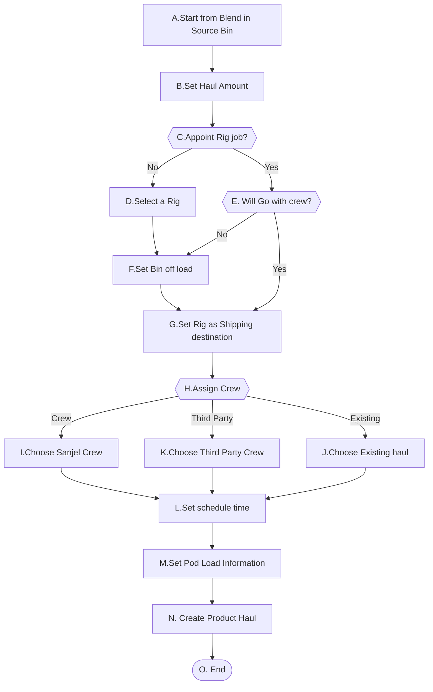
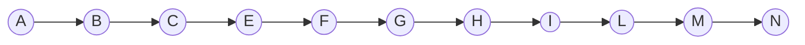
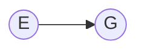
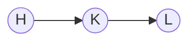
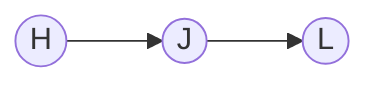

# 1. Haul Blend

它的前提条件是Blend已经存在或已经申请了。

- Blend 已经存在, 场景是Haul Blend in Bulk Plant Bin。这个场景的上游场景有Load Blend to Bin from Blend Request和Adjust Blend Amount。

- Blend 已经Schedule了，但是还没有Load到Bin中去。场景是Haul Blend from Blend Request will load to Bulk Plant Bin。具体根据上下文落实的场景如下

  - Haul blend from blend request scheduled from call sheet blend to bulk plant bin。
  - Haul blend from blend request from program blend to bulk plant bin。

  

## 1-1. Haul Blend in Bulk Plant Bin

### High Level Workflow

### Detail Workflow

## Use Case

**前置条件：**

1. Bulk Plant的Bin中存有Blend

**基本流程：**

**步骤：**

1. Dispatch 在Bulk Plant的Bin列选择需要运输的Bin，右点鼠标显示Haul Blend菜单
2. Dispatch点击菜单右侧箭头，显示Blend Request List:Blend in bin +  [Blend] + [Amount]，并点击
3. 打开Haul blend 页面，页面显示对应的From Storage 和 Blend 信息，Total Tonnage和Remains Amount
4. Dispatch 设置Haul Amount
5. Dispatch 选择一个CallSheet, 页面自动显示客户名称，Rig名称和指派给Rig的Bin，GoWithCrew 点选框
6. Dispatch 设置 Bin offload amount信息
7. Dispatch 选择一个Crew
8. Dispatch  选择装车时间, 选择预期到达时间，预计行程时间
9. Dispatch  设置Bulker中各Pod装入数量
10. Dispatch  确认并保存Product haul信息
11. 保存Product Haul

**替代流程**

##### 1-1-CD: Not appoint an rig job

5a. Dispatch 不选择Call Shett

5a.1 Dispatch 选择一个Rig，页面自动显示指派给Rig的Bin

Step 6

##### 1-1-EG: Go with appoint rig job pumper crew

5b. Dispatch checks Go With Crew checkbox, Bin Off load boxes disppear if any.

Step 7

##### 1-1-HK: Assign a third part crew

7a. Dispatch check Third Party checkbox, Crew dropdown is replaced by Third Party Crew Dropdownlist

7a.1 Dispatch select a third party crew

Step 8

##### 1-1-HJ: Use Existing Haul

7. b Dispatch check Load to An Exisiting Haul checkbox
   - Crew dropdown,  装车时间, 选择预期到达时间，预计行程时间 disppear. 
   - Existing Haul dropdownlist shows up

7b.1 Dispatch select an exisitng haul

Step 8

**后置条件**:

1. Product Haul 的状态为Scheduled

2. Shipping load sheet 的状态为Scheduled

3. Blend unload sheet信息设置成功

   

**补充约束**

1. 行程默认时间为4h

2. Call Sheet Number默认为空

3. Rig 默认为空, 必填

4. Remains Amount = Total Tonnage - SUM(Scheduled haul amount from same bin same blend)

5. Crew or Third Party Crew or Existing Haul 其中之一必填

6. Blend Request Id should be referenced in Shipping Load Sheet as accurate as possible. 

   

## 1-2 Haul blend from blend request scheduled from call sheet blend to bulk plant bin

## 1-3 Haul blend from blend request from program blend to bulk plant bin
