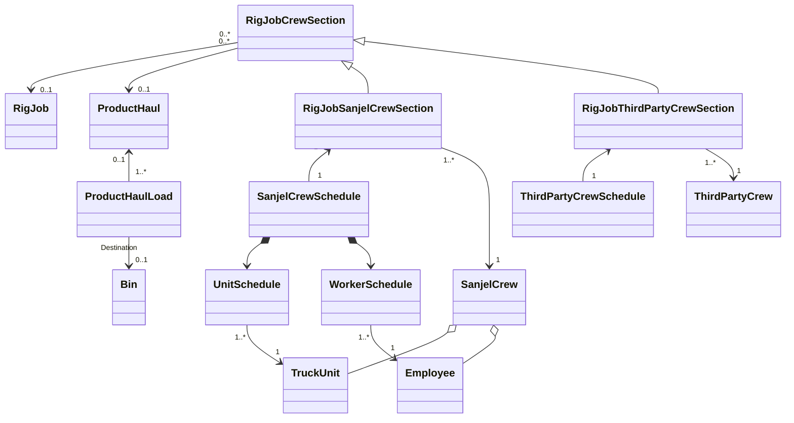
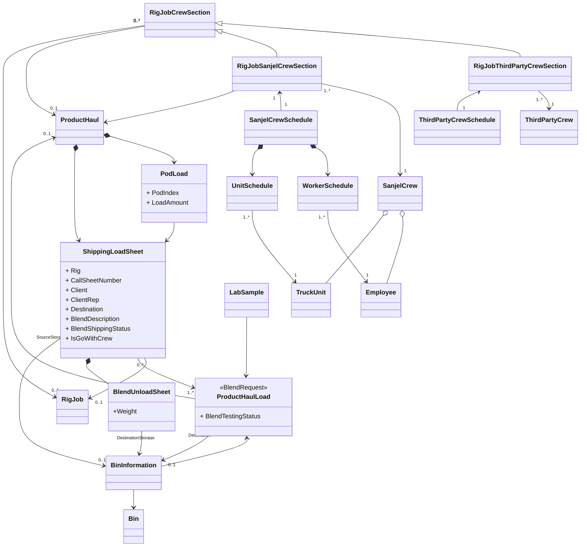
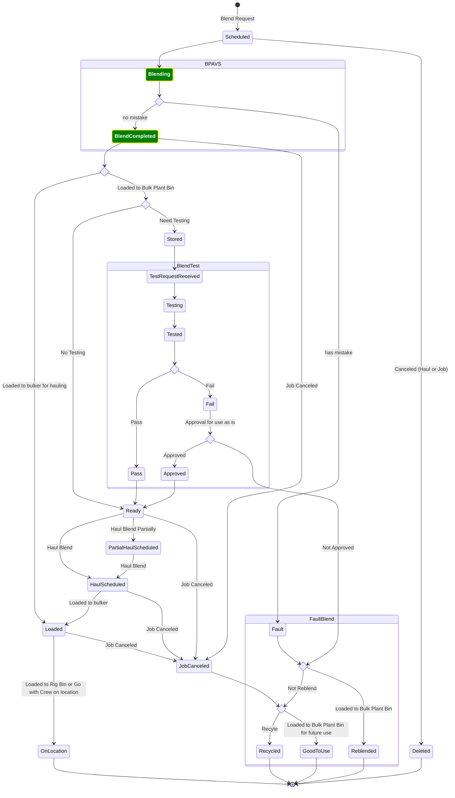
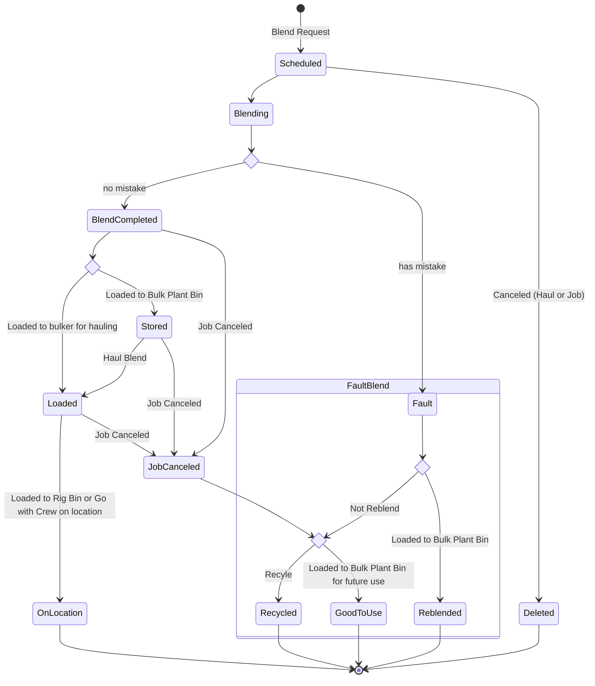
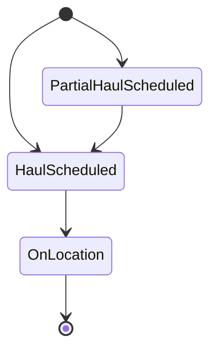
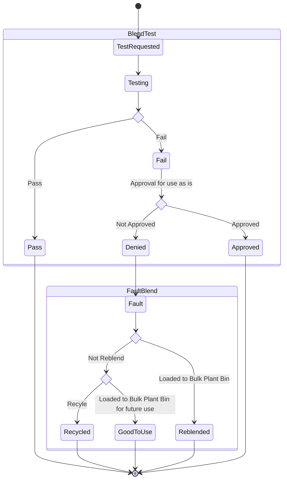
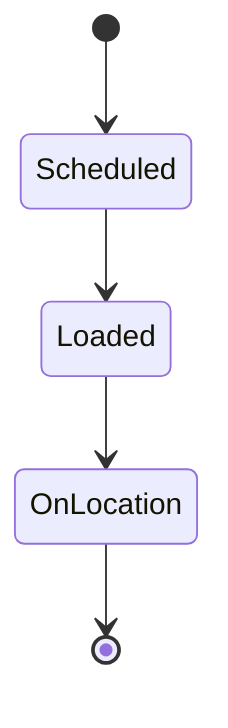
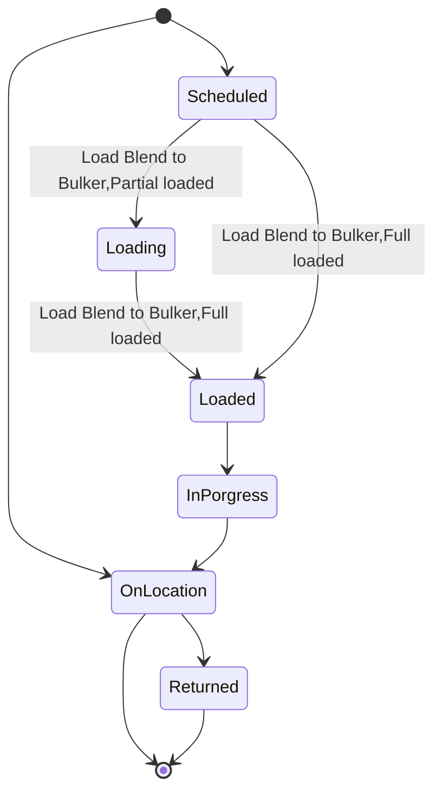
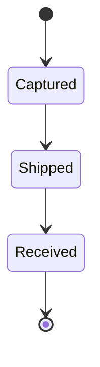

### Domain Model

## Refactor version 1

## Domain Model

### Product Haul Load State Machine

### Product Haul Load State Machine Breakdown

#### Blend Request State Machine

#### Blend Request status Definition

- Scheduled: Blend Request is scheduled.
- Blending: Blend Request is picked by in BPAVS, blending process is started.
- BlendCompleted: Blending process is completed, blend is ready to load to Bins or Bulker
- Loaded: Blend is loaded to Bulker
- Stored: Blend is loaded to Bulk Plant bins.
- OnLocation: Full amount of blend are shipped on location by product hauls.

#### Product Haul Status Definition

- Scheduled: A bulker is scheduled to haul specific blend either from bulk plant bins or blend request.

- Loaded: The blend is loaded to bulker

- OnLocation: The haul is completed, the blend is loaded to rig bins or pumped.

  

#### Blend Shipping State Machine

#### Blend Testing State Machine

### Shipping Status

### Product Haul State Machine

### Lab Sample State Machine

## Process View

## Wish List

- Schedule blend request without bin
  - BPAVS need to fill in the bin and update backend

- Schedule product haul with two bins - spit load
- Destination bins on MTS
- BPAVS need to be able to update "Loaded" status
- BPAVS sampling function and auto log in Lab Database
- Re-blend with blended blend.