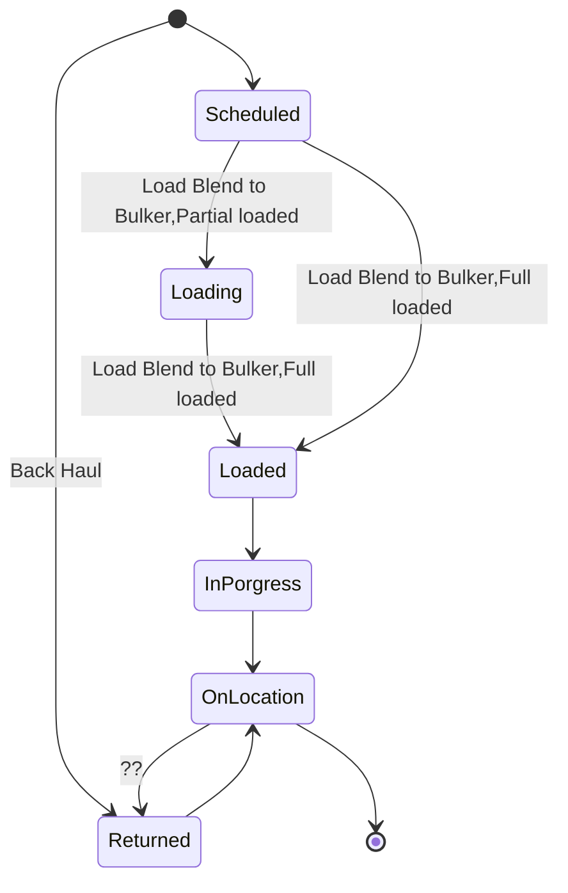

# Back Haul 

**场景描述：**

有些未使用完成的废料需要调度员安排运输Rig bin中的Blend到BulkPlant bin中，为ProductHaul的一种特殊场景，称为Back Haul，此操作为事先安排，不考虑当前RigBin\BulkPlant中的Blend是什么，有两种场景:

1. 新建一个ProductHaul运输Blend,即需要空车过来，拉回去。
2. 选择已存在的ProductHaul运输。

### Product Haul State Machine

### Scenario 1

**前置条件：**

1. Rig bin中有Blend需要运输到BulkPlant

**基本步骤：**

1. 调度员在RigBoard bin列，Onlocation 菜单下方点击Back Haul 菜单，
2. 打开Back Haul页面，

3. 确认输入必要的信息，BackAmount,BulkPlant,Bin,Crew,Pod信息
4. 保存

**后置条件：**

新增一个ProductHaul,ProductHaulLifeStatus=Returned, 

新增一个Shippingloadsheet，ShippingStatus=Scheduled

SourceStorage = rig 

Destination = bulkplant,bin

### Scenario 2

前置条件：有一个已存在的Haul

步骤：

3a.选择Load to an existing haul

4. 选择一个Haul，

5. 保存

后置条件：

新增一个Shippingloadsheet，ShippingStatus=Scheduled

SourceStorage = rig 

Destination = bulkplant,bin

ProductHaul 状态更新为Returned

任务

- [ ] Back Haul

  - [ ] Onlocation 菜单下方增加Back Haul 菜单

  - [ ] ProductHaulLifeStatus枚举属性值：Returned=4。

  - [ ] Back Haul页面逻辑
  - [ ] BaseBlend,Rig bin中的水泥类型
  - [ ] Rig,当前的Rig名称自动回填，不允许修改
  - [ ] Quantity 当前Rig bin中的Blend数据量，自动回填，不允许修改
  - [ ] BulkPlant，dropdownlist，默认None,可选择
  - [ ] Back to bin bulkplant bin，根据选择的BulkPlant联动
  - [ ] Haul Amount默认为0 ，可输入，支持 Haul All选项，
  - [ ] LoadAmount,默认为0 ，可输入，支持 Haul All选项 **Where this one from?**
    - [ ] 勾选HaulAll,LoadAmount=Quantity,不允许修改
    - [ ] 取消勾选HaulALL,LoadAmount=0可修改

  - [ ] Load to an existing haul ，复选框默认不勾选，
    - [ ] 勾选时 Estimated Load time、Expected On Location Time、Third Party，Crew隐藏不显示，
    - [ ] 显示Existing Haul 选项，默认None，并允许选择

  - [ ] Estimated Load time 默认为当前时间，年月日，时分
  - [ ] Expected On Location Time,默认为当前时间，年月日，时分
  - [ ] Third Party，默认不勾选
  - [ ] Crew默认None,可选择
  - [ ] Pod，可输入

- [ ] Onlocation(BulkPlant bin)
  - [ ] 可操作的ProductHaul状态为【Scheduled|Scheduled】、【Retruned|Scheduled】，
  - [ ] 当Onlocation时更新Bin的 Quantity=Quantity+LoadAmount

