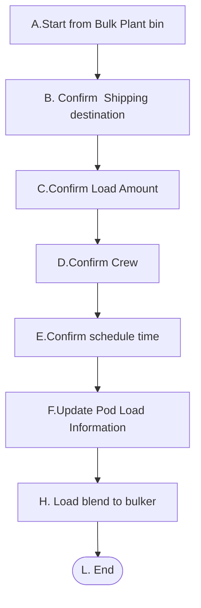
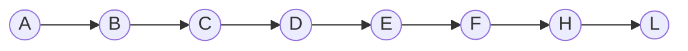
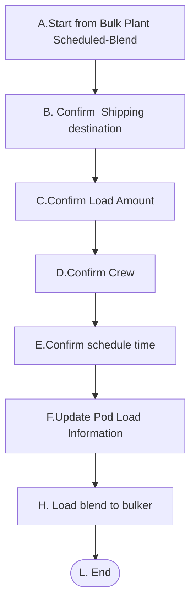

# 1. Load blend to bulker 

它的前提条件是在Product Haul 已存在，对应的Blend状态为BlendCompleted。

- **1-1** Blend 已经在Bin中， 场景是load blend  to blker form bulk plant bin。这个场景的上游场景有Load blend to bin。

- **1-2** Blend 不在Bin中，直接装车，这个场景的上游场景是Scheduled Product Haul.

   

## 1-1. Load blend to Bulker from bulk plant bin

### High Level Workflow

### Detail Workflow

### Use Case

**前置条件：**

1. Bulk Plant的Bin中存有Blend
1. Blend的Product Haul 已经Scheduled

**基本流程：**

**步骤：**

1. Dispatch 在BulkPlant的Bin列选择需要装车的ProductHaul，右点鼠标显示Load blend to bulker菜单,并点击
2. 打开Load Blendd to Bulker 页面，显示对应的Call sheet number、Client Name、 Blend 、Destination信息
3. Dispatch 确认Destination
4. Dispatch 确认ProductHaul信息，Go with crew ，Third party复选框
5. Dispatch确认Load amount信息
6. Dispatch 确认Crew信息
7. Dispatch  确认预期到达时间
8. Dispatch  确认Bulker中各Pod的装入数量
9. Dispatch  确认并保存Shipploadsheet信息
10. 保存Shipploadsheet

**后置条件**:

1. Product Haul 的状态为Loaded

2. Shipping load sheet 的状态为Loaded

   

**补充约束**

1. Pod为0时可修改，如被其它Shipping load sheet占用则不允许修改。

2. 页面上的Go with crew,Third party与Product haul的 Go with crew,Third party信息一致。

3. Bulk Plant Bin的Quantity更新规则Quantity=Quantity-Load Amount

4. BulkPlant中Quantity更新后=0，系统自动Empty bin。

5. Product Haul下有一个Shipping load sheet状态更新为Loaded,否则需要检查所有的Shipping load sheet状态为Loaded时更新Product Haul状态为Loaded。

   

## 1-1. Load blend to Bulker from bulk plant bin

### High Level Workflow

### Detail Workflow

**前置条件：**

1. Blend的Product Haul 已经Scheduled
2. Blend的状态为BlendCompleted

**基本流程：**

**步骤：**

1. Dispatch 在BulkPlant的Scheduled Blend列选择需要装车的Shipping load sheet，右点鼠标显示Load blend to bulker菜单,并点击
2. 打开Load Blendd to Bulker 页面，显示对应的Call sheet number、Client Name、 Blend 、Destination信息
3. Dispatch 确认Destination
4. Dispatch 确认ProductHaul信息，Go with crew ，Third party复选框
5. Dispatch确认Load amount信息
6. Dispatch 确认Crew信息
7. Dispatch  确认预期到达时间
8. Dispatch  确认Bulker中各Pod的装入数量
9. Dispatch  确认并保存Shipploadsheet信息
10. 保存Shipploadsheet

**后置条件**:

1. Product Haul 的状态为Loaded

2. Shipping load sheet 的状态为Loaded

3. Blend Request的状态为Loaded

   

**补充约束**

1. Pod为0时可修改，如被其它Shipping load sheet占用则不允许修改。

2. 页面上的Go with crew,Third party与Product haul的 Go with crew,Third party信息一致。

3. Product Haul下有一个Shipping load sheet状态更新为Loaded,否则需要检查所有的Shipping load sheet状态为Loaded时更新Product Haul状态为Loaded。

   
