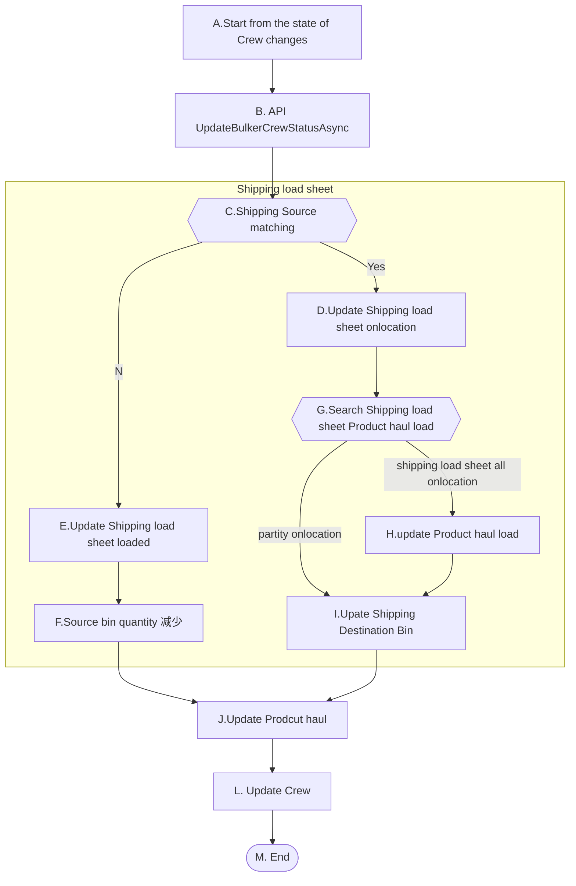
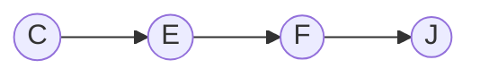
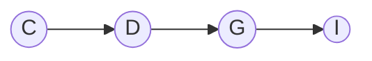

# On location

它的前提条件是，Crew 的状态是En Route,Product Haul状态是Loaded。这个场景的上游场景是Load blend to bulker。

### High Level Workflow

### Detail Workflow

Back Haul from rig bin to bulk plant bin only

|           | Crew Status | Product Haul | Shipping load sheet | from  bin Quantity | to bin Quantity               |
| --------- | ----------- | ------------ | ------------------- | ------------------ | ----------------------------- |
| Back Haul | Loaded      | Loaded       | Scheduled           |                    |                               |
| Back Haul | On location | On location  | Loaded              | --                 |                               |
| Back Haul | Returned    | Returned     | On location         |                    | None (bulk plant bin is none) |
| Back Haul | Returned    | Returned     | On location         |                    | ++                            |

Back Haul from rig bin to bulk plant bin with a regular product haul.

|                      | Crew Status | Product Haul | Shipping load sheet | from bin Quantity           | to bin Quantity               |
| -------------------- | ----------- | ------------ | ------------------- | --------------------------- | ----------------------------- |
| regular Product Haul | Loaded      | Loaded       | Loaded              | -- (,Haul Blend)            |                               |
| regular Product Haul | Loaded      | Loaded       | Loaded              | None(Schedule Product Haul) |                               |
| Back Haul            | Loaded      | Loaded       | Scheduled           |                             |                               |
| regular Product Haul | On location | On location  | On location         |                             | ++                            |
| Back Haul            | On location | On location  | Loaded              | --                          |                               |
| regular Product Haul | Returned    | Returned     | On location         |                             |                               |
| Back Haul            | Returned    | Returned     | On location         |                             | ++                            |
| Back Haul            | Returned    | Returned     | On location         |                             | None (bulk plant bin is none) |

Back Haul from rig bin to another rig bin only. Off load to another rig bin on Retured for now.

|           | Crew Status | Product Haul | Shipping load sheet | from rig bin Quantity | to rig bin Quantity     |
| --------- | ----------- | ------------ | ------------------- | --------------------- | ----------------------- |
| Back Haul | Loaded      | Loaded       | Scheduled           |                       |                         |
| Back Haul | On location | On location  | Loaded              | --                    | 预期:无更新，实际:++    |
| Back Haul | Returned    | Returned     | On location         |                       | ++                      |
| Back Haul | Returned    | Returned     | On location         |                       | None (rig bin is none ) |

Back Haul from rig bin to another rig bin with a regular product haul. Off load to another rig bin on Retured for now.

|                      | Crew Status | Product Haul | Shipping load sheet | from bin Quantity       | to  rig bin Quantity |
| -------------------- | ----------- | ------------ | ------------------- | ----------------------- | -------------------- |
| regular Product Haul | Loaded      | Loaded       | Loaded              | --(from bulk plant bin) |                      |
| Back Haul            | Loaded      | Loaded       | Scheduled           |                         |                      |
| regular Product Haul | On location | On location  | On location         |                         | ++                   |
| Back Haul            | On location | On location  | Loaded              | --(from rig bin)        |                      |
| regular Product Haul | On location | On location  | On location         |                         |                      |
| Back Haul            | Returned    | Returned     | On location         |                         | ++                   |

### Use Case

**前置条件：**

1. Product Haul 状态为Loaded
2. Crew状态为En Route

**基本流程：**

**步骤：**

1. DRB调用API更新指定Crew的状态
2. API根据目的地，出发地更新Shipping load sheet状态，onlocation时间
3. API根据Shipp load sheet 查找Blend request并更新blend request状态
4. API根据状态更新Rig bin 中的blend 信息和Quantity
5. API更新ProductHaul状态，onlocation时间
6. API更新Crew状态

**替代流程**

##### 1-1-CE: Back haul

2a. Back haul existing haul,Shipping loade sheet Destination not matching

2a.1 Source bin quntantity update

step5

##### 1-1-CDJI: blend request partial haul

3a blend request partial haul，不更新状态

Step4

**后置条件**:

1. Product Haul 的状态为Onlocation

2. Shipping load sheet 的状态为Onlocation

   1. 2a.Shipping load sheet 的状态为Loaded

3. Blend Reqeust 的状态为Onlocation

   1. 3a Blend Reqeust 的状态为不更新

4. Crew 的状态为Onlocation

5. Destination bin 更新正确 

   1. 2a Source bin 更新成功

   

**补充约束**

1. Shipping Destination Rig bin Quantity=Quantity+Load Amount

2. Source bin Quantity=Quantity- Load Amount

3. Blend Request Id should be referenced in Rig bin

4. Shipping load sheet Rig name为目的地，BulkPlantName为出发地点。当BackHaul时，需要正确的存储相关信息。

 
