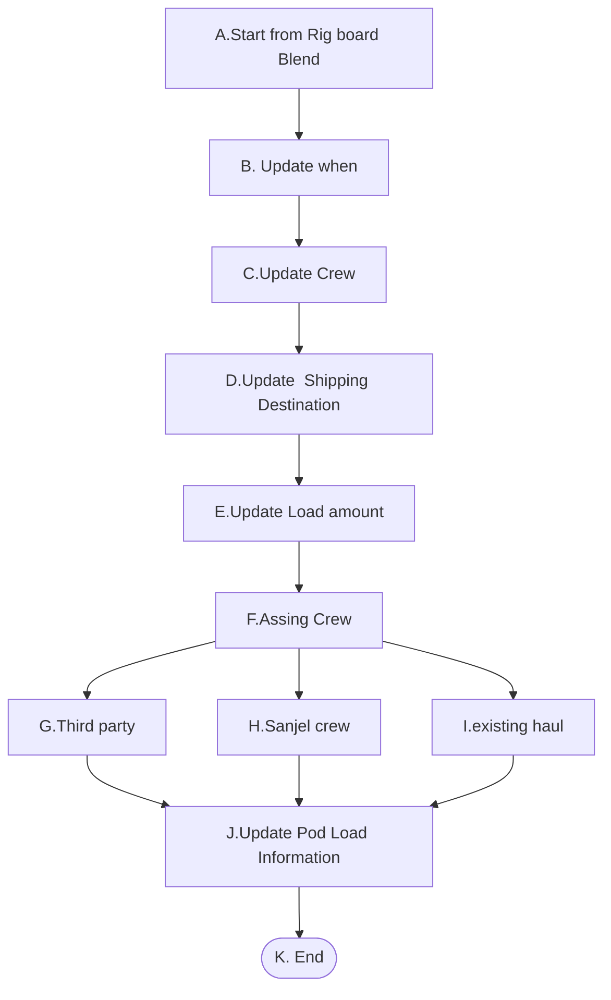
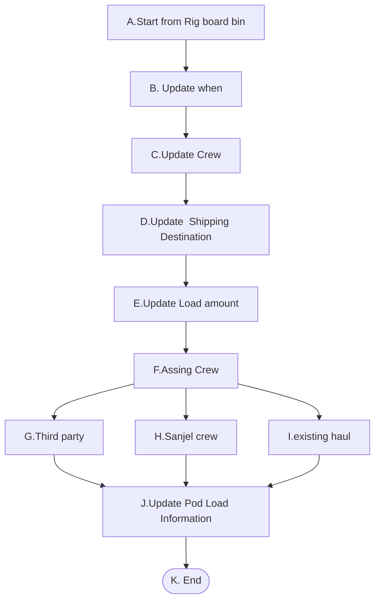
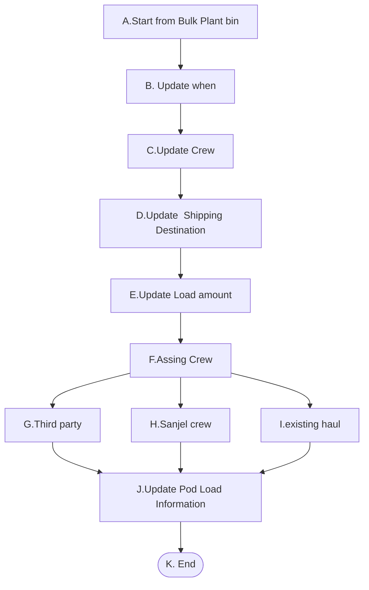

# 1. Rescheduled Product Haul 

它的前提条件是在Product Haul 已存在，且状态为Scheduled。

- **1-1** 给指定的Rig Job 安排Product Haul，并对其进行修改， 场景是ReScheduled product haul form Rig board blend。这个场景的上游场景Scheduled product haul form Rig board blend,Haul Blend form Rig board blend 。

- **1-2** 给指定的Rig 安排Product Haul,并对其进行修改， 场景是ReScheduled product haul form Rig board Bin。这个场景的上游场景Scheduled product haul form Rig board Bin。

- **1-3** 再BulkPlant中运输已有的Blend给指定的Rig,并对其进行修改， 场景是Rescheduled product haul form BulkPlant Bin。这个场景的上游场景HaulBlend from bulk Plant bin。

   

## 1-1. Rescheduled Product Haul from rig job blend

### High Level Workflow

### Detail Workflow

### Use Case

**前置条件：**

1. Product Haul 状态为Scheduled

**基本流程：**

**步骤：**

1. Dispatch 在Rig Board 的Blend列选择需要编辑ProductHaul的Rig Job，右点鼠标显示Rescheduled Product Haul菜单,菜单右侧显示箭头，点击箭头
2. 显示ProdutHaul List，Crew+Onlocation时间，点击Crew信息
3. 打开RescheduledProduct Haul页面，显示预期到达时间，Crew,Shipping Destination信息
4. Dispatch 更新预期到达时间 
5. Dispatch 更新Crew信息
6. Dispatch更新Go with crew ，Third party复选框
7. Dispatch更新Load amount信息
8. Dispatch  更新Bulker中各Pod的装入数量
9. Dispatch  更新并保存Shipploadsheet信息
10. 保存Shipploadsheet

**替代流程**

##### 1-1-FG: Assign a third part crew

6a. Dispatch check Third Party checkbox, Crew dropdown is replaced by Third Party Crew Dropdownlist

6a.1 Dispatch select a third party crew

Step 7

##### 1-1-FI: Use Existing Haul

6b Dispatch check Load to An Exisiting Haul checkbox

- Crew dropdown,  装车时间, 选择预期到达时间，预计行程时间 disppear. 
- Existing Haul dropdownlist shows up

6b.1 Dispatch select an exisitng haul

Step7

**后置条件**:

1. Product Haul 的状态为Scheduled

2. Shipping load sheet 的状态为Scheduled

3. Blend unload sheet信息设置成功

**补充约束**

1. 所有信息与Scheduled product haul一致

2. Crew or Third Party Crew or Existing Haul 其中之一必填

3. Blend Request Id should be referenced in Rig bin

4. Shipping load sheet Rig name为目的地，BulkPlantName为出发地点。当BackHaul时，需要正确的存储相关信息。

5. CallSheet number 不允许修改。

6. Rig 不允许修改。

7. Shipping load sheet 取消勾选保存后会Cancel这个Shipping load sheet,并释放Pod信息

8. 当Shipping load sheet 只有一个时不允许取消勾选。

## 1-2. Rescheduled Product Haul from rig job bin

### High Level Workflow

### Detail Workflow

### Use Case

**前置条件：**

1. Product Haul 的状态为Scheduled

**基本流程：**

**步骤：**

1. Dispatch 在Rig Board 的Bin列选择需要编辑ProductHaul的Rig ，右点鼠标显示Rescheduled Product Haul菜单,菜单右侧显示箭头，点击箭头
2. 显示ProdutHaul List，Crew+Onlocation时间，点击Crew信息
3. 打开RescheduledProduct Haul页面，显示预期到达时间，Crew,Shipping Destination信息
4. Dispatch 更新预期到达时间 
5. Dispatch 更新Crew信息
6. Dispatch更新Third party，Loading existing haul选项，当选择一个CallSheet时，显示Go with crew 复选框
7. Dispatch更新Load amount信息
8. Dispatch  更新Bulker中各Pod的装入数量
9. Dispatch  更新并保存Shipploadsheet信息
10. 保存Shipploadsheet

**替代流程**

##### 1-2-FG: Assign a third part crew

6a. Dispatch check Third Party checkbox, Crew dropdown is replaced by Third Party Crew Dropdownlist

6a.1 Dispatch select a third party crew

Step 7

##### 1-2-FI: Use Existing Haul

6b Dispatch check Load to An Exisiting Haul checkbox

- Crew dropdown,  装车时间, 选择预期到达时间，预计行程时间 disppear. 
- Existing Haul dropdownlist shows up

6b.1 Dispatch select an exisitng haul

Step7

**后置条件**:

1. Product Haul 的状态为Scheduled

2. Shipping load sheet 的状态为Scheduled，取消勾选的Shipping load sheet被 Cancel

3. Blend unload sheet信息设置成功

**补充约束**

1. 所有信息与Scheduled product haul一致

2. Crew or Third Party Crew or Existing Haul 其中之一必填

3. Blend Request Id should be referenced in Rig bin

4. Shipping load sheet Rig name为目的地，BulkPlantName为出发地点。当BackHaul时，需要正确的存储相关信息。

5. CallSheet number 默认为空，允许修改

6. Rig 不允许修改。

7. Shipping load sheet 取消勾选保存后会Cancel这个Shipping load sheet,并释放Pod信息

8. 当Shipping load sheet 只有一个时不允许取消勾选。

问题，

给指定的Rig 安排product haul，此种情况下Rig应该不允许修改，当选择Callsheet时只能选择这个Rig相关的Callsheet，否则会导致数据混乱。这里的Callsheetnumber应该不显示，不允许修改才对。

## 1-3. Rescheduled Product Haul from bulk plant bin

### High Level Workflow

### Detail Workflow

### Use Case

**前置条件：**

1. Product Haul 的状态为Scheduled

**基本流程：**

**步骤：**

1. Dispatch 在Bulk Plant 的Bin列选择需要编辑ProductHaul的Bin，右点鼠标显示Rescheduled Product Haul菜单,菜单右侧显示箭头，点击箭头
2. 显示ProdutHaul List，Crew+Onlocation时间，点击Crew信息
3. 打开RescheduledProduct Haul页面，显示预期到达时间，Crew,Shipping Destination信息
4. Dispatch 更新预期到达时间 
5. Dispatch 更新Crew信息
6. Dispatch更新Third party，Loading existing haul选项，当选择一个CallSheet时，显示Go with crew 复选框
7. Dispatch更新Rig 信息，系统自动加载Rig bin
8. Dispatch更新Load amount信息
9. Dispatch  更新Bulker中各Pod的装入数量
10. Dispatch  更新并保存Shipploadsheet信息
11. 保存Shipploadsheet

**替代流程**

##### 1-3-FG: Assign a third part crew

6a. Dispatch check Third Party checkbox, Crew dropdown is replaced by Third Party Crew Dropdownlist

6a.1 Dispatch select a third party crew

Step 7

##### 1-3-FI: Use Existing Haul

6b Dispatch check Load to An Exisiting Haul checkbox

- Crew dropdown,  装车时间, 选择预期到达时间，预计行程时间 disppear. 
- Existing Haul dropdownlist shows up

6b.1 Dispatch select an exisitng haul

Step7

**后置条件**:

1. Product Haul 的状态为Scheduled

2. Shipping load sheet 的状态为Scheduled，取消勾选的Shipping load sheet被 Cancel

3. Blend unload sheet信息设置成功

**补充约束**

1. 所有信息与Scheduled product haul一致

2. Crew or Third Party Crew or Existing Haul 其中之一必填

3. Blend Request Id should be referenced in Rig bin

4. Shipping load sheet Rig name为目的地，BulkPlantName为出发地点。当BackHaul时，需要正确的存储相关信息。

5. CallSheet number 默认为空，允许修改

6. Shipping load sheet 取消勾选保存后会Cancel这个Shipping load sheet,并释放Pod信息

7. 当Shipping load sheet 只有一个时不允许取消勾选。

