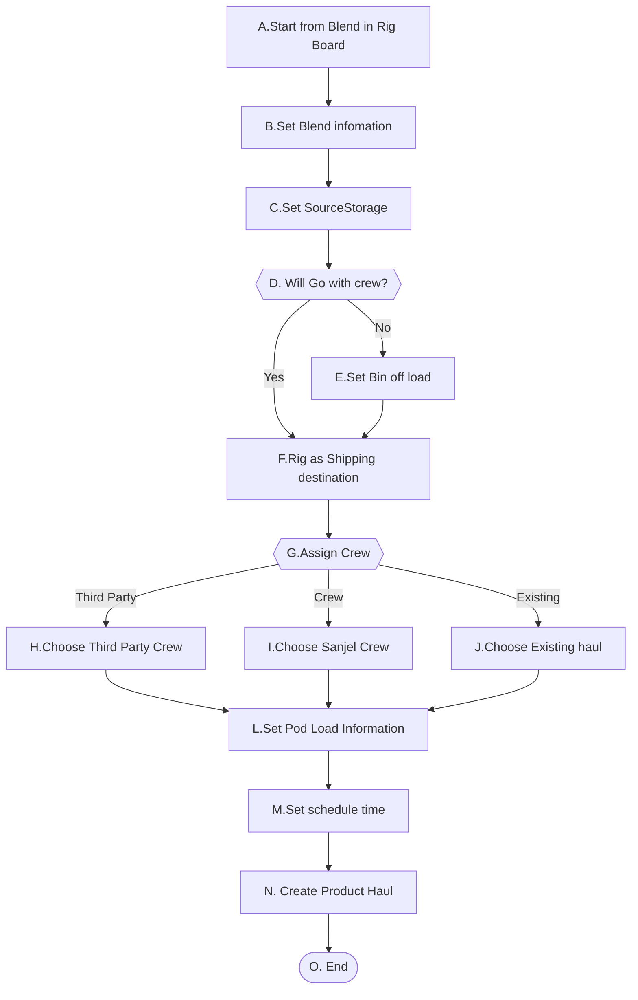
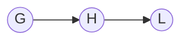
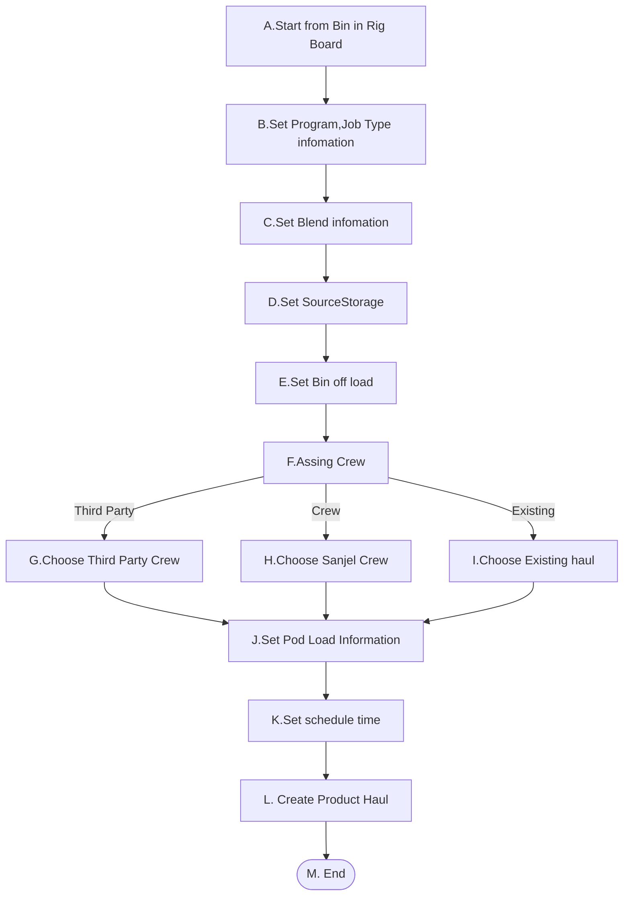

# 1. Scheduled Product Haul 

- **1-1** 给指定的Rig Job，安排Blend和Product Haul，Scheduled Product Haul from Rig board blend

- **1-2** 在已知Program的情况下，给指定的Rig 安排Blend 和ProductHaul ,Scheduled Product Haul from Rig board Bin

   

## 1-1. Scheduled Product Haul from Rig Board Blend

### High Level Workflow

### Detail Workflow

### Use Case

**前置条件：**

1. SourceStorage的Bulk Plant已就绪
1. Rig Job的状态为Inprogress,Pending.CallSheetBlendSection中的BlendCategory为Plug

**基本流程：**

**步骤：**

1. Dispatch 在RigBoard的Blend列选择右点鼠标显示Scheduled Product Haul菜单,并点击
2. 打开Scheduled Product Haul页面，显示对应的Call sheet number、BaseBlend、Amount,MixWater, Rig,Rig bin信息
3. Dispatch 设置Amount
4. Dispatch 设置SourceStorage为某一个Bulk Plant。
5. Dispatch 显示GoWithCrew 点选框
6. Dispatch 设置 Bin offload amount信息
7. Dispatch 选择一个Crew
8. Dispatch  选择装车时间, 选择预期到达时间，预计行程时间
9. Dispatch  设置Bulker中各Pod装入数量
10. Dispatch  确认并保存Product haul信息
11. 保存Product Haul
12. 

**替代流程**

##### 1-1-DF: Go with appoint rig job pumper crew

5a.Dispatch checks Go With Crew checkbox, Bin Off load boxes disppear if any.

Step 7

##### 1-1-GH: Assign a third part crew

7a. Dispatch check Third Party checkbox, Crew dropdown is replaced by Third Party Crew Dropdownlist

7a.1 Dispatch select a third party crew

Step 8

##### 1-1-GJ:Use Existing Haul

7. b Dispatch check Load to An Exisiting Haul checkbox
   - Crew dropdown,  装车时间, 选择预期到达时间，预计行程时间 disppear. 
   - Existing Haul dropdownlist shows up

7b.1 Dispatch select an exisitng haul

Step 8

**后置条件**:

1. Product Haul 的状态为Scheduled

2. Shipping load sheet 的状态为Scheduled,CallSheetnumber保存正确。

3. Blend Request 的状态为Scheduled，运输状态为HaulScheduled.

   

**补充约束**

1. Blend Test默认与Test标志同步，当有Test标志时，BlendTest默认被勾选

2. 行程默认时间为4h

3. Call Sheet Number默认值不允许修改

4. Rig 默认值不允许修改

5. Crew or Third Party Crew or Existing Haul 其中之一必填

6. Blend Request Id should be referenced in Shipping Load Sheet as accurate as possible. 

## 1-2. Scheduled Product Haul from Rig Board Bin

### High Level Workflow

### Detail Workflow

### Use Case

**前置条件：**

1. SourceStorage的Bulk Plant已就绪
1. Rig bin 正常可用

**基本流程：**

**步骤：**

1. Dispatch 在RigBoard的Bin列选择右点鼠标显示Scheduled Product Haul菜单,并点击

2. 打开Scheduled Product Haul页面，显示对应的Rig,Rig bin信息

3. Dispatch 设置ProgramID,系统根据Program加载Customer,Job Type信息，Amount

4. Dispatch 选择Job Type，系统根据JobType加载BaseBlend，mixwater，Amout信息

5. Dispatch 设置SourceStorage为某一个Bulk Plant。

6. Dispatch 设置 Bin offload amount信息

7. Dispatch 选择一个Crew

8. Dispatch  选择装车时间, 选择预期到达时间，预计行程时间

9. Dispatch  设置Bulker中各Pod装入数量

10. Dispatch  确认并保存Product haul信息

11. 保存Product Haul

    

**替代流程**

##### 1-2-GH: Assign a third part crew

7a. Dispatch check Third Party checkbox, Crew dropdown is replaced by Third Party Crew Dropdownlist

7a.1 Dispatch select a third party crew

Step 8

##### 1-1-GJ:Use Existing Haul

7. b Dispatch check Load to An Exisiting Haul checkbox
   - Crew dropdown,  装车时间, 选择预期到达时间，预计行程时间 disppear. 
   - Existing Haul dropdownlist shows up

7b.1 Dispatch select an exisitng haul

Step 8

**后置条件**:

1. Product Haul 的状态为Scheduled

2. Shipping load sheet 的状态为Scheduled

3. Blend Request 的状态为Scheduled，运输状态为HaulScheduled.

   

**补充约束**

1. 行程默认时间为4h

2. Rig默认值不允许修改

3. Crew or Third Party Crew or Existing Haul 其中之一必填

4. Blend Request Id should be referenced in Shipping Load Sheet as accurate as possible. 
