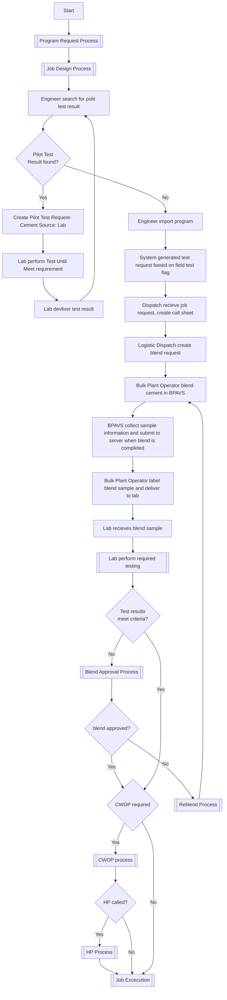

## Actors

- Sales
- Sales Manager
- Engineer
- Engineer Manager
- Operation Dispatch
- Field Supervisor
- Lab Technician
- Lab Manager
- Logistics Dispatch
- Bulk Plant Operator
- Operation Manager

### Workflow

### Business Process Gaps & Questions

- Product Haul process
  - Who schedules product haul?
    - If Logistics Dispatch, how he know when and what to schedule? From call sheet? Rig Board?
    - How does Logistics Dispatch with Operation dispatch communicate? 
- Test request generation
  - If we generate test requests when program is imported, it may not be sufficient. Field test will be requested per blend request, blend sample will be per cut. Should each cut be tested individually? We will need to sort up this process. 
  - Does lab use Test Iterations for all test under one program? 
- Blend sampling 
  - Is sample captured for all blends? Or only for ones are flagged "Need field testing"?

- Test Result review

  - When the first iteration fails, will be the same process for both pilot test and field test?
    - For pilot test, it is reasonable that lab makes additive adjustments for another iteration and let engineer know the feedback.
    - For field test, it will be a verification process, if it fails the approval process needs to be triggered right away. Ryan's workflow is not quite right.

- Failed Test approval process

  - According to Ryan's workflow, there are different criteria for Engineer approval, Operation approval and Executives approval. 
    - Are these criteria documented? 
    - Are these criteria should be automated? So the approver will be able to review it and sign it.
  - Is there a Client Approval which conducted by Sales?

- CWOP processes - Engineer hand-off to OPS

  - What is the criteria to trigger CWOP? Is CMS flag in red/black?
  - What is the current way to make a CWOP call? Do you expect notifications?
  - Is the CWOP document generator is expected? Not sure how job related data and test result data are imported.
  - How are CWOP documents stored today?

- HP process - Ops manager hand-off to crew

  - Who is calling HP? What is the criteria?

  - It seems HP process uses CWOP documentas well, is it right?

  - I assume CWOP and HP are per job, not per program. 

    