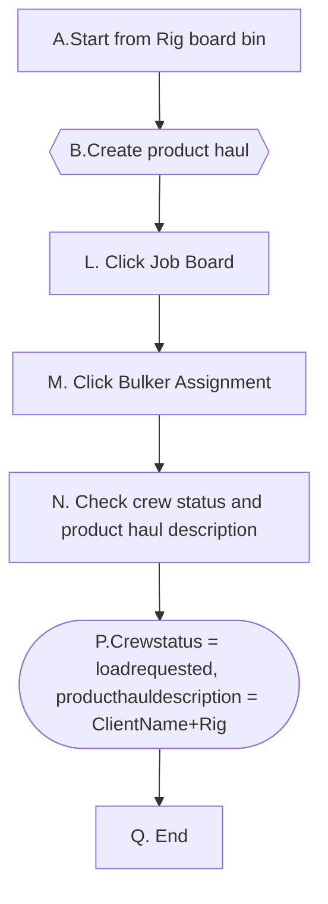

# 1. Job Board - Bulker Assignment

它的前提条件是haul已经存在或已经申请了。

1. Schedule Product Haul from Rig Board Blend列已存在。这个场景的上游场景有Schedule Product Haul,  Schedule Blend Request 和Haul Blend。

2. Schedule Product Haul, Back Haul, Transfer Haul from Rig Board Bin已经存在。具体根据上下文落实如下：

​                      ->   Schedule product haul from rig board bin;

​                      ->   Create Back Haul from rig board bin;

​                      ->   Create Transfer Haul from rig board bin;

3. Haul Blend from Blend scheduled from Bulk Plant已经存在

### 1-1. Schedule Product Haul from Rig Board Blend exists

### Detail Workflow

### Use Case

**前置条件：**

1.  Dispatch has scheduled product haul from Rig Board Blend column

**步骤：**

1. Bulkercrew管理员登录DRB系统

2. 管理员单击Job Board

3. 管理员单击Bulker Assignment

4. 管理员检查Product Haul Description

   1st Haul = Shippingloadsheet1 info

   product haul description = Client Short Name + Rig

   i,e.                         

   

**后置条件**:

producthaul information could be displayed correctly on DRB bulker assignment section.

### 1.2   Schedule Product Haul from Rig Board Bin exists

**前置条件：**

1. Schedule product haul from rig board bin

2. The product haul contains 2 shippingloadsheet.

   ​     ->  1st haul is from bulk plant to Rig1;

​            ->  2nd haul is from bulk plant to Rig2;

#### 步骤：

1. Bulkercrew管理员登录DRB系统

2. 管理员单击Job Board

3. 管理员单击Bulker Assignment

4. 管理员检查Product Haul Description，这两个运输单的目的地都应该显示在界面上。

   product haul description = Client Short Name + Rig

​        

1-2-B2: Schedule a product haul with 3 shippingloadsheet

​                 1st haul :   Normal haul from Bulk plant to rig bin

​                 2nd  haul:  Back haul from rig1 to rig 2

​                 3rd haul:    Transfer haul from rig1 to rig3

​           4a.管理员检查Product Haul Description

​            三个shippingloadsheet的description都需要显示出来

i,e.    

1-2-B3: Schedule product haul from Rig Board Bin with different blend in 2 shippingloadsheet to same rig

​              这两个shippingloadsheet都会显示在一个haul的description里

 

1-2-B4: Schedule product haul from Rig Board Bin with same blend in 2 shippingloadsheet, one shippingloadsheet is from bulk plant to bin, another shippingloadsheet is go with crew. Both of the shippingloadsheets information are displayed in one haul.

1-2-B5: Product haul1 -- two different shippingloadsheet

​              Product haul2 -- 3 different shippingloadhseet

  

 i,e.

​         

1-1-B3： A normal haul is planned with a back haul, both icons will show up

​       

4a. 管理员检查Product Haul Description

​     product haul description = Bulk Plant/Rig + Back to Bin           

​              

   1-1-B4:  First haul is loaded, and then a 2nd haul, back haul and a 3rd haul, transfer haul is added.Each haul will only have 1 icon.

​             

  1-1-B5:A normal haul is planned with a back haul and a transfer haul, all the icons will show up.

​            

**补充约束**

1. Status默认设为Off Duty 

2. Clock 

   

# 
