# Project Process

Project Sprint Cycle：One Month

# Development Process（Ticket）

# Task Status Migration

```mermaid
stateDiagram
[*] -->Todo :Requirement raised by Sanjel, or Tasks diagnosed by BA after analyze the requirement
Todo --> InProgress : Dev claims the Ticket and starts to do it
InProgress --> Test : Dev completes code development，complete unit test
InProgress --> Blocked : Dev encounters issue during code development, waiting for confirmation
Blocked --> InProgress : Issue is fixed
Test --> InReview : BA verify passed on Local environment and UAT environment 
Test --> Blocked : BA encounters issue during test, waiting for confirmation
Blocked --> Test : Issue is fixed
Test --> InProgress : BA verify failed on local environment and UAT environment
InReview --> Done :Sanjel, UAT verification passed
InReview --> Test :Sanjel, UAT verification failed
Done --> [*]
```

## Status Declaration

- No Status: Task Source

  - 1、 Raw Requirement
    
    ​       Sanjel user provides raw requirement to metashare, not limited to format. Meanwhile, BA utilizes  communication method and expression manner applicable to user to fetch customer's willing  for business scenes, expectation, idea, for example, user story, use case, diagram, freemind, Interface prototype, and so on.
    2、Change Request 
    
    ​      BA could separate customer's expected target, estimate maximum system boundary of realized target, define revised requirement.
    
  - 3、Bug：
    
    - BA needs to move the task to in progress column if  current function is verification failed, leaving a comment for developer on git for furthur fix, no need to write down testing steps.
    - BA needs to raise a new ticket with concrete reproduce steps if other bugs were defected during test. BA needs to link requirement to the bug if there were relative document and needs to update the document if requirement was changed. BA could assign the bug to Customer to review and move the ticket to ToDo column after customer provides confirmation, and could arrange fix appropriately.
    
  - 4、BA could make a series of work target after analyzing requirement, and each work target should be limited to one system or sub-system , component or model. If necessary, BA could establish hierarchical structure.  Backlog generated by a requirement should be equal to requirement logically, which could be verified alternatively.
  
    ​      BA could write down new requirement or new tasks.
  
- To do：

  ​        BA can design applicable tasks which could be executed by dev based on furthur analysis and design based on Backlog within system boundary.  Task granularity should be controlled to be testable on single system. Test is required to be  automatically runnable, which is also applicable to developer's work.

- In Progress:

  ​       Tasks under development is listed in in progress column. Dev could find tasks in To-do list and migrate the task to In progress column. Dev should do unit test after complete code development, do integration test and migrate the task to Test column, and update responsible person to BA.

- Blocked：In Progress 

  ​       BA could move tasks from other column to  to In progress column if the task is test failed.

- Test. 

  ​      Formulate  target validation process according to target define in Backlog.  BA could do verify data structure, user interface by test case design. If the task or function is test failed, BA could drag the task to failed column. If a new bug is defected, BA could raise a bug on Ready column and attach hyperlink of relative requirement or task, assigning the task to relative dev.   

- InReview：

    Sanjel Customer do functional validation and migrate the task to Done column if the validation is successful. Task is completed.

## Task Hyperlink

If one task is separated into several sub-tasks, BA needs to add father link in sub-task and add children link in father link.

BA needs to add task link or requirement link in raised bug, on the other hand, BA also needs to add bug link in requirement or task.

Blocked： BA could add task link which may affect current task progress. Therefore, customer is able to check which task has hindered current task.

# Roles and Responsibilities 

| Roles           | Responsibilities                                             | Workpiece                                                    |
| --------------- | ------------------------------------------------------------ | ------------------------------------------------------------ |
| BA              | Communicate with customer to fetch raw requirement;                  Divide requirement into sub-tasks;                                                                     Make personal work plan and complete work independently; | UseCase、User Story、Interface Prototype，Use Case、Test Case，Test Data、Functional Validation 、Divide Task |
| Developer       | Do code programming according to business analysis;                         Complete Unit Test、Integration Test;                                                     Has ability to analyze requirement or task independently and provide reasonable suggestion or idea; | Make personal plan、Do code implement、Unit Test、Integration Test、Confirm and fix bug |
| Project Manager | Follow up project progress;                                                               Control project cost;                                                                              Regulate team work flow; | Project Plan, Invoice                                        |
| Scrum Master    | In charge of morning meeting;                                                   Coordinate team members' work;                                                         Help team members to work together smoothly. | Workpiece Recorder                                           |
| Architect       | Assist PM to evaluate workload, provide solution to technical difficulties, review code, ensure code meets architecture requirement, ensure deliver quality | Code， Architecture Prototype                                |

