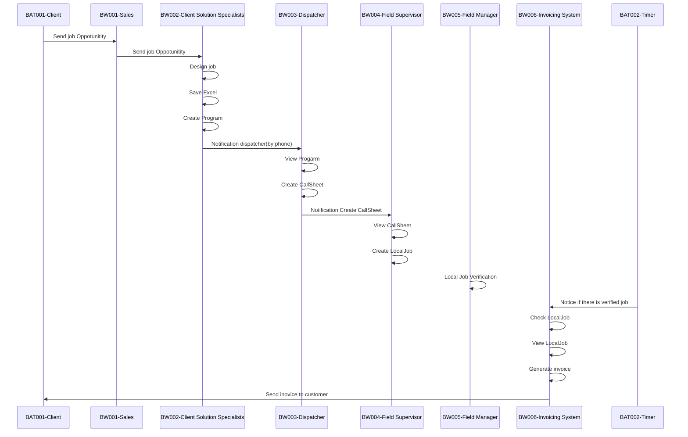
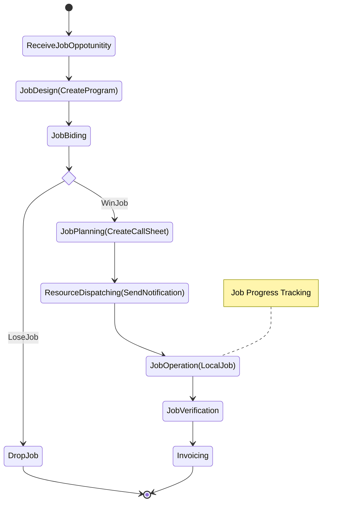
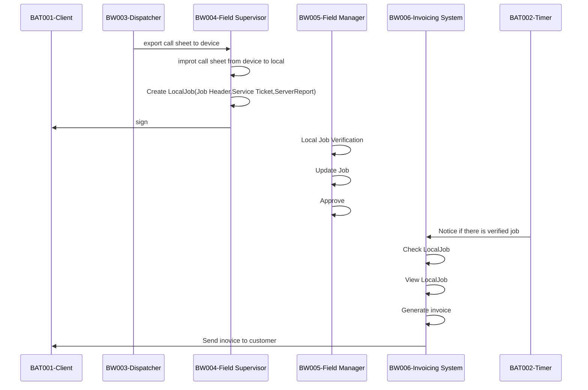
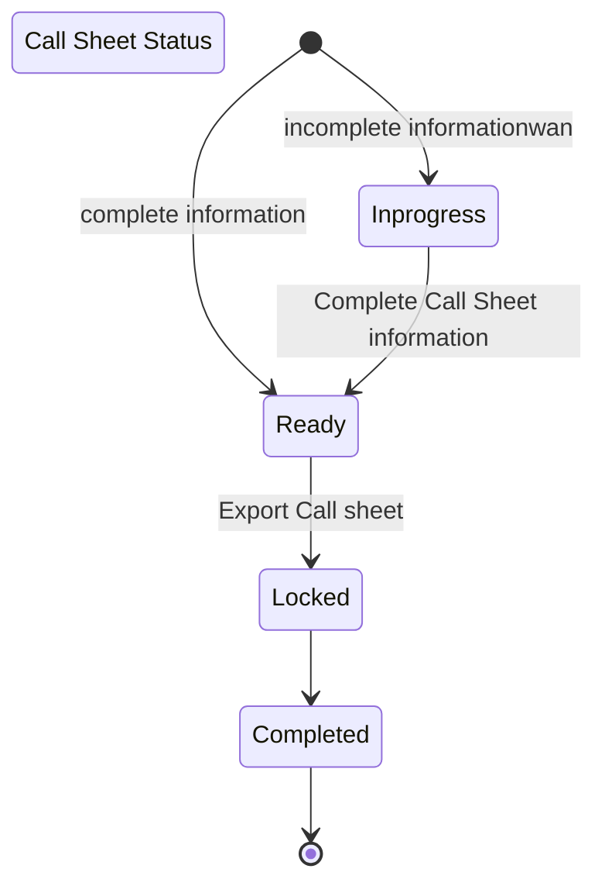
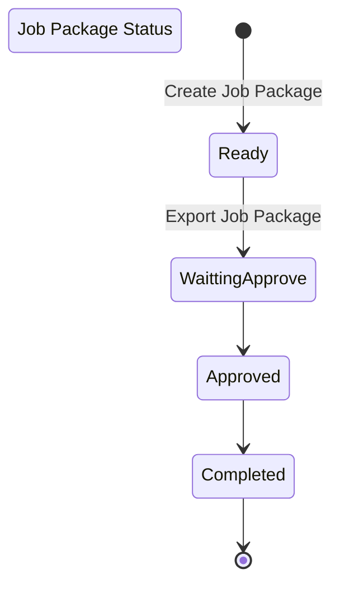

​    

​    

​    

# **业务名词解释** 

  本文包括专业词汇的中文描述、业务流程的中文描述等信息        

# 引言

## 目的

所有需求文档为英文文档，不方便大家理解，此文档整理成中文描述，对需求重新汇总和整理以方便大家查看。

# 2     业务词汇

Sanjel Energy Services 是加拿大石油行业油井服务提供商，主要专注于固井业务。简单地说就是水泥灌注。

## 业务介绍

​      石油公司发现有石油储藏后会找钻井公司进行测试井的挖掘，井的深度通常在上千米左右，进行逐步阶段的钻井工作，先使用大钻头挖井，到一定深度下管子（钻杆），然后在用小钻头，以此类推，钻杆需要固定好了之后在进行下一阶段的工作，Sanjel提供的就是固井服务。通常根据深度不同又分为不同的JobType，如表层固井，中层固井等。

## 2.1    Rig

Rig 石油钻机 – Sanjel是提供钻井后的固定服务的，服务的时间是需要根据钻井时间而定的。跟踪钻机动态，可以比较准确地预测提供相应服务的时间，以便调配资源。

## Program

​      根据钻井公司提供的数据进行固井服务的工作设计，比如需要的设备、原材料等，最终结果存放在Master Template.excel文件中，包括井的数量，阶段，等设计数据，根据表格导入数据到EProgram中，保存下来即Program其实可以称作JobDesign或工作设计结果。

## Callsheet

施工订单,通常投标成功后，钻井公司根据钻井进度会打电话通知何时开始提供固井服务，此时施工队长会创建一个callsheet提供对应的服务，即施工订单。

## Job

### OSR

OSR-——On Site Representative 现场代表。通常OSR会打电话给工程师告知一个大概的时间，当时间确定后OSR再打一次电话确定最后到位时间，这时会分配一个班组。

### Crew

Crew——班组，包括人员和设备。

## Blend相关

### Blend

Blend 混合物，在石油服务行业内特指水泥混凝泥浆。在加水混合前称为 Dry Blend，加水后称为Wet Blend.

### Base Blend

Base Blend基础混合物，是一种(Blend)水泥混凝泥浆的主要成份，它是Dry Blend，可以是从工厂采购的标准水泥，也可以是Sanjel按自己专用配方预先混合好的Blend.

### Additive

Additive添加剂，是在Blend中的添加的化学药剂，这些化学药剂可以改变泥浆的化学属性，如凝固时间、硬度等。

### Blend Recipe

Blend Recipe，混凝泥浆配方。它包括Base Blend和Blend Additives。配方表示方法有以下不同几种。

\-     BWOB (Percent of whole blend) - by weight of Blend -Describing the amount (in percent) of a material added to cement when the material is added based on the total amount of a specific blend, often abbreviated as BWOB. 

**翻译：**– 在这种情况，通常整个Blend为1000T, 然后Base Blend 和Additives各有不同的占比。有时是Base Blend为1000T，那么整个Blend就会超出1000T。实验室给出的Sanjel品牌产品通常是这种情况。

\-     BWOW - by weight of Water- Describing the amount (in percent) of a material added to a cement slurry based on the weight of water used to mix the slurry. Commonly abbreviated as BWOW, this convention normally is used only for salt [NaCl] and KCl. 

**翻译**：这种情况是需要先算出单位Base Blend的用水量，然后再根据用水量的百分比计算。在第一期中，用水量需要手工输入。

\-     BWOC (Percent of Base Blend) – by weight of Cement - Describing the amount (in percent) of a material added to cement, and is often abbreviated as BWOC. BWOC is the method used to describe the amount of most additives in the dry form – 

**翻译**：在这种情况下，Base Blend为1，添加剂的量为相对百分比。eService 中Production Section中通常是这种情况。

\-     BYOC（By Yield of Base Cement） - 

**翻译：**当添加比例为kg/m3或l/m3时，需要将Base Blend的重量转换为体积，然后再进行计算

### Product Haul

Product Haul产品拖运 – 在施工开始前，所需的水泥需要按照配方要求进行混合，并拖运到指定的地点。

### Bulker 

Bulker 水泥拖运车的司机

### Bulk Truck

Bulk Truck （Bulk Unit, Bucker） – 水泥拖运车，用来运载干水泥。Sanjel Bulk Truck 一般有三个仓位(Pod)，这样一次可运载不同的水泥。

水泥运输车：车体有3-4个格子，一个车可以放多个批次的水泥，即Pod1、Pod2、Pod3、Pod4

### Unit Trip

Unit Trip一趟运输 – 一辆拖车运送一次水泥。

### Load Sheet

Load Sheet装载表 – 记录每一趟运输要装载的水泥种类和数量，三个仓位可能装不同的水泥。

### Mix Sheet

Mix Sheet搅拌混合表 ，每装载一种水泥，要按照配方进行混合，Mixer混合搅拌机的容量小于仓位的容积，也就是说装载一个仓位要分几批搅拌装载。每次搅拌要有详细的成份添加列表。

### Bulk Plant 

Bulk Plant 货场， Sanjel的主要原料是水泥，水泥的储存容器称为Bulk，所以全名可以叫做水泥容器储存区。

### Product

Product 产品- 在Sanjel的业务语境中，Product被重复使用，有多种含义。在开发过程中我们会重新定义这些数据以加以区分，加以完善。

### Inventory Product 

Inventory Product – 是从厂家采购的原材料，或是从化学角度上可单独使用的成份。它们在仓库中保管，每个都有库存编号。隶属于库存管理系统。它可以是Blend 或 Additive。例如 Class A Cement。

### Sales Product 

Sales Product – 是Sanjel对外销售的Blend 或服务，有许多是按行业习惯称谓定义，在销售和施工过程中使用。隶属于销售系统。例如0:1:12 ‘G’，它是由1份Class G cement加上12%的GSS-1。

###  Billing Product 

Billing Product – 是Sanjel向客户收费的项目名称，它与Sales Products相对应，它们在价目表中都有编号。按照销售合同使用，隶属于财务系统。例如0:1:12 ‘G’，它对应着Class G Cement (113002)和GSS-1(113139)两个收费项目。

 

# 3   Eservice

| Actor                       | Remarks          | Business UseCase         | UseCase                                                      | Buseiness Entity                                             | APP      |
| --------------------------- | ---------------- | ------------------------ | ------------------------------------------------------------ | ------------------------------------------------------------ | -------- |
| Sales                       | 销售人员         | Receive Job Oppotunitity |                                                              |                                                              |          |
| Client Solution Specialists | 客户解决方案专家 | Job Design               | Create Program、CloneProgarm、Search Program、Print Progarm、Attach File to Progarm | Progarm                                                      | EProgram |
| Dispatcher                  | 调度员           | Job Planning             | Create CallSheet、 Improt Call Sheet from Memory Device、View callsheet Form server、View Callsheet From Local、Search CallSheet、Export Call Sheet、Print Call Sheet、Attach File to Call Sheet、Clone Call Sheet | Call Sheet                                                   | EService |
| Field Supervisor            | 野外工作人员     | Job Operation            | Create Job Package by Call Sheet、Create Job Package、**Print JobPackage from Server** | Job Package                                                  | EService |
| Engineer                    | 工程师           | Job Operation            | **Print JobPackage from Server**、Export Package 、Send Package to Server、Validate Job Package、Import Job from Memory Device、View Job Package From Local、Update Job Package From Server、 View Job Package From Server、Print Job Package From Server、Search Job Package | Job Package                                                  | EService |
| Managers                    | 经理、管理人员   | Job Verification         | Approval Job Package From Server、Create Service Ticket From Call Sheet Ofline、Create Service Ticket Offline、Print Service Ticket-Form Local、Upload documents to a Service Ticket、Modify Service Ticket、Create Service Report From Call Sheet Offline、Create Service Report Offline、Create Service Report Offline、Create Service Report form Local、Create Pumping Service Report | Job Package、ServiceTicket、Service Report                   | EService |
| Accounting                  | 会计             | Invoicing                | Print Price Book、Create Accounting Ticket from Service Ticket、Send Invoice to customer、Acctounts Receivable | Price Book、AccountTicket、Accounts Receivable、Service  Ticket、Invoice |          |

## Client stamp

## OVPP

## AR

## BI dataset

## field ticket