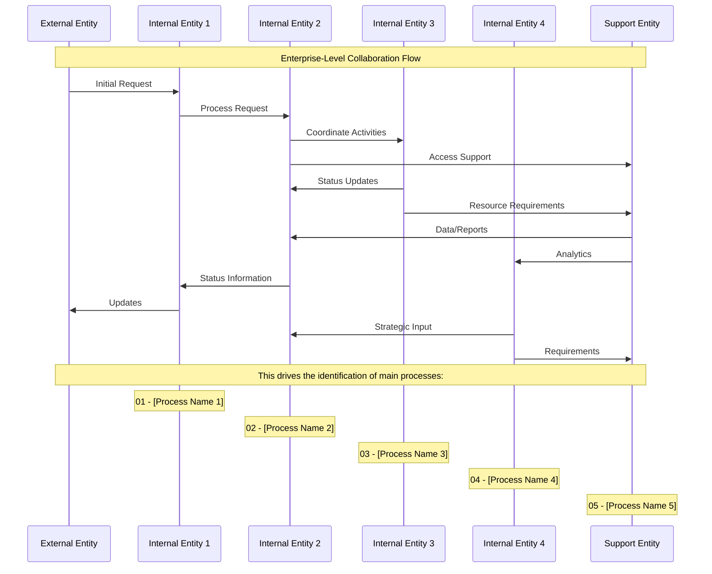

<!-- Identifier: C -->

# Root Collaboration Overview

This document contains the enterprise-level Mermaid sequence diagram that describes the collaborations among the key organizational entities and drives the next level process breakdowns.

## Collaboration Diagram

## Identified Entities

### Primary Actors
- **External Entity**: [To be defined based on organizational analysis]
- **Internal Entity 1**: [To be defined based on organizational analysis]
- **Internal Entity 2**: [To be defined based on organizational analysis]
- **Internal Entity 3**: [To be defined based on organizational analysis]
- **Internal Entity 4**: [To be defined based on organizational analysis]
- **Support Entity**: [To be defined based on organizational analysis]

## Main Process Identification

Based on collaboration analysis, the following main processes will be identified for detailed breakdown:

1. **01 - [Process Name 1]**
   - [Key activities to be defined]
   - [Responsibilities and scope]
   - [Expected outcomes]

2. **02 - [Process Name 2]**
   - [Key activities to be defined]
   - [Responsibilities and scope]
   - [Expected outcomes]

3. **03 - [Process Name 3]**
   - [Key activities to be defined]
   - [Responsibilities and scope]
   - [Expected outcomes]

4. **04 - [Process Name 4]**
   - [Key activities to be defined]
   - [Responsibilities and scope]
   - [Expected outcomes]

5. **05 - [Process Name 5]**
   - [Key activities to be defined]
   - [Responsibilities and scope]
   - [Expected outcomes]

## Collaboration Patterns

### Service Delivery Flow
- Customer requests trigger operations coordination
- Operations management orchestrates field activities
- Support systems provide data and technical capabilities
- Status information flows back through the chain

### Strategic Flow
- Strategic management provides direction to operations
- Performance data flows up through support systems
- Strategic decisions influence operational priorities

### Information Flow
- Bidirectional information sharing between operations and field management
- Support systems serve as data repository and analytics engine
- Customer service acts as primary customer interface

## Related Documents

- [Process Overview](process.md) - High-level process workflows
- [Domain Model](domain-model.md) - Detailed entity definitions and relationships
- [Vocabulary](vocabulary.md) - Standard terminology for collaborative interactions

## Next Steps

Each identified main process (01-05) should be further analyzed with:
- Detailed process breakdowns in numbered sub-folders
- Specific collaboration diagrams for each process area
- Domain models focusing on process-specific entities
- Test cases to validate collaborative interactions

This collaboration model drives the creation of the next level of process documentation in numbered folders (01 - Process Name, 02 - Process Name, etc.).