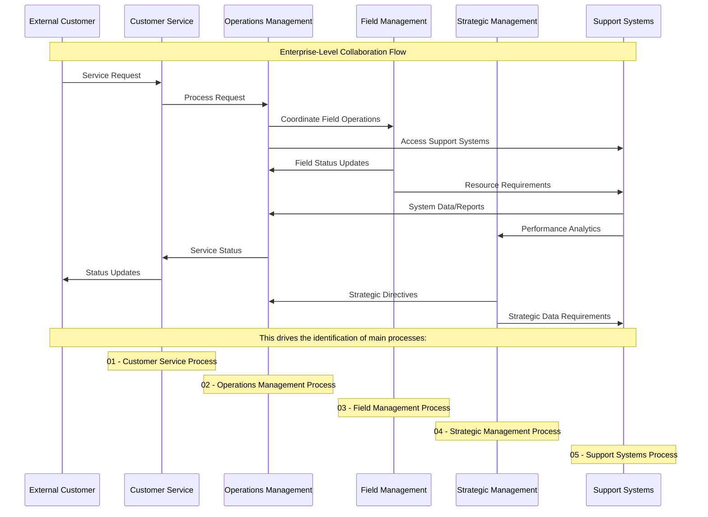

<!-- Identifier: C -->

# Root Collaboration Overview

This document contains the enterprise-level Mermaid sequence diagram that describes the collaborations among the key organizational entities and drives the next level process breakdowns.

## Collaboration Diagram

## Identified Entities

### Primary Actors
- **External Customer**: Service requestors and recipients
- **Customer Service**: Customer-facing interface and coordination
- **Operations Management**: Core operational coordination and management
- **Field Management**: On-site service delivery and field operations
- **Strategic Management**: Strategic planning and organizational direction
- **Support Systems**: Technology and data systems supporting operations

## Main Process Identification

Based on this collaboration analysis, the following main processes are identified for detailed breakdown:

1. **01 - Customer Service Process**
   - Customer interaction management
   - Service request processing
   - Customer communication and updates

2. **02 - Operations Management Process**
   - Operational coordination and control
   - Resource allocation and management
   - Service delivery oversight

3. **03 - Field Management Process**
   - Field service execution
   - On-site operations management
   - Resource and equipment coordination

4. **04 - Strategic Management Process**
   - Strategic planning and direction
   - Performance management
   - Organizational development

5. **05 - Support Systems Process**
   - System data management
   - Technical support and infrastructure
   - Analytics and reporting

## Collaboration Patterns

### Service Delivery Flow
- Customer requests trigger operations coordination
- Operations management orchestrates field activities
- Support systems provide data and technical capabilities
- Status information flows back through the chain

### Strategic Flow
- Strategic management provides direction to operations
- Performance data flows up through support systems
- Strategic decisions influence operational priorities

### Information Flow
- Bidirectional information sharing between operations and field management
- Support systems serve as data repository and analytics engine
- Customer service acts as primary customer interface

## Related Documents

- [Process Overview](process.md) - High-level process workflows
- [Domain Model](domain-model.md) - Detailed entity definitions and relationships
- [Vocabulary](vocabulary.md) - Standard terminology for collaborative interactions

## Next Steps

Each identified main process (01-05) should be further analyzed with:
- Detailed process breakdowns in numbered sub-folders
- Specific collaboration diagrams for each process area
- Domain models focusing on process-specific entities
- Test cases to validate collaborative interactions

This collaboration model drives the creation of the next level of process documentation in numbered folders (01 - Process Name, 02 - Process Name, etc.).