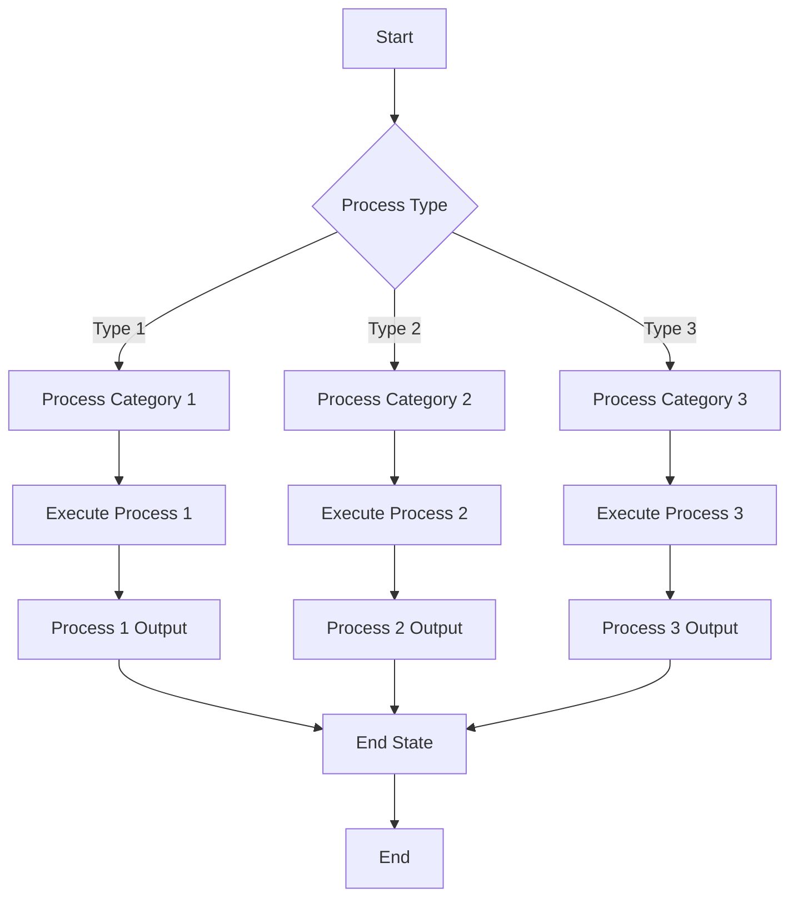

<!-- Identifier: P -->

# Root Process Overview

This document contains the high-level Mermaid Activity Diagram that describes the organization's primary workflows and business logic at the enterprise level.

## Process Flow

## Process Description

### Main Process Categories

1. **Process Category 1**
   - [Description to be defined based on organizational analysis]
   - [Key activities and responsibilities]
   - [Expected outcomes and deliverables]

2. **Process Category 2**
   - [Description to be defined based on organizational analysis]
   - [Key activities and responsibilities]
   - [Expected outcomes and deliverables]

3. **Process Category 3**
   - [Description to be defined based on organizational analysis]
   - [Key activities and responsibilities]
   - [Expected outcomes and deliverables]

## Sub-Process Breakdown

This root process will drive the identification of main process categories based on actual organizational analysis. Each category will be further decomposed into specific numbered sub-processes based on the collaboration analysis.

## Process Inputs and Outputs

### Inputs
- [To be defined based on organizational analysis]
- [Input types and sources]
- [Requirements and constraints]

### Outputs
- [To be defined based on organizational analysis]
- [Output types and destinations]
- [Success criteria and metrics]

## Related Documents

- [Collaboration Diagram](collaboration.md) - Shows how different entities interact in these processes
- [Domain Model](domain-model.md) - Defines the key actors and systems involved
- [Test Cases](test-case-list.md) - Validation scenarios for these processes

## Notes

This is a template process diagram. The actual organizational processes should be defined based on the specific business requirements and analysis of the organization's operations. The diagram should be updated to reflect the real workflows and decision points identified during the business analysis phase.