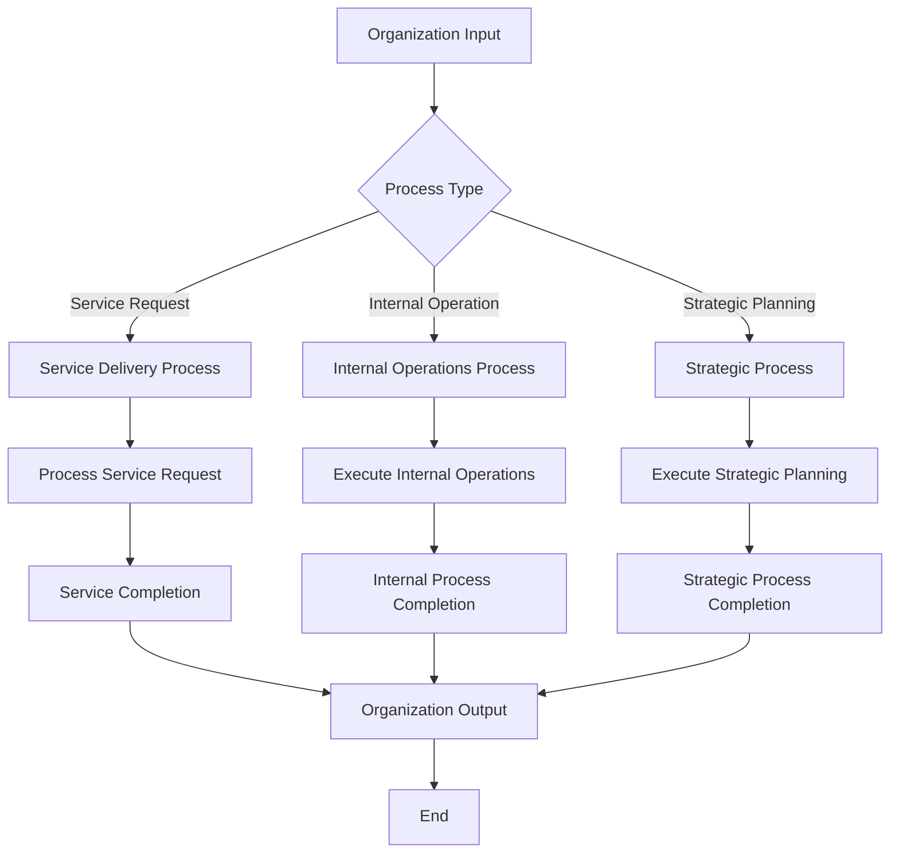

<!-- Identifier: P -->

# Root Process Overview

This document contains the high-level Mermaid Activity Diagram that describes the organization's primary workflows and business logic at the enterprise level.

## Process Flow

## Process Description

### Main Process Categories

1. **Service Delivery Process**
   - External customer-facing processes
   - Service request handling and fulfillment
   - Customer satisfaction and delivery

2. **Internal Operations Process**
   - Internal organizational processes
   - Resource management and optimization
   - Quality control and compliance

3. **Strategic Process**
   - Long-term planning and strategy execution
   - Organizational development and growth
   - Performance analysis and improvement

## Sub-Process Breakdown

This root process drives the identification of the following main process categories:
- Service delivery and customer-facing processes
- Internal operational processes
- Strategic and planning processes

Each category will be further decomposed into specific numbered sub-processes based on the collaboration analysis.

## Process Inputs and Outputs

### Inputs
- External service requests
- Internal operational requirements
- Strategic directives and goals
- Resource availability
- Regulatory requirements

### Outputs
- Delivered services
- Completed internal operations
- Executed strategic initiatives
- Performance metrics
- Compliance reports

## Related Documents

- [Collaboration Diagram](collaboration.md) - Shows how different entities interact in these processes
- [Domain Model](domain-model.md) - Defines the key actors and systems involved
- [Test Cases](test-case-list.md) - Validation scenarios for these processes

## Notes

This is a template process diagram. The actual organizational processes should be defined based on the specific business requirements and analysis of the organization's operations. The diagram should be updated to reflect the real workflows and decision points identified during the business analysis phase.